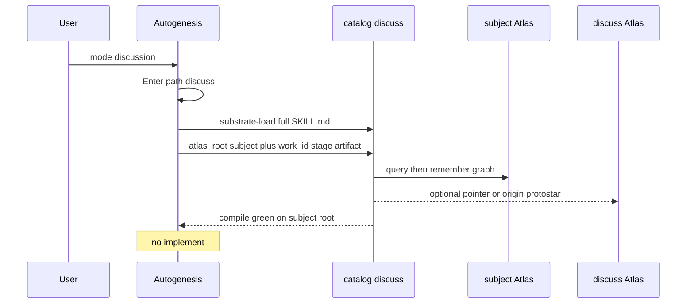

## Intent + scope

Add Autogenesis path_id discuss. When mode is discussion, Enter uses that path. The path module substrate-loads catalog skill discuss and follows the full discuss body.

Write-home is the subject Atlas. Autogenesis passes atlas_root into discuss. Canonical work hub is subject work/<work_id>.md. Discussion pages carry stage and artifact and relates_to that work hub or a tighter intra-Atlas node.

Keep the authority fence. Internal think-challenge stays an Autogenesis-only validation gate. think-grill and think-ramble are not loaded in discussion mode.

Later implement files only: references/paths/discuss.md; Autogenesis SKILL.md registry and discussion-mode text; references/modules/workflow-discipline.md path enum, card fields, fail-closed Enter, think-verb routing.

## Non-goals

- Implement or path wire in this Run
- Typed cross-Atlas relates_to
- Subject-Atlas folder convention name
- Renaming path_id to avoid collision with catalog discuss
- Deleting root catalog think-* skills
- Making think-challenge user-activable
- Dual-write of the discussion fabric

## Pins

P1. path_id discuss; default Run path stays design.
P2. Path module substrate-loads catalog discuss; full body; no shim.
P3. atlas_root passed by Autogenesis equals subject Atlas.
P4. Canonical work is subject work/<work_id>.md. Discuss-Atlas same-id page is work_role pointer.
P5. Pages in the graph carry stage and artifact.
P6. Discussion mode does not load think-grill or think-ramble.
P7. think-challenge remains internal validation only. User talk about a challenge result is discuss, linked to the challenged artifact.
P8. mode discussion without discuss load or discuss fields is incomplete Enter.
P9. Discussion does not edit Autogenesis product files.
P10. Registry wording must say path discuss vs skill discuss.

### Challenge pins

C-a. Handoff without shared record. Path discuss must pass subject, work_id, atlas_root, stage, artifact, discussion_root, current_branch. Source: multi-agent orchestration handoff failures.
C-b. Dual-store drift. One write-home (subject Atlas). Pointer plus external_ref only on the other root. Source: knowledge-layer write/projection split; this session probe.
C-c. Duplicate work entities. work_role canonical or pointer. Source: KG duplication; probe finding.
C-d. Instruction interference. Do not load old think modules beside discuss. Source: skill-reuse interference.
C-e. User-invoked self-challenge rejected. Gate stays internal. Source: user pin Q4.

## Genesis Artifacts

### Intent + scope + non-goals

See above. change-class new-surface.

### Diagrams / interface

Interface sketch for references/paths/discuss.md:

- When: Autogenesis mode discussion.
- Inputs: subject, intent, objective, atlas_root required as subject Atlas, work_id when work exists, stage, artifact.
- Outputs: discuss Enter card, graph pages on subject Atlas, path receipt. Never product edits.
- Dependencies: catalog discuss EXTERNAL; atlas query remember work.

workflow-discipline deltas: path enum includes discuss; discussion mode must use path discuss; think-grill and think-ramble not loaded; missing discuss load or fields is incomplete Enter.

### Cost note

One extra full skill load per discussion Enter. Subject-Atlas compile per persist. Dual-write rejected. Stance balanced.

## Acceptance

- Registry lists path discuss and the path file exists.
- Path text requires substrate-load of catalog discuss and passing atlas_root.
- Fail-closed language is in workflow-discipline.
- think-grill and ramble excluded from discussion mode.
- Adversarial YAML smokes are not dropped without a new design.
- Subject Atlas compile stays green after implement.

## Residual risks

- Path vs skill name collision in speech.
- stage and artifact not schema-validated yet.
- Sessions started on discuss Atlas before implement will not auto-migrate.
- specify Gherkin not minted this Run.

## Behavioural contract (agent-spec)

deferred: specify not run this packet. Contract families for later specify: fail-closed discussion Enter; atlas_root pass-through; canonical work hub; no product writes from discussion; think-challenge not user-activable. Forbidden expected: discussion to implement; write to discuss default root when Autogenesis is caller; load think-grill in discussion mode.

## Evaluation plan

Deterministic smokes primary: path file present; registry row; workflow-discipline enum; path file names catalog discuss and atlas_root; fail-closed incomplete Enter language; discussion-mode text does not load think-grill or think-ramble; adversarial YAML present.

Agent evaluations secondary: discussion Enter emits discuss fields; agent does not edit SKILL.md while path discuss is active.

## Catalogue Review

genesis matches: A9 supervised execution; B4 plan memento; B8 attention anchor. Conflicts none.
Autogenesis extension: B17 activation card gains discuss fields.
composition: path module INLINE; catalog discuss EXTERNAL; workflow-discipline LOCAL SIBLING edit.
inherited anti-patterns: phantom dependency; discussion to implement; dual-write.
delta only: new path plus mode routing.
admission note: protocol is new-surface, not a new genesis pattern.

## Adversarial scenario draft

File references/scenarios/discuss-activation-adversarial-v1.yaml.

## Stop for approval

Implement is blocked until explicit approval of this designed packet. Prior Approved applied to running this design Run and to the enhanced discipline pins, not to product file edits.
