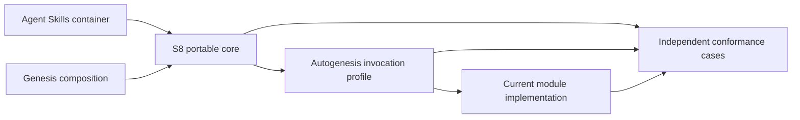

# S8 self-review diagnostic

**Verdict: needs-work. Neither S8 nor the migration is the reference oracle.**
The migration establishes a useful container and routing structure, but the
callable contract and evidence model are not yet sufficient to serve as a
golden standard.

The user requested this review at 15:50 +01:00 on 2026-09-11, explicitly
challenging both the new pattern and its first implementation. This is an
advisory review and candidate standard, not a formal approved implementation
plan. Earlier S8 implementation approval does not approve these new changes.

## Scope and method

Read the root, all 21 candidate module entrypoints, S8, its injector and the
invocation authority. Used installed Autogenesis v0.4.3 review-package and its
four facets, Genesis composition/refactor guidance, live Agent Skills sources,
OKF authority and the existing subject Atlas.

One bounded GPT-5.4 read-only reviewer examined the substantial checker,
consumer, scenario and CI surfaces. The coordinator owned module semantics
and synthesis. The reviewer used disposable probes; no product changes were
made. This was not a multi-reviewer panel, a live candidate invocation run,
or a measured cost comparison.

Sources:

- https://agentskills.io/specification
- https://agentskills.io/skill-creation/optimizing-descriptions
- Installed Genesis `assets/composition-substrate.md`, S1/S3,
  R1 SPLIT/R2 FUSE and common runtime affordances.
- Candidate source paths and executable diagnostic results below.

The live specification defines container fields, not parent-routing semantics
or guaranteed host discovery. Its 1024-character description limit is a format
constraint; its recommended token budget is not evidence of host rejection.
Genesis's distribution module remains distinct from S8's internal skill module.

## Diagnostic results

| Probe | Observed outcome | What it establishes |
|---|---|---|
| Existing unittest discovery | 71 tests passed | Existing regression baseline only |
| Actual source checker | Green; 21 modules/entrypoints/rows, 25 suites | Declared structural inventory |
| Research entrypoint reduced to frontmatter + Arguments in a disposable copy | Green, no errors | A callable procedure can disappear without source rejection |
| Current happy suite replaced with `this_is_not_a_scenario: true` in a disposable copy | Source checker and APM file audit both green | Presence is not scenario validity or execution |
| Research description changed to 1025 characters in a disposable fixture | Green, no errors | Agent Skills description limit is not enforced |
| Extra valid-looking `references/modules/rogue/SKILL.md` in a disposable fixture | `KeyError('rogue')` | Unknown module fails by crash, not the promised structured diagnostic |
| Direct design -> discuss transition checker probe | `operation-transition` error | That direct encoding is rejected |
| Direct implement -> review-package transition checker probe | `operation-transition` error | That direct encoding is rejected |
| Direct discuss -> design control probe | Green | The transition probe exercises a real whitelist |
| Store contract and actual Atlas compile | Green | Reviewed gitlink and current memory structure, not skill behavior |

Source mutations were isolated and cleaned up. The original source stayed
unchanged. No fake receipts were presented as runtime evidence.

## Discrepancies and design gaps

### D1. A skill-shaped folder is not yet a callable interface

**High; contract gap, experimentally demonstrated checker limitation.**

S8 declares private callable interfaces but specifies neither minimum argument
semantics nor result, precondition, failure and effect declarations.
`scripts/module_contract.py:693-786` checks metadata and argument-name
inventories; `invocation-contract.json` mostly specifies required/optional
argument names. The stripped research probe still passes.

Concrete example: `research` requires `question`, but its procedure says
"User material and/or controlled web research" without defining how the
argument is bound, what result constitutes an answer, or what must exist
before capture is complete. Several small modules have analogous gaps.

This does not make the structural checker dishonest by itself: it explicitly
labels its scope structural. It means neither that check nor the 21-folder
migration is sufficient evidence of S8 conformance.

**Candidate standard:** each callable declares purpose/selection, input
meaning and constraints, parent-context requirements, allowed effects,
result/postconditions and failure behavior. One authoritative declaration;
no repeated schema copies. A valid counterexample must exercise the contract,
not merely omit a magic phrase.

### D2. Invalid containers and unknown modules are not diagnosed reliably

**High for missing format coverage; medium for error-contract failure.**

`scripts/module_contract.py:731-739` accepts any nonempty description.
The 1025-character probe violates the live Agent Skills limit but passes.
At line 756, indexing `expected_modules[module_name]` crashes for an extra
module after inventory validation has already noticed it.

**Candidate standard:** validate applicable Agent Skills field constraints
and string-valued metadata; unknown/unregistered modules return structured
errors and a nonzero exit rather than traceback-only output. These are
deterministic conformance cases, not LLM evaluation tasks.

### D3. Optional pattern selection conflicts with generic review requirements

**High; source-level contradiction in review scope.**

S8 rejects premature decomposition. `review-package` says the draft is not a
mandatory conformance rule. But
`references/modules/validate-progressive-disclosure/SKILL.md:30-32` requires
the private module layout and parent/role registry without checking whether
the reviewed target adopts S8. A legitimate simple or externally composed
skill can consequently be judged against an irrelevant pattern.

`initialise/SKILL.md:65-76` also combines mandatory module/discipline fusion
with a no-blind-scaffolding caveat. Its existing confirmation intentionally
approves a fuller discipline; silently deleting that fusion would be another
breaking change, not the cure.

**Candidate standard:** apply generic Agent Skills/Genesis review first;
apply S8 rules only to an adopted/applicable S8 topology. Make confirmed
initialise fusion an explicit profile decision. Retain it until a separately
approved design changes it.

### D4. Call, handoff and parent transition need distinct encodings

**High; handoff ambiguity, not proof that every root-routed path fails.**

`discuss/SKILL.md:42-58` permits leaving design for discussion and asks for a
new operation request. `implement/SKILL.md:43` recommends first running
review-package when chaining needs review. Yet
`scripts/module_contract.py:1748-1758` accepts only direct discuss -> design
and design -> implement operation edges.

Both disputed direct encodings fail the probe. A new request under the root
can avoid that direct-edge whitelist, but the caller text does not specify
the handoff, old-operation disposition, parent request identity or resumption.
Do not fix this merely by allowing every operation-to-operation edge.

**Candidate standard:** support calls return to the active operation;
operation changes are explicit root-owned handoffs. Preserve immutable
request snapshots, identify derived context and revalidate approval scope.
Define suspension/termination/resumption and failure propagation with positive
and negative traces before choosing a wire representation.

### D5. Protected context still leaks into local reference and hub vocabulary

**High; concrete naming/path discrepancies, no observed wrong-store write.**

`validate-skill-import-links/SKILL.md:29-35` resolves the Autogenesis reference
store using the old `skill_path` name and assigns `atlas_root`. Under the new
protocol the package location is `resolved.skill_root`, while
`context.atlas_root` is protected subject write-home. These happen to coincide
when reviewing Autogenesis itself, masking the cross-subject case.

`discuss/SKILL.md:75` names `work/<work_id>.md` as canonical, while the shared
Autogenesis discipline fixes `autogenesis/work/<work_id>.md`.

**Candidate standard:** distinguish read-only reference locations, inspected
target locations and protected write-home. Pass the already selected canonical
hub to external collaborators; do not rederive another hub from the work ID.
Foreign-target tests must retain the original context and write-home.

### D6. Known-use recording lacks an explicit mutable-source boundary

**Medium; effect/ownership gap.**

`patterns/SKILL.md:78-83` tells record-known-use to append to a living pattern
asset. But consumers receive a versioned package, while runtime experience
belongs in the subject Atlas. The instruction does not distinguish runtime
capture from a maintainer's approved source update.

**Candidate standard:** capture observed use in the subject store. Curate a
pattern's shipped Known uses only through an approved source change.
`support` is a routing role, not a declaration that an action is read-only.
The record action needs an effect policy distinct from `load`.

### D7. Audience and distribution boundaries remain underspecified

**Medium; packaging-policy gap requiring an adapter-backed decision.**

The migrated runtime resource tree contains current scenarios, historical
scenarios and deprecated pattern resources. Consumer validation requires all
source `references/` assets to be deployed. S8 merely warns against using
maintainer fixtures as runtime guidance, whereas Genesis flags non-runtime
bundle leakage at the distribution boundary.

Do not classify every scenario as non-runtime: Autogenesis explicitly uses
current suites during self-evaluation. Classify each asset by its actual
consumer and load condition. Preserve historical evidence byte-for-byte, but
decide whether it belongs in the installed payload.

**Candidate standard:** explicit runtime/reference/contributor ownership and
an observed export boundary. A directory rename alone does not prove exclusion.
Do not introduce a marketplace or packages tree, nor invent APM exclude syntax.

### D8. Scenario and evidence gates can pass without their claimed behavior

**High; executable coverage gap.**

`scripts/module_contract.py:816-1065` validates scenario membership/references,
not complete scenario shape. `.github/workflows/ci.yml:87-113` runs unit/source
checks, not an end-to-end current-suite runner. A current YAML can cease to
contain any smokes and remain green.

The `c1-root-only-and-assets` scenario names native-copy/consumer evidence but
invokes a synthetic inventory test. Separate consumer jobs do test deployment,
but that particular smoke is not their evidence.

**Candidate standard:** validate current-suite shape and bind each claim to
the appropriate executed test. Separate four levels: container/structure,
semantic contract, deployed assets/discovery, and observed runtime behavior.
Passes at one level must not populate passes at another.

### Evidence gaps and unconfirmed concerns

- Actual candidate live module calls, paired design tasks and held-out S8
  selection queries remain unexecuted. This was already recorded; it is not
  a newly discovered regression. Final CI alone will not close live evals.
- Only the previously observed Copilot discovery can be claimed; multi-target
  asset deployment is not nine-host catalogue behavior.
- The reviewer showed that consumer validation ignores altered target/runtime
  metadata and a removed owners list in synthetic locks. Keep this as an
  adapter-consistency investigation, not an invented rule that stable runtime
  records must never say `target: agent-skills`. Establish APM 0.30.0's actual
  serialized semantics first. Active-owner/path/content evidence already
  exists and is not negated merely by that unused metadata.
- Twenty-one modules is the migration's inventory, not a universal S8 rule or
  proof of optimal decomposition. No module is condemned solely for being
  short, and no unconditional merge or rename is recommended.
- The capitalized name in the passive S8 pattern resource is not a SKILL.md
  naming violation. The installed v0.4.3 protocol is not a stale candidate
  consumer to be mechanically rewritten.

## Candidate golden standard: portable core plus application profile

**Proposed, not approved or coined into the shipped S8 body yet.**

> A skill module is a cohesive, parent-resolved private procedure, packaged in
> a skill-shaped entrypoint, with an explicit callable contract, owned effects,
> deterministic resource resolution and evidence-bearing outcomes.



| Rule | Portable S8 requirement | Autogenesis realization |
|---|---|---|
| S8-01 Identity | One public parent; private child identity and explicit entrypoint | Existing target.skill/module and parent registry; no new alias protocol |
| S8-02 Cohesion | A justified callable boundary; split/fuse based on actual callers | Review 21 leaves individually, not a mandatory count |
| S8-03 Interface | Meaningful inputs, prerequisites, context requirements, result and failures | Enrich the single module-contract authority and bind entrypoint procedures |
| S8-04 Effects | Declare read/write/external effects and who authorizes them | Separate read-only, Atlas writes, product edits and wiring/migration approval |
| S8-05 Context | Parent-owned snapshots; local data cannot overwrite authority | Seven protected fields; reference/target roots remain separate locals |
| S8-06 Composition | Distinguish private calls, public handoffs and external collaborators | Support returns; explicit operation handoffs; external skill protocols unchanged |
| S8-07 Resources | Each executable reference has one unambiguous base and load condition | Module root, skill root or parent registry; no cwd/search-order fallback |
| S8-08 Evidence | A request view is not execution; match evidence to each claim | B17 remains the card view; real receipts, gated outcomes and profile retry policy |
| S8-09 Distribution | Declare runtime versus contributor ownership; verify exports | Preserve one private APM root package; use observed adapter behavior |
| S8-10 Admission | Draft use, conformance and active promotion are separate decisions | Keep S8 draft; one Autogenesis package is one adoption |

The portable core must not require Atlas, G0-G8, the exact operation/support
taxonomy, exactly two attempts or Autogenesis schema IDs for every adopter.
Those are this parent's profile. This distinction does not weaken any current
Autogenesis gate or enable a child to opt out.

Minimum interface sketch (conceptual, not a second invocation schema):

```text
module identity + selection reason
inputs: names, meaning, accepted shape, required/default rules
context requirements: parent-owned prerequisites
effects: permitted read/write scopes and approval owner
procedure: bindings, dependencies and explicit load conditions
result: caller-consumable outcome and required postconditions
failure: reject/block/fail conditions; parent-owned retry policy
evidence: observable artifacts or tool results required for the outcome
```

### Self-application assessment: all 21 modules

The proposed standard is applied here as an assessment, not a source rewrite.
All entries share D1's need for a complete interface declaration.

| Module | Assessment / proposed disposition |
|---|---|
| design | Retain primary design responsibility; define result and root-owned discussion handoff |
| initialise | Retain confirmation/fusion gates; explicitly resolve profile and applicability tension |
| implement | Retain approved-plan-only authority; resolve pre-review handoff and result evidence |
| research | Retain pending cohesion evidence; bind question/capture scope and answer/capture result |
| reflect-challenge | Retain behavior-experience purpose; bind observations and distinguish it from design challenge |
| learn-skill | Retain peer-link boundary; declare local reference reads, Atlas-only writes and returned reliance record |
| reevaluate | Retain advisory impact/proposal role; define proposal result and memory effects |
| aware-runtime | Retain governed edit purpose; declare product-write scope and approval preconditions |
| wire | Retain separately approved external/product effect; declare provenance/result and partial-effect failure |
| review-package | Retain advisory orchestration; conditional pattern conformance, not universal S8 enforcement |
| atlas-migrate | Retain migration workflow; explicit staged effects, gates and postconditions |
| discuss | Retain external-discussion adapter; root handoff and canonical-hub correction |
| workflow-discipline | Retain profile authority; define bootstrap versus callable support and context transitions |
| think-challenge | Retain grounded design-support lens; bind design_target and returned counter records |
| think-grill | Retain distinct interactive support pending usage evidence; bind topic and clarify result/completion |
| think-ramble | Retain capture-support lens pending usage evidence; explicit Atlas-write contract |
| patterns | Retain injector; action-specific effects and immutable-package/runtime-memory split |
| validate-skill-import-links | Retain focused facet; repair resolved-name and reference-store/write-home separation |
| validate-progressive-disclosure | Retain focused facet; apply S8 only when adopted/applicable |
| validate-okf-conformance | Retain pure-format adapter; keep inspected store separate from write-home |
| validate-gate-map-and-non-goals | Retain policy facet; match profile/effect declarations and target applicability |

R1/R2 are a review discipline, not a mandate to split or fuse these modules now.
No blanket layout rewrite, new engine or extra runtime layer is proposed.

## Acceptance cases for the subsequent formal design

1. Valid minimal S8 module passes; frontmatter+Arguments-only stub fails.
2. Wrong/empty input, missing result and forbidden effects receive specific
   diagnostics rather than success-shaped defaults.
3. Description length 1024 passes; 1025 fails. Unregistered child produces
   JSON diagnostics, not KeyError. Validate string-valued metadata.
4. A simple non-S8 skill passes generic progressive-disclosure review.
   An S8 adopter with a missing declared leaf fails the S8-specific facet.
5. Define and execute design -> discussion -> design and approved
   implement/pre-review/resumption traces without concurrent active operations.
6. A foreign-target reference lookup leaves protected write-home and canonical
   work hub unchanged. No duplicate work hub is created.
7. Runtime known-use capture writes only to subject memory; shipped catalogue
   curation requires separately approved source modification.
8. Current suite without executable smokes fails shape validation. Run real
   positive and adversarial commands, with honest diagnostic/evidence mapping.
9. Inspect an actual exported consumer to verify runtime asset completeness,
   chosen contributor exclusions and adapter metadata consistency.
10. Run a bounded real task plus the already designed paired/held-out
    evaluations; failures or unavailable infrastructure remain explicit.

Historical YAML bodies and external protocols remain evidence, not edit
targets. Required current-suite changes need versioned successors and an
updated index. CI changes, packaging policy and any protocol revision must be
included explicitly in the next approved plan, not slipped into this review.

## Facet reports

```text
FACET: validate-skill-import-links
target: autogenesis candidate
substrate_contract: gaps
harness_mapping: pass
gaps:
  - validate-skill-import-links:29-35 - old resolved-location name and ambiguous reference-store atlas_root
suggested_fix: Use resolved.skill_root for the parent; use a distinct read-only reference root and preserve protected subject context.
status: needs-work
```

The full-body external loader contract is present. The gap is the local
binding/use of it, not absence of all external-loading guidance.

```text
FACET: validate-progressive-disclosure
target: autogenesis candidate
thin_registry: pass
path_module_separation: pass
one_path_at_a_time: gaps
on_demand_only: pass
gaps:
  - operation handoffs - caller text and direct transition encoding are not aligned
  - validate-progressive-disclosure:30-32 - generic review imposes S8 topology
status: needs-work
```

These installed-facet labels describe candidate modules; they do not require
restoring the removed references/paths layout. Resource/audience findings D7
are additional Genesis findings, not claims of observed eager execution.

```text
FACET: validate-okf-conformance
target: autogenesis candidate
store: atlas
okf_status: pass
atlas_compile: pass
gaps: []
status: pass
```

```text
FACET: validate-gate-map-and-non-goals
target: autogenesis candidate
gate_map_alignment: gaps
stop_for_approval_honesty: pass
non_goals_present: gaps
non_goals_honesty: gaps
card_check: pass
gaps:
  - aware-runtime - effect limits are not fully declared locally; relies on parent
  - patterns - runtime recording versus approved source mutation is unresolved
  - operation handoffs and discuss work hub - D4/D5
status: needs-work
```

Card check pass means declared on/full/compact/request-only policy is present,
not that actual candidate cards or receipts were executed in this review.
Not every missing local heading is a defect: explicit inheritance can satisfy
non-goals once the minimum interface and effect contract define it.

## Aggregated report and stop

```text
DEEP REVIEW-PACKAGE REPORT
target: autogenesis candidate v0.5.0 + autogenesis:S8 draft
genesis_summary: Useful S1/S3 composition, but incomplete private callable contracts and unresolved applicability, effects, handoffs and evidence boundaries.
facets:
  - validate-skill-import-links: needs-work
  - validate-progressive-disclosure: needs-work
  - validate-okf-conformance: pass
  - validate-gate-map-and-non-goals: needs-work
overall_status: needs-work
recommended_changes: Formalize a portable S8 core plus Autogenesis profile; address D1-D8 with independent acceptance cases before source self-application.
gaps_detail: See discrepancy records and all-21-module assessment above.
```

**Stop for approval.** The immediate architectural decision is whether to adopt
the proposed portable-core/profile split as the basis for formal design.
That decision is not active-pattern admission or approval to implement an
unwritten plan.

### User decision and formal design

The user selected "Yes - use core + profile for the formal self-application
design". The architectural direction is now approved. The subsequent
[formal plan](../plans/2026-09-11-s8-core-profile-self-application.md) and its
[work hub](../work/2026-09-11-s8-core-profile-self-application.md) preserve the
new implementation approval boundary. The diagnostic above remains a record
of what was actually found, not a claim that it has been fixed.

## Changed files

No product source changed in this review. Only this subject-Atlas experience,
its experience index and the existing S8 work hub are updated.

## Review receipt

```text
skill: autogenesis
skill_path: /Users/sergio_sisternes/.agents/skills/autogenesis
subject: autogenesis
path: review-package
approved: n/a
atlas_id: github.com/sergio-sisternes-epam/autogenesis-atlas
atlas_root: /Users/sergio_sisternes/work/copilot-worktrees/autogenesis/sergio-sisternes-epam-fictional-system/.atlas/github.com/sergio-sisternes-epam/autogenesis-atlas
nested_skills_loaded: genesis, atlas, okf; four installed review facets
substrate_contract: applied
remember: yes
compile: yes
Enter|Change|Exit: pass|advisory only|pass
```
