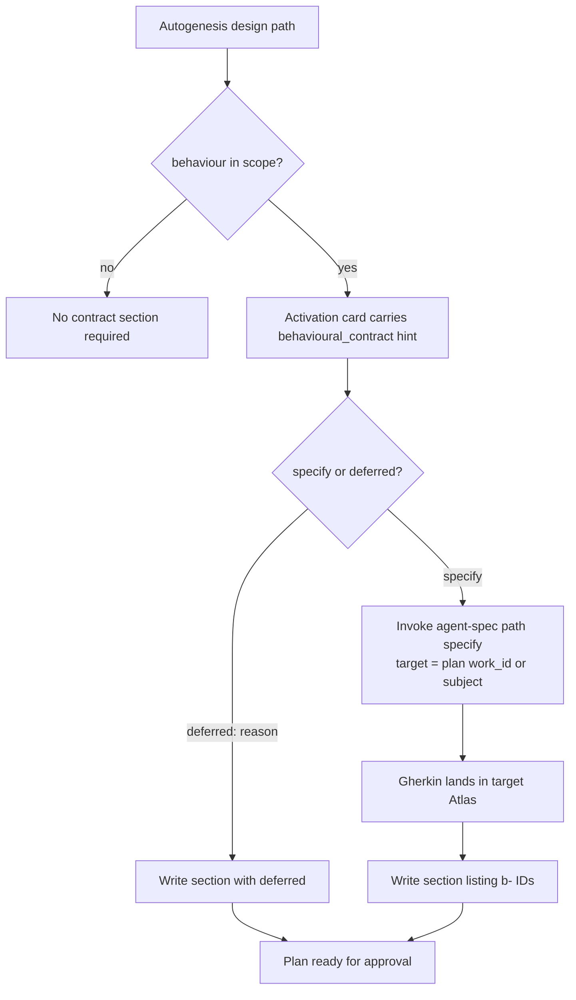

# Plan: Make agent-spec `specify` the sole producer of behavioural contracts

## Genesis Artifacts

### Intent + Scope

Make the call to agent-spec path `specify` the **only** legal way to produce behavioural Gherkin (and therefore the content of the `## Behavioural contract (agent-spec)` section) inside Autogenesis design. Eliminate direct authoring of `.feature` files by Autogenesis. Clarify ownership: agent-spec owns writing specifications. Add explicit activation-card hints. Update discussion principles so exploration remains possible while the ownership boundary is protected.

Scope:
- Update `references/paths/design.md` step 6b to the sole-producer rule.
- Add `behavioural_contract: specify | deferred:<reason>` hint requirement to activation-card discipline (workflow-discipline or design path).
- Update discussion-mode rules so discussion may invoke `specify` (mode=discussion) for exploration only; only formal design materialises the contract.
- Keep explicit `deferred: <one-line reason>` as first-class and G-BDD-satisfying.
- No change to Construct, agent-spec internals, or implement path beyond the safety-net note if needed.
- Adversarial scenario draft for the new rule.

### Non-goals

- Changing the agent-spec `specify` path itself.
- Removing the ability to defer.
- Making every design run call `specify` even when behaviour is out of scope.
- Runtime enforcement of Gherkin.
- Auto-wiring or peer mutation.

### Component / sequence sketch



### Interface sketch

**Activation-card addition (when behaviour in scope)**  
```text
behavioural_contract: specify | deferred:<one-line reason>
```

**design.md step 6b (new rule)**  
- Sole producer: only agent-spec `specify` may author/update `.feature` files and supply the concrete content of the behavioural-contract section.
- Direct authoring or pasting of Gherkin inside Autogenesis is forbidden.
- Explicit `deferred: <reason>` remains legal and satisfies G-BDD.
- Load agent-spec via substrate contract when calling specify.

**Discussion principles**  
- Discussion may call `specify` (mode=discussion) for exploration/review.
- Discussion may never materialise a finished behavioural-contract section into a plan or claim the contract is complete.
- Formal design is the only path that writes the section (via specify or deferred).

### Cost note

Low. One additional nested skill activation (specify) on behavioural designs; deferred path is zero extra cost. Activation-card hint is a single line.

### Acceptance criteria

1. `design.md` step 6b states the sole-producer rule and forbids direct authoring.
2. Activation-card / workflow-discipline documents the `behavioural_contract:` hint when behaviour is in scope.
3. Discussion principles updated as above.
4. Explicit deferred remains legal.
5. Adversarial scenario draft exists under the contract filename.
6. Ownership sentence appears in the changed artefacts.
7. Mini-genesis artefacts, pins, catalogue review present.
8. No product writes of `.feature` files by Autogenesis under this change.

## Pinned decisions

| Counter | Decision | Rationale |
|---------|----------|-----------|
| Dual-authoring drift | Accept & eliminate | agent-spec is sole writer of Gherkin. |
| Orchestration tax | Accept & mitigate | deferred remains first-class; hint makes call visible and auditable. |
| Hardening overkill | Accept & mitigate | deferred with reason covers trivial cases. |
| Discussion friction | Accept & define | discussion may explore via specify (discussion mode); only design materialises. |

## Catalogue Review

- Genesis matches: B17 activation-card; composition INLINE for procedure change.
- Autogenesis extension: B17 visible; G-BDD clarified.
- Composition mode: INLINE (design path + discussion principles).
- Inherited anti-patterns: none material.
- Delta only: sole-producer rule + hint + discussion clarification.
- Admission note: strengthens existing one-way dependency on agent-spec; no cycle.

## Behavioural contract (agent-spec)

`deferred: first implement of sole-producer rule will produce the Gherkin via specify against this plan`

## Evaluation plan

**Deterministic (primary)**  
- design.md contains sole-producer wording and forbids direct authoring.  
- Activation / workflow-discipline mentions the behavioural_contract hint.  
- Discussion principles state the exploration vs materialisation split.  
- No `.feature` authored by this change under Autogenesis.

**Agent evaluations (secondary)**  
- Soft review that ownership sentence is clear.

## Adversarial scenario draft

Filename: `autogenesis/references/scenarios/specify-only-adversarial-v1.yaml`

- `design-authors-feature-directly` — red if design path writes/pastes Gherkin.
- `design-missing-behavioural-hint` — red if behaviour-in-scope card lacks the hint.
- `discussion-claims-contract-complete` — red if discussion asserts finished contract.
- `deferred-without-reason` — red if deferred appears without reason.

## Stop for approval

Approved by user on 2026-08-25.
