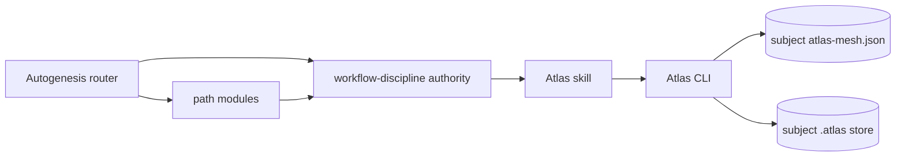
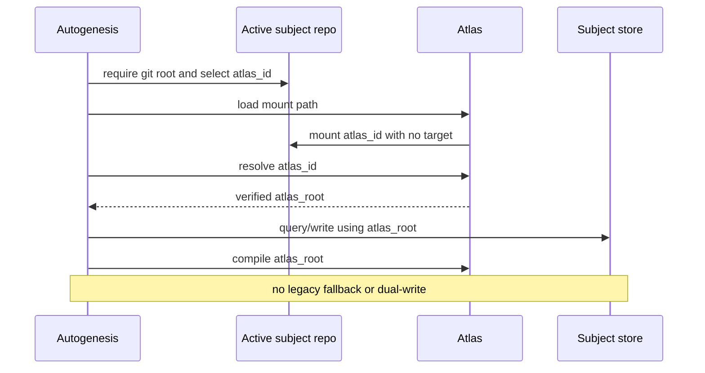

## Intent and scope

Align Autogenesis with Atlas v0.8.13 storage semantics. Every Autogenesis
memory operation resolves a subject's declared Atlas from the active subject
git repository, mounts it without `--target`, and uses only the root returned
by `atlas resolve <atlas_id>` for query, write, and compile.

This is a `new-surface` change because it alters the Autogenesis/Atlas storage
protocol, migration behavior, activation evidence, scenarios, and release
contract. The target release is Autogenesis v0.4.0.

## Current-state evidence

- Autogenesis v0.3.13 hard-coded `references/atlas`, mounted with
  `--target references/atlas`, and tracked its memory gitlink there.
- Atlas v0.8.13 mounts stores at
  `<active-git-root>/.atlas/<host>/<org>/<repo>`, requires no-target mount,
  and exposes the effective root through `atlas resolve`.
- Canonical Autogenesis memory requires Atlas-only memory, subject-local plans,
  stable `work_id` lineage, and compile-green Exit.
- A user-global APM dependency on mutable `#main` is already current, proving
  source drift rather than a stale installation.

## Bootstrapping resolution

The obsolete rule cannot safely persist the design it replaces. The design
was therefore prepared in a temporary git root that mounted the canonical
`autogenesis-atlas` repository with Atlas's current no-target procedure. That
checkout was a staging location, not a second authority or compatibility
store. During implementation, the approved plan and work lineage moved into
the relocated canonical gitlink under this source repository.

No write targets `references/atlas`.

## Non-goals

- Do not edit Atlas or Discuss source.
- Do not create a symlink, copy, fallback, or dual-write at
  `references/atlas`.
- Do not weaken multi-harness skill loading, B17 activation,
  Enter/Change/Exit, approval gates, Atlas-only memory, `work_id` lineage, or
  compile-green Exit.
- Do not merge, tag, release, mutate settings, or update global APM state.
- Do not rewrite historical evidence merely to hide former paths.

## Architecture

## Interface contract

| Surface | Inputs | Output | Fail-closed conditions |
|---|---|---|---|
| Subject Atlas resolution | active git root, optional explicit `atlas_id`, mesh, ref | canonical `atlas_id` and resolved `atlas_root` | no git root, zero/multiple candidates, mount/resolve failure, or missing schema |
| Enter/Exit | existing card plus Atlas identity/root | receipt with exact root and compile status | missing/mismatched Atlas evidence |
| `atlas-migrate` | legacy gitlink and mesh; optional legacy wiki | single default `.atlas/<id>` store | dirty/mismatched checkout, duplicate live stores, or red compile |
| APM handoff | immutable release ref | dry-run, approved update, verification, rollback | no implicit global mutation |

`references/modules/workflow-discipline.md` remains the sole resolver
authority. Consumers receive the resolved root and must not reconstruct it.
Atlas owns mount, resolve, migrate, and compile mechanics. OKF remains format
authority.

## Pinned decisions

1. Subject memory lives in the active subject repository's declared Atlas,
   never in the installed Autogenesis package.
2. Explicit `atlas_id` wins; inference is allowed only when the mesh has
   exactly one store.
3. Mount uses no `--target`; `atlas resolve` is the only root authority.
4. Missing git root, ambiguity, failed mount/resolve, or missing schema stops
   the path.
5. Migration is a single-writer cutover with no symlink, copy, dual-write, or
   silent fallback.
6. Plans remain `autogenesis/plans/<work_id>.md`; related work and experiences
   retain the same `work_id`.
7. v0.4.0 communicates the breaking storage-contract change.
8. Global APM mutation requires an immutable upstream release and separate
   approval.

## Planned changes

1. Relocate the tracked `autogenesis-atlas` gitlink to
   `.atlas/github.com/sergio-sisternes-epam/autogenesis-atlas` and align
   `.gitmodules`, `atlas-mesh.json`, and `.gitignore`.
2. Rewrite workflow discipline to require the active git root, explicit or
   unambiguous identity, no-target mount, resolve, schema verification, and
   fail-closed behavior.
3. Align router, path modules, templates, validation modules, and documentation
   to consume the resolved root.
4. Rewrite `atlas-migrate` as storage migration first, with optional legacy
   okf-wiki intake only after the canonical root exists.
5. Add happy-path and adversarial scenario contracts.
6. Align `SKILL.md`, `apm.yml`, and `CHANGELOG.md` on v0.4.0.
7. Repair pre-existing canonical-store page/schema warnings so the relocated
   store can satisfy the compile-green gate.

## Safe migration and compatibility

Existing source clones must:

1. Capture the old gitlink commit and verify the legacy submodule is clean.
2. Run Atlas's migration procedure from the active repository.
3. Verify `.gitmodules`, the gitlink, and mesh all identify the default
   `.atlas/<atlas_id>` path.
4. Resolve the store with Atlas and compile that exact root.
5. Remove stale local submodule registration only after the new root resolves
   and compiles.

There is no compatibility symlink or dual-write period. Old callers fail with
an actionable migration instruction until their repository metadata updates.

After upstream merge and an immutable v0.4.0 release, an explicitly approved
global consumer update must back up `~/.apm/apm.yml` and
`~/.apm/apm.lock.yaml`, pin `#v0.4.0`, preview with
`apm update -g sergio-sisternes-epam/autogenesis --dry-run`, apply with
`apm update -g sergio-sisternes-epam/autogenesis --yes`, verify the resolved
commit, and run an Autogenesis design preflight from the subject repository.
Rollback restores the backup or pins the previous known-good ref, followed by
the same explicit update flow.

## Acceptance

- All active Autogenesis memory operations resolve the subject store through
  Atlas from the active subject repository.
- No active instruction mounts, writes, or compiles a skill-local
  `references/atlas`.
- Gitlink and mesh agree on the canonical `.atlas/<id>` path.
- Ambiguous or unavailable subject storage fails closed.
- Multi-harness loading, Enter/Change/Exit, approval, Atlas-only memory,
  `work_id` lineage, and compile-green gates remain intact.
- Current scenarios cover the valid migration and reject legacy paths,
  first-row guessing, silent fallback, and dual-write.
- Version surfaces agree on v0.4.0.
- The relocated canonical store compiles with zero warnings.

## Evaluation

- Deterministic scenario smokes are primary.
- Atlas compile runs against the root returned by `atlas resolve`.
- Static checks verify gitlink/mesh agreement, version agreement, workflow
  gates, and absence of active legacy-path instructions.
- Formal Construct execution is deferred because Construct is unavailable in
  the current harness; no successful Construct run is claimed.
- `agent-spec` is unavailable, so behavioral Gherkin remains explicitly
  deferred rather than authored directly.

## Catalogue review

The design composes Genesis A9/S7 for deterministic mount/resolve/compile,
B4 for persisted plan lineage, B8 for the stable work contract, and
Autogenesis B17 for explicit activation evidence. The delta corrects an
existing composition; it introduces no new reusable pattern or orchestration
layer.

## Approval

Approved for implementation. Publication, merge, release, settings changes,
and global APM updates remain outside this approval.
