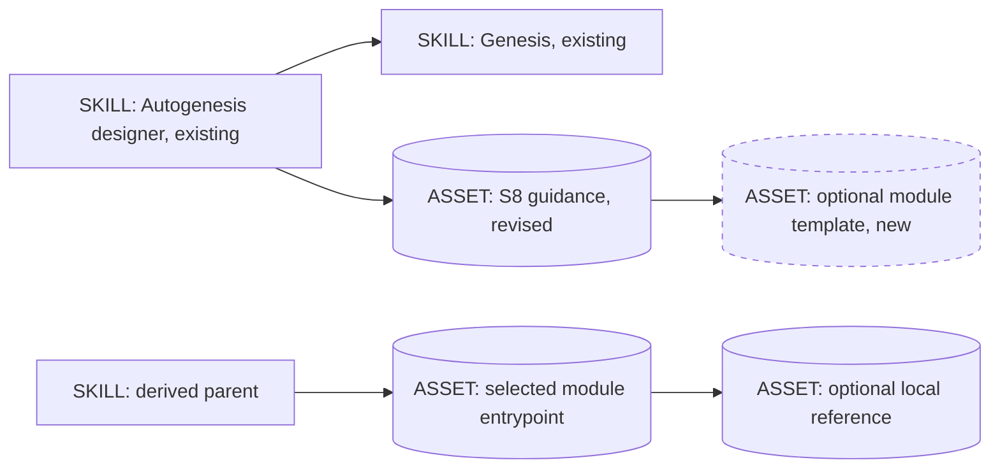
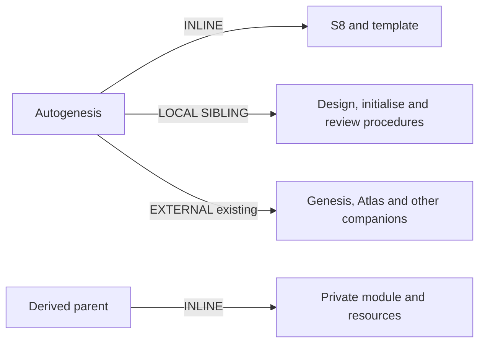

# Instruction-first modules for derived skills

**Approved for implementation.** The user explicitly selected "Approve
implementation" after this packet was presented. The user's 17:13 "Proceed" follows the
clarified direction: simplify what Autogenesis teaches and scaffolds into
derived skills, not this repository's release scripts. This formal design
replaces the earlier unapproved machinery-heavy proposal.

The user reiterated approval and instructed implementation to proceed at
2026-09-11T18:21:20+01:00. This confirms the implementation authority; it does
not waive Construct, independent evaluation, GitHub CI, or unrelated release
defects.

## Genesis Artifacts

### Intent, scope and non-goals

Make a skill module a useful, parent-routed instruction unit. A derived skill
can adopt it using Markdown entrypoints and local resources, without adopting
Autogenesis's machine schemas, trace checker or execution infrastructure.
The design process still uses Genesis, challenge, approval and honest evidence.

Scope: S8 guidance, the design/initialise selection and fusion rules, generic
package-review facets, a small optional module template and aligned usage docs.
Keep the current 21 Autogenesis modules, its own invocation protocol and its
repository-specific checks. Keep v0.5.0 as the package release candidate; revise
the passive S8 draft to version 0.2, without promoting it.

Non-goals: removing release scripts; fixing the separate consumer-validator
blocker; adding module_interfaces, a profile schema, a scheduler or new checker;
changing external skills, dependencies, store gitlinks, tags or global installs;
retroactively changing existing derived skills; making all skills use modules.

### Components



The generated parent selects and reads its own module. The template is an
authoring resource, not a runtime dependency of the generated skill.

### Sequence

```mermaid
sequenceDiagram
    actor User
    participant Agent as Agent following the derived parent
    User->>Agent: Request a domain task
    Note over Agent: One thread; module loading does not spawn a child
    Agent->>Agent: Select and read the needed module
    Agent-->>User: Show invocation cue when configured
    Agent->>Agent: Bind inputs; respect scope and approval
    Agent->>Agent: Follow procedure; use existing tools when needed
    Agent-->>User: Return result, actual evidence or explicit blocker
```

### Composition and dependency boundary



All new resources are INLINE, human/agent-readable normal prose. No new
external module or dependency declaration is introduced. Existing companions
retain their current declaration and substrate-loading contracts. S8 creates
no external dependency edge for its adopter.

### Interface sketch

| Surface | Required meaning, not a machine schema |
|---|---|
| Parent SKILL.md | Purpose; when to select each module; its relative entrypoint; shared constraints |
| Module frontmatter | Agent Skills-compatible name matching its directory, and a useful description |
| Module instructions | Purpose/selection; required and optional inputs; relevant inherited context; procedure; expected outcome; what blocks or fails |
| Module resources | Explicit load conditions and module-relative references; create only when needed |
| Activation card | Visible invocation request cue when configured; not approval, execution or completion proof |
| Result | Useful task output plus real evidence or a clear failure/blocker; plain prose is sufficient |

Canonical shape: `references/modules/<name>/SKILL.md`, optionally
`references/modules/<name>/references/`. Headings can vary if the meanings are
clear. Modules remain private, parent-loaded assets; no separate catalogue
registration, module version, child package manifest or fixed number of leaves.
Invocation mode is parent-selected, not independent description discovery.

No mandatory JSON envelope, request ID, lifecycle ledger, trace file, Python
validator or Autogenesis role metadata for an S8 adopter. A concrete consumer
may justify structured data separately. Task-serving scripts remain permitted.
No empty scripts/references directories are scaffolded by default.

### Pinned decisions

1. Separate authoring discipline, derived runtime behavior and repository
   maintenance. Following Genesis to design a skill does not alone require
   shipping Genesis or Autogenesis as that skill's runtime.
2. Narrow initialise's blanket fusion rule explicitly: preserve full Genesis
   design quality and authoring memory/approval, but select generated runtime
   capabilities by the subject's purpose. A default design operation and a
   copied Autogenesis workflow module are not required merely to adopt S8.
   Explicitly requested self-evolving/full-fusion skills remain possible in an
   approved design. This default change requires this plan's approval.
3. Plain-language inputs and outcomes do not grant authority. A child cannot
   expand scope or manufacture approval. Real effects use existing tool
   interfaces and their permission boundaries; Markdown is not a sandbox.
4. Keep activation-card semantics and off/on/debug choice. No new required
   serialization accompanies the visible cue. Off never disables approvals.
5. Make review conditional on the target's chosen architecture. A simple
   single-procedure skill can pass without modules; a plain S8 adopter can pass
   without Autogenesis-specific metadata, schemas or tools.
6. Autogenesis's own v1 protocol remains local policy, not the portable S8
   definition. No new module-profile or machine inventory is introduced.

### Cost and execution stance

Frugal, no monetary cap supplied. One coordinating editor is sufficient for
this coupled instruction change; no fixed worker panel or new spawn topology.
Implementation uses a capable editor at low/medium effort, escalating only on
an actual ambiguity. Planned task() spawns: zero; per-spawn tables are n/a.

Incremental requirements imposed on derived skills: zero new interpreters,
validators, dependencies or automatic model calls. Small tasks may remain one
body; medium tasks load one relevant module; larger tasks load needed modules
on demand. No dollar/token saving is asserted without observed comparison.

### Acceptance

- A new plain S8 skill can be authored and followed without Python or a custom
  invocation interpreter, while producing a useful result.
- No default scaffolding of Autogenesis schemas/checkers/trace infrastructure.
- A short single-procedure skill is not rejected for lacking modules.
- A tool-backed skill may still use an existing CLI or a justified task script.
- Scope, approval and honest outcomes survive the simplification; cards alone
  never prove approval or completion.
- Autogenesis's current protocol and release safeguards are not removed.
- New behavior is stated consistently in the root, authoring and review
  surfaces. S8 remains draft. Existing acceptance deferrals remain honest.

## Catalogue Review

Refactor triggers first: reject PREMATURE SPLIT (R1); use R2 only for genuinely
co-invoked tiny leaves. No new execution topology is needed. A9/S7 describe
real tool use where effects require it, not a mandate to invent a CLI.

S8 refines S1 COMPOSED MODULE, S3 ORCHESTRATOR FACADE, C1 LAZY ASSET and
B2 CONDITIONAL DISPATCH. B4 PLAN MEMENTO and B8 ATTENTION ANCHOR govern this
authoring work. B17 remains the visible request interface, not a protocol engine.

Inherited anti-patterns: HIDDEN COUPLING, STUB ORCHESTRATION, EAGER BLOAT,
ALL-BRANCHES-LOADED and PREMATURE SPLIT. The parent's real selection and
shared-boundary responsibility must justify its existence.

Composition: INLINE S8/template; existing LOCAL SIBLING authoring procedures;
unchanged EXTERNAL companions. No parallel catalogue or upstream Genesis edit.
`pattern_applicability: applicable` for distinct procedures sharing a parent;
`pattern_admission: draft`. Application and active promotion remain separate.

## Challenge and pins

| Counter | Source | Resolution |
|---|---|---|
| Simpler prose could weaken real safety | Genesis A9/S7; Agent Skills using-scripts | Accept: preserve explicit approval and actual tool boundaries; do not pretend prose enforces permissions |
| A script ban could cripple useful skills | Agent Skills using-scripts | Reject blanket ban: domain scripts remain allowed; only automatic framework inheritance is excluded |
| A schema-free card could become false evidence | Anthropic agent-evaluation guidance | Accept: judge actual state/output and observed approval order, not the card's existence |
| A module pattern could force pointless splitting | Genesis R1; Agent Skills specification | Accept: allow a valid root-only skill and require a real reason for modules |

Sources: https://agentskills.io/specification,
https://agentskills.io/skill-creation/using-scripts,
https://www.anthropic.com/engineering/demystifying-evals-for-ai-agents.
Two fresh searches and direct primary-source reading grounded the challenge;
the earlier challenge experience supplies additional source-backed context.
C1-C5: material counters addressed; pins visible; scope explicit; no product
implementation in this design Run. No unresolved design blocker is concealed.

## Behavioural contract (agent-spec)

Deferred: agent-spec is unavailable in this session; use the acceptance cases
here without writing Gherkin or inventing b-IDs. It remains the sole producer
of any later behavioural Gherkin.

## Evaluation plan

Use three disposable content tasks twice, with and without the revised
guidance: (1) a root-only text-editing skill, (2) a two-module text-review skill,
(3) a tool-backed CSV-normalisation skill with an explicitly requested shell
script. Compare useful results, unnecessary scaffolding and reviewer effort.
Treat these as evaluation fixtures, not published peer skills.

Deterministic checks inspect real fixture files, resolved links and outputs.
The draft below checks the no-scaffolding boundary, not semantic compliance.
Agent evaluation separately observes selection/load, approval ordering,
card/result distinction and whether the requested result was achieved.
No custom request/receipt JSON is required as evaluation infrastructure.

Reuse the original S8 plan's fixed 20-query selection corpus and 60/40 split;
record candidate outcomes separately without rewriting its baseline. S8 has
no independent catalogue trigger; evaluate its selection through the parent.
At least one real-task refinement is required before claiming behavioral value.
If no useful delta is observed, revise the guidance rather than expanding tooling.

Construct currently cannot import its installed module. Do not fabricate a
Construct report or install an unverified package. After implementation, run
the same bounded smokes with available tools and record any remaining
Construct/live-evaluation deferral. Final GitHub CI remains the agreed release
gate; this plan does not waive other release blockers.

### Adversarial scenario draft

Future file: `references/scenarios/derived-skill-modules-adversarial-v1.yaml`.
The three package roots are actual outputs of the content tasks above. An
implementer must supply those fixture roots; they are not Autogenesis source.

```yaml
id: derived-skill-modules-adversarial-v1
kind: skill-discipline
version: "1"
work_id: 2026-09-11-instruction-first-skill-modules
adversarial: true
packages:
  - {id: plain, root: "<root-only-fixture>", mode: mount}
  - {id: modular, root: "<text-review-fixture>", mode: mount}
  - {id: tool, root: "<csv-normalisation-fixture>", mode: mount}
project: {seed_knowledge: []}
smokes:
  - id: no-forced-split
    source: "Genesis R1 PREMATURE SPLIT"
    cmd: |
      test -f "$PKG_plain/SKILL.md" &&
      test ! -d "$PKG_plain/references/modules" &&
      test ! -d "$PKG_plain/scripts" &&
      printf '{"ok":true}\n'
    expect: {ok: true}
  - id: modules-without-framework
    source: "Agent Skills specification; clarified user scope"
    cmd: |
      test -f "$PKG_modular/SKILL.md" &&
      test -f "$PKG_modular/references/modules/analyse/SKILL.md" &&
      test -f "$PKG_modular/references/modules/rewrite/SKILL.md" &&
      test ! -d "$PKG_modular/scripts" &&
      test ! -e "$PKG_modular/references/modules/workflow-discipline" &&
      test ! -e "$PKG_modular/invocation-contract.json" &&
      printf '{"ok":true}\n'
    expect: {ok: true}
  - id: useful-domain-script-remains
    source: "Agent Skills using-scripts; Genesis S7"
    cmd: |
      test -f "$PKG_tool/SKILL.md" &&
      test -f "$PKG_tool/scripts/normalise.sh" &&
      sh "$PKG_tool/scripts/normalise.sh" --help >/dev/null &&
      printf '{"ok":true}\n'
    expect: {ok: true}
  - id: reported-result-is-real
    source: "Anthropic transcript-versus-outcome distinction"
    cmd: |
      test -s "$PKG_modular/artifacts/review.md" &&
      test -s "$PKG_modular/artifacts/rewritten.txt" &&
      cmp "$PKG_tool/fixtures/expected.csv" "$PKG_tool/artifacts/normalised.csv" &&
      printf '{"ok":true}\n'
    expect: {ok: true}
```

These probes do not certify all possible framework filenames or instruction
semantics. Inspect the complete generated tree and declared dependencies too.
Normalisation fixtures must use small, independently specified input/expected
files; do not derive the expected file from the script under evaluation.

## Implementation handoff

All edits below depend on explicit approval of this persisted plan.

1. Revise S8's existing passive asset and add one small optional
   `references/modules/patterns/references/skill-module-template.md`. Keep the
   template instruction-only, with optional resources and no new catalogue row.
2. Update `design`, `initialise` and `patterns` entrypoints, plus the root
   descriptions: distinguish designing under the discipline from inheriting
   Autogenesis's runtime implementation. Preserve the full-body external
   skill-loading contract and approval stop.
3. Update `review-package` and its four facets so generic target conformance
   is not confused with Autogenesis-specific metadata, invocation schemas,
   Atlas integration or gate-map names. Still enforce a target's own declared
   dependencies, approval boundaries and chosen memory format.
4. Align README, AGENTS, CONTRIBUTING, CHANGELOG (Unreleased), references README
   and affected shared templates. Explicitly label Autogenesis's workflow
   companion/JSON as local policy rather than something S8 adopters must copy.
5. Extend current scenarios without rewriting historical bodies. Adapt only
   directly affected existing source assertions, if necessary; do not create
   another validator, profile schema or generic evaluation engine.
6. Run existing targeted checks and the above fixture evaluations; record
   limitations and results. Recheck the exact inherited-output requirement,
   not merely whether this repository's source stays green.

Review every touched source surface together. The source scope is guidance and
directly coupled regression assertions, not release-script deletion or repair.
External artifact audience: normal prose for humans and skill authors.
No worker briefs or worker receipt schemas are needed for this single-editor
plan. Product source must not be changed during this design Run.

## Approval boundary

This packet replaces the older unapproved S8 core/profile implementation
candidate. It does not supersede the original migration's approved safety
semantics or close its release review. Stop here for explicit implementation
approval (subsequently received as recorded above). The old D1-D8 diagnostic remains evidence, not an automatic backlog
to implement inside this smaller change.
