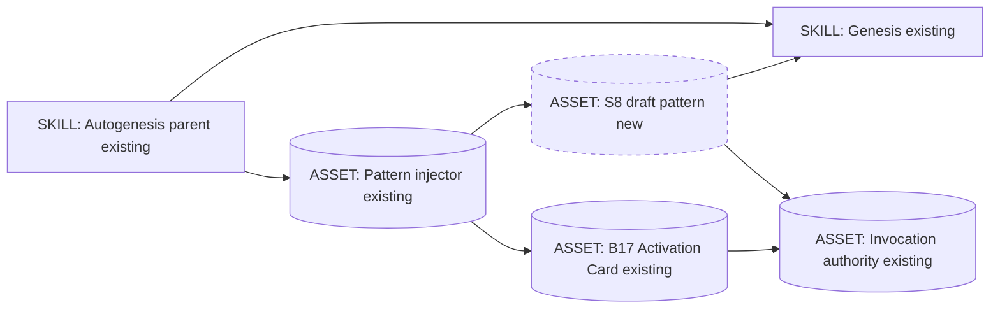
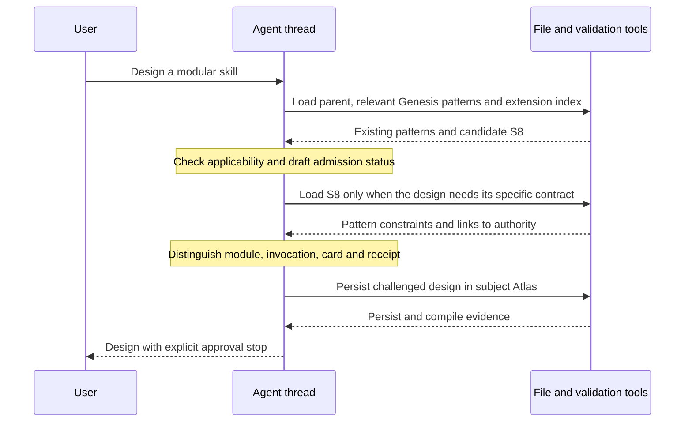
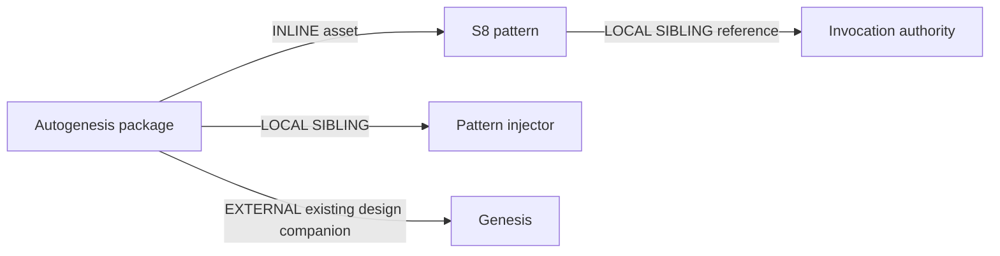

# Parent-routed Skill Module

**Approved for implementation:** user approval received on 2026-09-11 at
15:05 +01:00. Approval covers the draft pattern and bounded integration below,
not active admission, publication, global installation or release.

The user requested a new pattern under Genesis discipline, hosted inside
Autogenesis. This packet follows the locally implemented v0.5.0 module cutover;
it neither reopens that implementation nor declares its pending acceptance
complete. The installed Autogenesis v0.4.3 design procedure governs this Run.

## Genesis Artifacts

### Intent, scope and non-goals

Make parent-routed skill composition a named, selectable structural pattern
when a skill has distinct procedures but should retain one public identity,
one release boundary and parent-owned invocation context. Host the pattern
as an Autogenesis extension; keep Genesis read-only and authoritative for its
primitive taxonomy and existing patterns.

Non-goals: a new skill or runtime module, a new dispatcher or security sandbox,
mandatory decomposition of simple skills, automatic thread spawning, separate
module releases, another request schema, changing B17's identity, global
installation, upstream Genesis edits, or release operations.

### Component diagram



### Thread / sequence diagram



No subagent is implied by a module read. This design adds no child thread.
The agent follows loaded instructions; tools perform actual reads and writes.

### Dependency graph and composition



| Box | Mode | Audience / rationale |
|---|---|---|
| S8 pattern resource | INLINE asset in patterns support | Human-readable reference; normal prose; no new catalogue skill |
| Pattern injector | LOCAL SIBLING, existing | Agent-consumed selection index; small status-labelled entry |
| Invocation authority | LOCAL SIBLING, existing | Single process owner; referenced, never copied |
| B17 Activation Card | INLINE existing pattern asset | Complementary visible request interface; stays active |
| Genesis | EXTERNAL existing design companion | Read-only foundation; existing substrate loader and use-site probe |

No new external dependency is introduced. Existing companion discovery and
full-body loading stay mandatory; this pattern does not change manifests,
dependency pins or lockfiles. Common file-read/write and validation affordances
are sufficient. Declared target: common-only, with deployment/discovery claims
limited to independently observed hosts.

### Interface sketch

Proposed host file:
`references/modules/patterns/references/parent-routed-skill-module.md`.
This is a passive pattern resource, **not** another SKILL.md entrypoint.

| Field | Proposed design |
|---|---|
| Display name | S8. PARENT-ROUTED SKILL MODULE |
| Scoped identity | autogenesis:S8; not a reservation in upstream Genesis |
| Stable resource id | parent-routed-skill-module |
| Category | Structural / Composition |
| Initial status | draft |
| Classical analog | Private package namespace with explicit callable interfaces |
| Selection mode | Parent-selected only; no harness catalogue trigger |
| Inputs to selection | Skill design, decomposition need, ownership/release boundary, evidence |
| Output | Applicability decision, module boundaries and referenced invocation contract |
| Authority | Genesis composition; Agent Skills container format; parent's protocol |

Selection-description sketch:
"Use this pattern when designing several cohesive procedures behind one skill
identity, with private module routing and shared context ownership. Do not use
it merely to split a short procedure or to package independently released skills."

The eventual body follows the existing pattern template: Context, Problem,
Solution, Consequences, Known uses, Related patterns and Sketch. It also
includes explicit Applicability, Invariants and Anti-patterns sections.
This packet is the design/interface sketch, not the finished pattern body.

### Proposed reusable contract

1. One parent is the public catalogue identity and distribution/version owner.
2. A skill module is a cohesive procedure under
   `<skill_root>/references/modules/<module>/SKILL.md`, optionally with local
   `references/`. Its name matches its directory; metadata is namespaced and
   string-valued. This is a container convention, not a new primitive taxonomy.
3. The parent registry resolves the module and reads its entrypoint explicitly.
   No child name is independently discovered as a root skill.
4. Arguments are explicit; protected context belongs to the parent. Children
   cannot grant themselves approval, switch subjects or choose another store.
5. An operation is a primary procedure; a support procedure serves the current
   operation and returns to its caller. Neither role implies a separate thread.
6. Each module resolves local references from its own root, shared references
   from the parent root, and siblings through the registry, never through cwd.
7. Invocation, receipts and failure/retry policy are owned by one parent
   contract. The pattern references that contract rather than redefining it.
8. Activation Card is a view of a request, not the module, call result,
   execution evidence or approval.
9. Modules inherit distribution and dependency ownership. Independent consumers
   or release cadence trigger reevaluation as an external Genesis module.
10. This is instruction-level encapsulation, not an enforced security boundary
    or context isolation. Platform capabilities must be observed, not assumed.

For Autogenesis, the existing `autogenesis-parent` / `autogenesis-role`
metadata and invocation authority realize this contract. Other adopting skills
must declare their own namespaced metadata and protocol ownership; they must
not copy Autogenesis-specific schema IDs, work IDs or store identities.

## Catalogue Review

Refactor triggers were considered first: R1 SPLIT applies to genuinely separate
procedures/fragment callers, not every short body; R3 EXTRACT keeps the shared
protocol outside leaves; R4 INLINE rules out a one-reference forwarding stub.
R2 FUSE remains the alternative when leaves are tiny and always co-invoked.

This is a Tier-2 structural pattern, not a new Tier-3 workflow topology.
No panel, saga or reconciliation loop is introduced. Parent workflows may
independently use an existing Tier-3 topology.

| Existing pattern | Relationship | What S8 adds or does not replace |
|---|---|---|
| S1 COMPOSED MODULE | uses / refines | A private leaf namespace and a fixed parent-owned invocation boundary |
| S3 ORCHESTRATOR FACADE | uses | One public identity without independently exported leaf skills |
| C1 LAZY ASSET / S5 LAZY PROXY | uses | Callable procedure entrypoints, not just passive knowledge |
| B2 CONDITIONAL DISPATCH | uses | Registry-based selection within the parent rather than root discovery |
| S4 VALIDATION DECORATOR | uses | Existing deterministic conformance checks remain authoritative evidence |
| B4 PLAN MEMENTO / B8 ATTENTION ANCHOR | uses | This persisted packet and explicit context re-anchoring |
| B17 ACTIVATION CARD | complements | Visible request interface; remains active and unchanged in identity |

**Delta-only admission rationale:** composing S1/S3/C1 supplies mechanisms,
but does not itself require private skill-shaped leaf entrypoints, no leaf
catalogue export, parent-owned protected context, or shared release ownership.
S8 names that constrained contract, not the generic idea of modularity.
If later evidence shows this named contract adds no reliable design value,
revise or withdraw the draft rather than promote an overlapping catalogue.

Genesis uses **module** for a distribution unit. This extension consistently
uses **skill module** for an internal procedure and **distribution module**
when discussing Genesis's packaging concept. Do not redefine upstream terms.

Inherited anti-patterns: HIDDEN COUPLING, STUB ORCHESTRATION, EAGER BLOAT,
DISPATCH COLLISION, PREMATURE SPLIT, HIDDEN EXTERNAL and BUNDLE LEAKAGE.
The facade earns its place by owning selection and context/gates, not merely
forwarding to another file. Existing repository scenario placement is outside
this pattern change; it is not a recommendation to publish maintainer-only
fixtures in every adopting skill.

## Challenge and pinned decisions

Grounding: read-only searches and reads of Genesis's current local catalogues
and live Agent Skills specification/description guidance on 2026-09-11.
This was one integrated design challenge, not an independent panel.

| Counter / source | Severity | Pin / disposition |
|---|---|---|
| S1/S3 already cover the mechanics; a new label could duplicate the catalogue | high | Accept the objection; admit only the private callable-leaf contract as a draft delta |
| Genesis composition substrate defines module as distribution | high | Qualify "skill module"; preserve the upstream ontology |
| Agent Skills metadata does not guarantee nested files stay out of every host catalogue | high | No universal discovery claim; require deployed asset and actual host-discovery evidence |
| R1 PREMATURE SPLIT and C1 EAGER BLOAT can increase routing/context cost | medium | Require an applicability reason; lazy-load only the selected pattern/module |
| Cards and same-thread reads can be mistaken for execution or isolation | high | Keep B17 request-only; retain tool-backed receipt evidence and explicit no-isolation statement |

Authoritative external sources:
- https://agentskills.io/specification
- https://agentskills.io/skill-creation/optimizing-descriptions

The live spec permits additional directories and defines container fields; it
does not define this parent-routing convention. Its <5000-token guidance is
a recommendation, not proof of rejection or discovery behavior. Genesis's own
body budget remains the authoring discipline. Avoid recursive module nesting
and deep reference chains; parent registry points directly to each entrypoint.

## Cost note

Stance: balanced with the prior cost-aware delegation preference; no monetary
cap supplied. This bounded design uses the current coordinator only.
Implementation is a small direct editing/checking pass, not one agent per file.
No new model invocation or tool surface is added by the pattern itself.

Qualitative contract: pattern entry is small; pattern body is lazy and bounded
to roughly 1000 tokens as an authoring target. A trivial unrelated design
should load no pattern body; a relevant known-module design loads one; a large
skill redesign reuses that same reference and loads only needed leaves.
These are budgets, not measured token savings. Dollar ranges remain unpriced
without verified account/harness rates; no fabricated savings claim is allowed.

Per-spawn declarations, SPAWN_BRIEFS and RECEIPT_SCHEMAS: empty, no spawns.
EXTERNAL_ARTIFACT_SPEC: this packet and eventual pattern use normal prose.
HUMAN_RATIONALE: a common name helps authors discuss and select the specific
ownership boundary without conflating package layout, invocation and visibility.

## Implementation handoff, after approval

1. Add the draft pattern asset; use the existing template, not a new skill.
2. Update `references/modules/patterns/SKILL.md`: replace "Sole remaining
   pattern" with an extension index, keep B17 active, add scoped S8 draft, and
   distinguish discovery of a draft from automatic application/promotion.
   Generalise known-use recording by selected pattern without changing B17.
3. Update design/initialise/review-package selection guidance. Make S8 visible
   on relevant composition work; require an applicability/admission note.
   Preserve explicit approval, confirmed initialise fusion and all existing
   gates. No blind module scaffolding from merely selecting the pattern.
4. Add pattern contract regression tests in `scripts/test_module_contract.py`;
   extend source checking in `scripts/module_contract.py` only as needed.
   Do not weaken the 21-module count: this is a new asset, not module 22.
5. Add the two scenario suites drafted below and extend suite-index selection
   plus exact expected counts: 13 current, 12 historical, 25 total, with all
   existing 23 YAML bodies unchanged. Preserve all nine successor mappings.
6. Review/update AGENTS.md, README.md, CONTRIBUTING.md and CHANGELOG.md for
   draft status and usage. Keep the unreleased 0.5.0 identity; no release action.
7. Run targeted existing checks, full local suite, source audit and consumer
   asset/replay checks; final GitHub CI remains required. Record actual results,
   not a pass copied from the earlier cutover. Compile the subject memory.

Dependency order: pattern asset -> injector -> callers -> checks/scenarios/docs
-> local evidence -> final CI/behavioural acceptance -> explicit active-admission
decision after repeated known-use evidence. Draft implementation approval does
not grant active status or publication.

## Acceptance

- S8 is visibly an Autogenesis-owned structural draft with one canonical asset.
- Its delta, qualified terminology, when-not-to-use guidance and B17 separation
  are explicit. Genesis files, installed/global skills and dependency pins do
  not change.
- Root catalogue exports and runtime module inventory remain one and 21.
- No duplicated invocation schema, independent child manifest or implicit spawn.
- Relevant design/initialise/review flows can find the candidate; simple and
  independently released-skill cases can reject its applicability.
- Existing approvals, card modes, Atlas ownership, retry limits and historical
  evidence are preserved.
- New known-use entries cite observed outcomes; the Autogenesis cutover is one
  experimental application, not 21 independent adoptions or completed live evals.

## Behavioural contract (agent-spec)

deferred: agent-spec is not available in this session. No Gherkin or b- IDs
are authored. Critical families: private export boundary, context ownership,
request-only visibility, no auto-promotion and no premature split.

## Evaluation plan

Deterministic first: implement the three planned test methods below, checking
both positive cases and explicit negative mutations. Existing consumer checks
must retain the new asset and still reject extra owned exports. Check Genesis
and historical suites for zero source changes. Synthetic traces and source
checks are not live behavior evidence.

### Full adversarial suite draft

```yaml
id: skill-module-pattern-adversarial-v1
kind: skill-discipline
version: "1"
work_id: 2026-09-11-parent-routed-skill-module-pattern
adversarial: true
packages:
  - id: subject
    root: "<candidate-root>"
    mode: mount
project:
  seed_knowledge: []
smokes:
  - id: draft-admission-and-ontology
    source: "Genesis S1/S3 and composition-substrate MODULE; existing pattern admission"
    cmd: |
      cd "$PKG_subject" &&
      PYTHONPATH=scripts python3 -m unittest test_module_contract.ModuleContractTests.test_skill_module_pattern_admission &&
      printf '{"ok":true}\n'
    expect: {ok: true}
  - id: ownership-and-no-false-authority
    source: "Agent Skills specification; B17 and Autogenesis protected invocation context"
    cmd: |
      cd "$PKG_subject" &&
      PYTHONPATH=scripts python3 -m unittest test_module_contract.ModuleContractTests.test_skill_module_pattern_boundaries &&
      printf '{"ok":true}\n'
    expect: {ok: true}
  - id: no-premature-split
    source: "Genesis R1 PREMATURE SPLIT and C1 EAGER BLOAT"
    cmd: |
      cd "$PKG_subject" &&
      PYTHONPATH=scripts python3 -m unittest test_module_contract.ModuleContractTests.test_skill_module_pattern_selection &&
      printf '{"ok":true}\n'
    expect: {ok: true}
```

### Full happy-path suite draft

```yaml
id: skill-module-pattern-happy-v1
kind: skill-discipline
version: "1"
work_id: 2026-09-11-parent-routed-skill-module-pattern
adversarial: false
packages:
  - id: subject
    root: "<candidate-root>"
    mode: mount
project:
  seed_knowledge: []
smokes:
  - id: valid-pattern-and-selection
    source: "Approved pattern interface, registry and parent-selected applicability"
    cmd: |
      cd "$PKG_subject" &&
      python3 scripts/module_contract.py source --root . &&
      PYTHONPATH=scripts python3 -m unittest test_module_contract.ModuleContractTests.test_skill_module_pattern_selection &&
      printf '{"ok":true}\n'
    expect: {ok: true}
```

The named tests do not exist yet; these are executable-shape design drafts,
not claimed runs. Both positive selection and negative near-miss cases belong
in the selection test; source assertions alone do not prove agent selection.

### Content / real-task evaluations

Run the same three tasks with the existing candidate skill but S8 unavailable,
then with S8 available; capture outputs and actual reads/actions.

| Prompt | Expected outcome / value criterion |
|---|---|
| Design a skill with separate import, inspect and report procedures but one public entrypoint | Parent registry, coherent skill-shaped leaves, explicit context and no leaf exports |
| Design a short single-purpose text formatting skill | No unjustified module decomposition; explain non-applicability |
| Design procedures owned by separate teams with independent releases | Choose external distribution modules rather than hiding them as private leaves |

Compare boundary violations and design omissions, not prose fluency. Use the
first as a disposable real design exercise, without production implementation.
If outputs are indistinguishable, revise or withdraw the claimed pattern delta.
Construct/live task availability was blocked during the preceding work; do not
claim it restored or evaluated here. Final CI does not automatically run these
model exercises.

### Fixed selection-query set

This tests selection of a passive pattern by its parent, not standalone harness
discovery. No new root description is introduced.

| Split | Should select S8 | Query |
|---|---|---|
| train | yes | Keep import and export behind one skill name. |
| train | yes | Give a skill private callable procedures with local references. |
| train | yes | Split a large skill without creating new catalogue entries. |
| train | yes | Preserve subject context across internal support procedures. |
| train | yes | Design one skill with operation and support roles. |
| train | yes | Give internal procedures explicit arguments but one release owner. |
| train | no | Fix a typo in a README. |
| train | no | Explain Python import syntax. |
| train | no | Change only the colour of an activation card. |
| train | no | Package independently versioned skills for separate teams. |
| train | no | Run an existing unit test. |
| train | no | Write one short formatting procedure. |
| validation | yes | Several workflows need one public agent capability and private helpers. |
| validation | yes | Keep helper entrypoints out of the root skill catalogue. |
| validation | yes | Structure a skill so the parent controls all invocation context. |
| validation | yes | Reorganise task-specific instructions into cohesive local callable units. |
| validation | no | Publish an independent plugin release. |
| validation | no | Rename a database module. |
| validation | no | Show an execution receipt for an existing invocation. |
| validation | no | Design fan-out across already independent peer skills. |

Held-out gate: positive recall >=0.5, false-positive rate <0.5. Do not tune on
validation prompts or report scores without execution. Repeated observed use
is required separately for draft-to-active promotion.

## Design receipt and approval stop

C1: non-trivial overlap and distribution-ontology challenges addressed.
C2: high-severity discovery/context counters pinned, not hidden.
C3: visible decisions and admission rule above.
C4: pattern asset + selection integration only; no new engine or external edit.
C5: no product changes in this design Run.
Genesis Artifacts, Catalogue Review, Evaluation plan and explicit agent-spec
deferral are present. Loaded sources include installed Autogenesis design,
workflow discipline, patterns and think-challenge; Genesis; Atlas; OKF;
and the relevant Genesis catalogues/container sources cited above.

This design Run stopped for approval here. The subsequent approval recorded
at the top satisfies that stop for draft implementation only. See the
[implementation experience](../experiences/2026-09-11-skill-module-pattern-implementation.md)
for completed local work and pending final acceptance.
