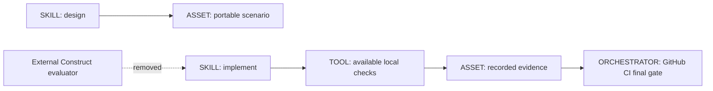
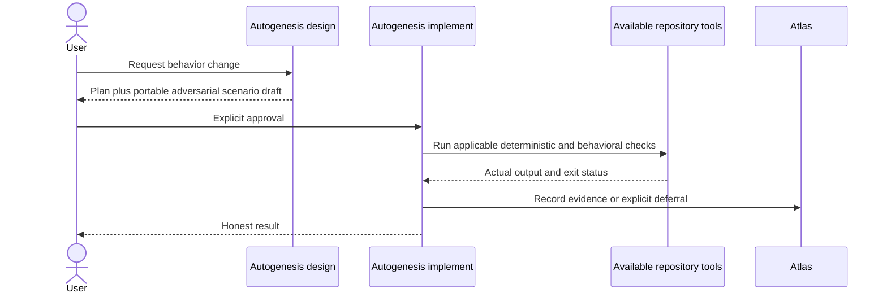
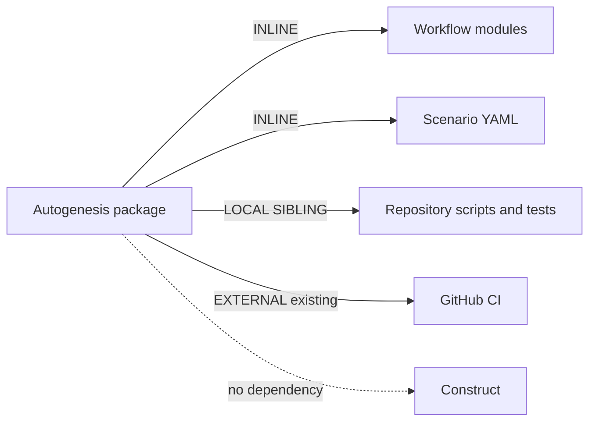

# Remove Construct from the Autogenesis runtime contract

**Implemented locally.** The user selected "Approve implementation" after
reviewing this persisted packet. The user decided that Autogenesis must not
bind to Construct because that evaluator will not be open sourced in the
foreseeable future. The approved cutover is recorded in
`../experiences/2026-09-11-evaluator-decoupling-implementation.md`.

## Genesis Artifacts

### Intent, scope and non-goals

Autogenesis should design, implement and assess changes without requiring an
unavailable external evaluator. Keep portable scenario files as repository
acceptance specifications, execute deterministic checks with available tools,
record honest evidence, and retain GitHub CI as the final release gate.

Scope:

- Remove live Construct language and obligations from the root router,
  workflow discipline, design, implement, challenge guidance and work template.
- Remove `construct_eval`, `construct_report` and `construct_scenario` from
  future Autogenesis-authored records and templates.
- Replace the current Construct-specific scenario with
  `autogenesis-adversarial-v4.yaml`; move v3 to historical through the existing
  additive successor policy.
- Align the source-contract constants/tests and current documentation.
- Update the instruction-first work from acceptance-deferred to locally done
  once its only missing local gate is no longer part of Autogenesis.

Non-goals:

- Delete or rewrite historical scenarios, plans, decisions or experiences.
- Remove generic words such as “constructive” that do not name the product.
- Introduce another evaluator, scenario runner, service or hidden dependency.
- Weaken approval, real-outcome evidence, deterministic checks, Atlas lineage,
  source audit, consumer validation or GitHub CI.
- Fix the separately reviewed ownership-ledger traversal defect.

### Components

### Sequence

### Dependency graph and composition

| Box | Composition | Rationale |
|---|---|---|
| Workflow wording | INLINE | Unique to Autogenesis's own discipline |
| Scenario YAML | INLINE | Portable acceptance specification already shipped |
| Source/tests | LOCAL SIBLING | Maintainer-side deterministic verification |
| GitHub CI | Existing repository workflow | Established final release gate |
| Construct | Removed | Unavailable private evaluator cannot be a public runtime dependency |

External modules required: none. Declared target: common-only. Invocation mode:
Autogenesis remains BOTH; no new module or dispatch surface.

### Interface sketch

| Surface | Revised contract |
|---|---|
| Design | Emit a portable adversarial scenario draft, not a Construct scenario |
| Implement | Run applicable scenario commands/checks using available tools; record actual evidence or a precise deferral |
| Workflow lineage | Require `work_id`, `implements`, `closes`, `plan_path`; evaluation details live in the evidence body |
| Work template | Optional generic `scenario_ref` and `evaluation_evidence`; no evaluator-specific fields |
| Current scenario index | v4 current, v3 historical, successor chain preserved |
| Release | Repository checks and GitHub CI remain authoritative |

### Cost stance

Frugal. No new model calls, dependencies, services or scripts. Removing a dead
external gate reduces failed invocations and operator ambiguity. Existing
checks run only when applicable. No cost saving is quantified.

### Acceptance

- No case-insensitive `construct` product reference remains in live root,
  module, or shared-template instructions. The current diagnostic scenario may
  name the removed dependency only in provenance and in the assertion that
  verifies those live surfaces remain decoupled.
- Historical scenarios and Atlas records remain byte-preserved except for new
  forward links/status notes.
- Design still requires a non-empty, source-named adversarial scenario for
  behavioral work.
- Implement still cannot claim success from prose: applicable commands must
  run and actual evidence or a precise deferral must be recorded.
- Current suite selection points to v4 and preserves v3 as history.
- Full tests, source inventory, source audit and both consumer profiles pass.
- GitHub CI remains the final release gate.

## Catalogue Review

Genesis R4 INLINE applies to the obsolete evaluator boundary: it is a thin
external dependency whose required implementation is unavailable. A9
SUPERVISED EXECUTION and S7 DETERMINISTIC TOOL BRIDGE remain: consequential
claims still cross real available tools. B4 PLAN MEMENTO and B8 ATTENTION
ANCHOR preserve this packet and its approved scenario.

Composition mode is INLINE/LOCAL SIBLING with the existing GitHub workflow.
No new pattern is introduced. S8 is not applicable to this dependency removal;
`pattern_applicability: not-applicable`, because module topology does not
change. `pattern_admission: not-selected`.

Inherited anti-patterns:

- **PHANTOM DEPENDENCY:** retaining a required evaluator consumers cannot get.
- **TOOLLESS ASSERTION:** removing Construct must not turn checks into prose.
- **BUNDLE LEAKAGE:** do not ship private evaluator assumptions in public skill
  instructions or current fixtures.

## Challenge and pinned decisions

| Counter | Severity | Resolution |
|---|---|---|
| Removing Construct could weaken evaluation | High | Accept and pin direct deterministic commands, repository checks and GitHub CI; no prose-only completion |
| Rewriting history would erase provenance | High | Reject history deletion; old scenarios and Atlas pages remain historical evidence |
| Replacing it immediately with another framework repeats the coupling | Medium | Accept; introduce no evaluator or runner |
| Generic evaluation fields could recreate unnecessary protocol | Medium | Keep evidence in prose; only optional neutral work-template links remain |

C1-C5: non-trivial counters addressed; high-severity risks pinned; scope is
bounded; this design makes no product edits.

## Behavioural contract (agent-spec)

Deferred: this is a removal of a private evaluator dependency. The portable
scenario below and existing repository contracts provide deterministic
acceptance without introducing new Gherkin or an external behavioral tool.

## Evaluation plan

1. Add `autogenesis-adversarial-v4.yaml` as a successor to v3. It checks:
   - live root/modules/templates contain no Construct product binding;
   - design requires a portable non-empty adversarial scenario;
   - implement requires actual applicable commands and evidence/deferral;
   - current suite index selects v4 and keeps v3 historical.
2. Run existing source/module tests and the source contract.
3. Run release metadata, dependency, store and source-audit checks.
4. Run both existing APM consumer profiles.
5. Leave final GitHub CI pending; do not fabricate remote acceptance.

## Implementation handoff

1. Update root/module/template wording and matching root registry stub.
2. Add v4 scenario; update suite index and frozen source expectations.
3. Update docs and Unreleased changelog.
4. Update current work/experience status without rewriting historical claims.
5. Run the acceptance plan and persist exact evidence.

No subagents are planned; the contract is tightly coupled and one editor avoids
conflicting terminology edits.
