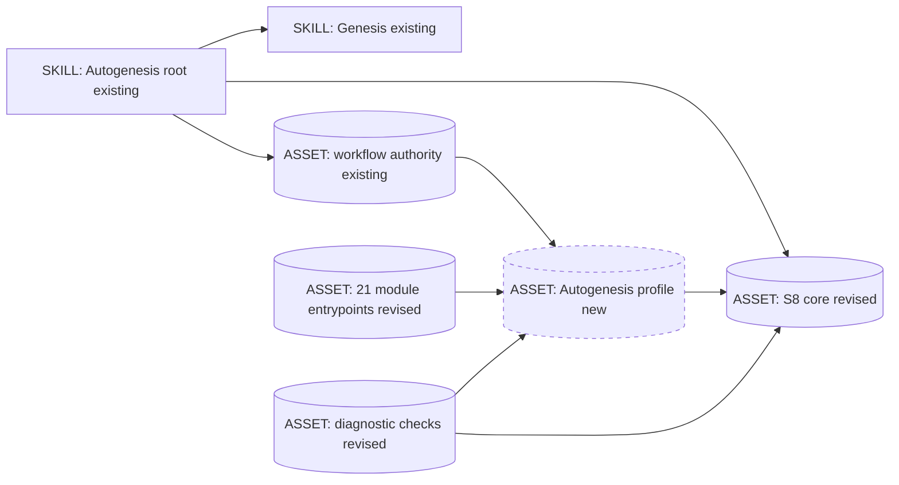
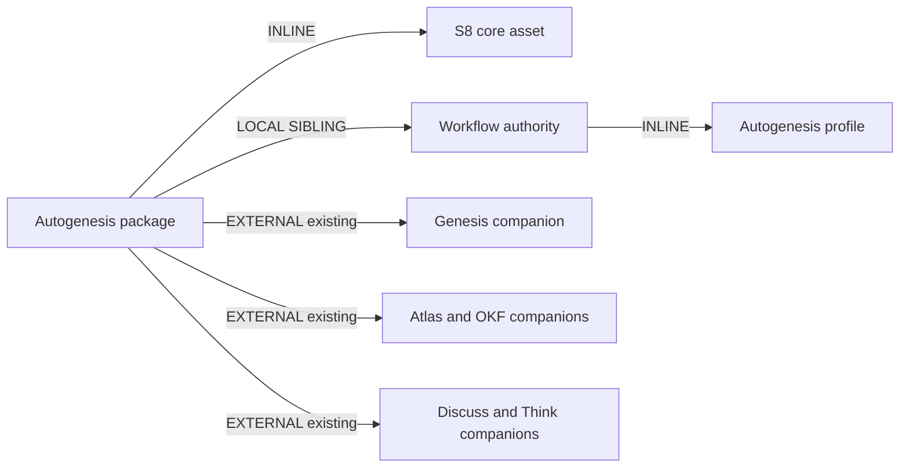

# S8 portable core and self-application

**Historical proposal; not the current implementation candidate.** Replaced by
[Instruction-first modules for derived skills](2026-09-11-instruction-first-skill-modules.md)
after the user clarified the simplification scope. The detailed proposal below
is retained as history; do not execute its tasks or future test selectors.

The user selected "Yes - use core + profile for the formal self-application
design" after reviewing the diagnostic. That decision approves the separation,
not an unwritten implementation, active-pattern promotion or release.

## Genesis Artifacts

### Intent, scope and non-goals

Make S8 a useful, portable contract for cohesive private procedures and apply
it to Autogenesis's existing modules. Trigger: authors need multiple internal
procedures behind one public skill, rather than independent distributions.
Separate container conformance, callable semantics, deployment and observed
execution. Address D1-D8 in the linked diagnostic; neither today's prose nor
today's green checker is the oracle.

Non-goals: a new runtime engine, sandbox, scheduler or public skill; mandatory
Atlas for other S8 adopters; universal operation/support roles; splitting or
merging solely to change the number 21; changing Genesis or installed global
skills; restoring legacy aliases; changing dependency pins, store gitlink,
tags, settings or releases.

### Component diagram



### Execution and thread diagram

```mermaid
sequenceDiagram
    participant U as User
    participant C as Coordinator
    participant A as Scoped implementer
    participant T as Tools
    U->>C: Approve persisted implementation plan
    C->>T: Establish baseline and authoritative profile
    C->>A: Bounded source or checker slice
    A-->>C: Changes and evidence
    Note over C,A: One writer per file; no overlapping ownership
    C->>T: Validate independent positive and negative cases
    C->>T: Compare actual source, export and observed behavior
    C-->>U: Evidence-tiered result and remaining gates
```

These are implementation-work threads, not threads created by S8 module reads.
Runtime modules remain agent-followed instructions in the caller's context.

### Composition and dependency graph



| Artifact | Composition | Audience / load boundary |
|---|---|---|
| S8 core resource | INLINE in patterns support | External readable reference, loaded for applicable composition |
| Profile prose | INLINE in workflow discipline | Readable application rules; not copied into S8 core |
| Module interface inventory | Existing workflow JSON authority, extended | Structured authoring data; select one module rather than dumping all 21 into context |
| Module entrypoints | Existing local siblings | Agent instructions; bind declared inputs to procedure and results |
| Conformance cases and test helpers | Contributor-owned code | Executed by existing test tooling, not root catalogue entries |

Declared target: common-only instruction design. Actual deployment/discovery
claims remain specific to observed hosts. No new external skill dependency.
Existing external companions retain their protocols. At every external load:
resolve by catalogue name, load the full body, follow it and perform required
live calls; never substitute remembered text.

### Interface and authority decisions

1. Keep S8 at
   `references/modules/patterns/references/parent-routed-skill-module.md`,
   identity `autogenesis:S8`, draft status, pattern version `0.2`.
2. S8 owns rules S8-01 through S8-10 from the diagnostic: identity, cohesion,
   interface, effects, context, composition, resources, evidence, distribution
   and admission. It names obligations, not Autogenesis field names.
3. Add `references/modules/workflow-discipline/references/module-profile.md`
   for this application's mapping. Workflow discipline remains the owner,
   not a 22nd runtime module.
4. Extend the existing `invocation-contract.json` with `module_interfaces`.
   Advance its inventory schema to `autogenesis.invocation-contract/v2`.
   Retain request/receipt/trace v1 envelopes and existing argument names;
   this source-inventory revision is not a parallel request protocol.
5. Each interface record describes argument constraints/bindings, required
   context, allowed effects, result/postconditions, failure classes, dependencies
   and evidence requirements. Its argument set must equal the existing
   required/optional inventory. No hand-maintained second module registry.
6. Entry bodies contain an explicit contract reference plus usable bindings,
   prerequisites, procedure, outputs and failure guidance. They must not
   become forwarding stubs or copy the entire inventory. A stripped-body
   mutation must fail even when metadata and argument names survive.
7. Reuse the existing checker for source and trace diagnostics. If selected
   interface extraction is needed, add a read-only `interface --module NAME`
   command to that script: structured stdout, errors on stderr, no invocation
   or execution capability. Do not add a dispatcher.

Semantic constraints may include domain data that is intentionally flexible;
do not invent overly restrictive types merely to make lint easy. They must
still specify what that data means and how the procedure consumes it. Explicit
empty/default handling and negative boundary cases are required.

### Autogenesis profile

| Concern | Design decision |
|---|---|
| Existing inventory | Retain 12 operations and nine supports for this change; all-21 assessment in diagnostic is the binding scope |
| Arguments | Preserve current names; document accepted shapes, unresolved values and actual bindings |
| Protected context | Preserve seven parent-owned fields; read-only reference/target roots are distinct local variables |
| Effects | Declare read-only, subject-memory write, product write and external/wiring effects per action; support is not synonymous with read-only |
| Results | Module-specific caller-consumable outputs inside existing receipt.result; shared receipt is not a substitute for postconditions |
| Failure | Invalid input rejects; missing prerequisite blocks; executed failure records actual history; no success-shaped defaults |
| Retries | Preserve immediate-caller ownership and two-attempt ceiling; no replay/renaming resets |
| Cards | B17 remains a request projection; off/debug behavior and redaction unchanged |
| Review applicability | Generic review first; S8-specific assertions only for an adopted/applicable private-module topology |
| Initialise | Preserve confirmed full fusion; explicitly describe it as this profile, not an obligation imposed by portable S8 |
| Work hub | One canonical subject hub at autogenesis/work/<work_id>.md; external handoff receives that identity |
| Known uses | Runtime capture goes to subject Atlas; package catalogue curation requires approved source modification |

Outputs must be concrete: design/initialise return their persisted plan and
approval disposition; research returns sourced answer/capture references;
reflect-challenge returns an unverified behavior record; learn-skill returns
a reliance record; reevaluate returns proposals; review facets return their
reports; think supports return counters/clarification/capture results; effects
modules return the actual changed artifacts, scope and evidence. Keep the
existing atlas-migrate result details rather than replacing them with a generic
"done". Add explicit no-change and blocked outcomes where those are legitimate.

### Operation handoff rule

Private support calls may nest and return. A change of active operation is a
root-owned handoff, not a direct operation-child call. Align prose, examples
and validation to that one convention, including design/discuss/design and
approved design-to-implement.

Use existing result/evidence fields to describe the proposed next operation,
work/artifact continuity and the prior operation's disposition. Root dispatch
must observe the required prior outcome before issuing the next request.
An incomplete or blocked operation is not retroactively marked completed.

For chaining pre-review, perform the required review before issuing the
implement request. If implement discovers it missing, block without product
effects and return the missing prerequisite; do not silently call another
operation. A fresh explicitly authorized continuation after changed
prerequisites is not an automatic retry. Record the changed prerequisite and
authorization; never fabricate a new identity to repeat the same failed work.

Do not add a persistent scheduler or implicit resume engine. Positive traces
must demonstrate the legal root-owned sequence; negative traces must reject
direct operation children, unauthorized continuation and retry amplification.
Update the old direct-edge fixtures rather than maintaining two conventions.

### Resource and audience policy

Executable references state their base and load condition: module-local,
parent-shared, registry sibling, or externally resolved. Inherited context
never doubles as a local scratch variable.

Classify exported assets by actual consumer. Current self-evaluation resources
may be runtime dependencies; historical/deprecated fixtures are not assumed
to be so. Before moving or excluding anything, demonstrate the actual APM
0.30.0 export behavior in a disposable consumer. Preserve historical content
byte-for-byte and update links/indexes if an approved relocation is necessary.

Do not infer exclusion from a folder name. If separating contributor assets
requires a different package architecture, manifest dependency change or
unsupported adapter mechanism, stop for a design amendment. The one private
root-skill boundary is not negotiable inside this plan.

## Catalogue Review

R1/R2: retain genuine procedure boundaries, no forced split/fusion.
R3: extract application-specific rules from the portable pattern.
S1 COMPOSED MODULE and S3 ORCHESTRATOR FACADE supply composition and identity.
S8 adds private callable ownership/contracts, not a new primitive taxonomy.
C1 LAZY ASSET keeps profile data out of unrelated calls.
B2 CONDITIONAL DISPATCH controls applicability.
A9 SUPERVISED EXECUTION applies in its contractual developer-session form:
actual tools do writes/checks, not prose; this is not a security sandbox.
B4 PLAN MEMENTO and B8 ATTENTION ANCHOR require reloading this packet at each
phase and before/after delegation.

Autogenesis extensions: B17 active and complementary; S8 draft, applicable to
this migration. Composition mode: EXTENSION with local profile assets.
Inherited anti-patterns: HIDDEN COUPLING, STUB ORCHESTRATION, PREMATURE SPLIT,
FORCED FUSION, EAGER BLOAT, BUNDLE LEAKAGE and WRITE-ONCE-NEVER-READ.

## Challenge and pinned decisions

Grounding included two live searches (static skill validation limits; design
by contract) and direct first-party reads:

- https://agentskills.io/specification
- https://agentskills.io/skill-creation/optimizing-descriptions
- https://www.eiffel.org/doc/eiffel/ET-_Design_by_Contract_%28tm%29%2C_Assertions_and_Exceptions

| Counter | Severity | Pin |
|---|---|---|
| A ten-rule pattern could just repackage generic composition and contracts | High | Keep private callable boundary as the delta; draft promotion requires observed value, not rule count |
| A schema can become another green-but-empty proxy | High | Independent mutations, real output/effect assertions and live evaluation remain separate gates |
| Core/profile layering could double prompt size and duplicate authority | Medium | One owner, one machine inventory, selected-module loading; no compulsory extra files per leaf |
| Fixing handoffs by allowing all operation edges defeats the parent boundary | High | One root-owned handoff convention, negative escalation/retry tests |
| Bundle cleanup can remove real runtime evaluation dependencies | High | Actual-consumer classification and export probe before any move/exclusion |
| Portable S8 could inherit Eiffel guarantees or require a runtime type system | High | Borrow obligation/guarantee concepts only; explicit agent/tool enforcement limits |

A search synthesis suggested build-time-only skill composition. That claim
is not adopted: the directly fetched Agent Skills specification supports
on-demand resources and does not impose such a restriction. Search summaries
are not normative authority.

C1: substantial overlap/evidence/overengineering counters considered.
C2: all high counters have explicit pins. C3: pins visible.
C4: bounded to S8 and this application's profile/diagnostics.
C5: no product implementation in this design.

## Implementation order and ownership

1. **Baseline and evidence map:** snapshot existing source/scenario hashes;
   retain 71-test baseline; map D1-D8 to tests. Inspect current scenario command
   shape and actual export metadata. Record unknown adapter semantics, not guesses.
2. **Core and profile:** coordinator authors S8 revision, profile and authoritative
   interface inventory; freezes the contract slice before delegation.
3. **Bind all modules:** update the 21 entrypoints and matching root rows,
   action-specific effects, reference roots, hub identity and handoff wording.
4. **Diagnostics:** fix unknown-module crash and container constraints; validate
   minimum callable interfaces, profile-aware applicability, semantic traces and
   actual current-suite shape. Preserve the original protection tests.
5. **Evidence wiring:** version affected scenario suites; keep prior bodies;
   validate selected smokes and their claim-to-test mapping. Add deterministic
   positive/adversarial execution to the existing test/CI route, not a new agent
   service. No silent skips when a runner/parser is missing.
6. **Integration:** update AGENTS, README, CONTRIBUTING and Unreleased CHANGELOG;
   run targeted then integrated checks, both consumer profiles and source audit
   including untracked files. Persist actual outcomes and obtain final CI.

Source scope includes S8, patterns and workflow references; all 21 entrypoints
and root registry; existing checker/consumer tests and scripts; versioned
scenarios/index; the four repository guidance files. CI edits are limited to
deterministic validation wiring, with unchanged permissions/secrets and stable
required-check names. Adapter-sensitive packaging changes require phase-1
evidence. No lock regeneration or dependency-pin change is authorized.

Use existing runners and parsing dependencies where sufficient. If complete
YAML validation lacks an installed parser, document and pin a maintainer-only
parser dependency rather than creating another partial YAML parser or skipping
validation; this does not become an APM runtime dependency.

### Cost and delegation

Stance: balanced with cost-aware delegation; no monetary cap supplied.
Coordinator retains semantics/integration. At most two bounded implementation
workers after the contract is stable, then one read-only review if warranted.
No per-file or per-module agent fan-out.

| Spawn | Role | Audience / tier | Brief / receipt | Model candidate |
|---|---|---|---|---|
| 1 | Mechanical module/doc binding | INTERNAL / IMPLEMENTER | CAVEMAN_FULL / JSON | GPT-5.4-mini |
| 2 | Checker/trace/scenario implementation | INTERNAL / IMPLEMENTER | CAVEMAN_FULL / JSON | GPT-5.4 |
| 3 | Independent settled-diff review | INTERNAL / REVIEWER | CAVEMAN_FULL / JSON | GPT-5.4 |

SPAWN_BRIEFS: each receives its exact file ownership, approved plan slice,
invariants, test commands and escalation boundary. Reload the persisted plan
before and after each spawn. Workers do not own overlapping files.

RECEIPT_SCHEMAS: `{files_changed, contract_ids, commands_run, actual_results,
unresolved, requires_parent_decision}`; reviewer uses
`{findings:[{file,lines,issue,evidence,confidence}], limitations}`.

EXTERNAL_ARTIFACT_SPEC: normal prose for S8, profile, plans, reports and
documentation. HUMAN_RATIONALE: make obligations and evidence inspectable
without turning every instruction into boilerplate or an extra model call.

Runtime budgets: unrelated trivial work loads neither S8 nor the profile;
one-module work loads only its necessary contract slice; repo-wide review may
load all interfaces. Keep S8 near its original roughly 1000-token target and
entrypoints within the inherited body budgets. This is an authoring target,
not measured savings. Model price ordering and dollar ranges are unverified;
no fabricated cost projection. No new runtime model dispatch is introduced.

## Behavioural contract (agent-spec)

deferred: agent-spec is unavailable; no Gherkin or b- IDs are authored.

Critical families: parent ownership, approval/effect boundaries, root-owned
handoffs, canonical write-home, invalid input/result rejection, no false
execution evidence and no automatic active-pattern promotion.

## Evaluation plan

Keep four explicit evidence levels: structural, semantic-contract, deployment/
discovery and live behavior. A structural pass cannot populate another level.
The diagnostic's ten acceptance cases remain required; D1-D8 must map to
specific positive and negative tests, not vocabulary-presence checks alone.

Tests must include a small independent S8 adopter without Atlas/G0-G8, a
legitimate non-S8 single-purpose skill, and Autogenesis. This catches
accidental hard-coding of the application profile into the core.

### Full adversarial scenario draft

```yaml
id: s8-core-profile-adversarial-v1
kind: skill-discipline
version: "1"
work_id: 2026-09-11-s8-core-profile-self-application
adversarial: true
packages:
  - id: subject
    root: "<candidate-root>"
    mode: mount
project:
  seed_knowledge: []
smokes:
  - id: callable-not-empty-shell
    source: "D1; design-by-contract obligations and guarantees"
    cmd: |
      cd "$PKG_subject" &&
      PYTHONPATH=scripts python3 -m unittest test_module_contract.ModuleContractTests.test_s8_callable_contract_negative &&
      printf '{"ok":true}\n'
    expect: {ok: true}
  - id: container-errors-not-crashes
    source: "D2; Agent Skills specification"
    cmd: |
      cd "$PKG_subject" &&
      PYTHONPATH=scripts python3 -m unittest test_module_contract.ModuleContractTests.test_s8_container_boundaries &&
      printf '{"ok":true}\n'
    expect: {ok: true}
  - id: optional-profile-not-universal
    source: "D3; Genesis PREMATURE SPLIT"
    cmd: |
      cd "$PKG_subject" &&
      PYTHONPATH=scripts python3 -m unittest test_module_contract.ModuleContractTests.test_s8_profile_applicability &&
      printf '{"ok":true}\n'
    expect: {ok: true}
  - id: no-silent-operation-jump
    source: "D4; parent routing and retry ownership"
    cmd: |
      cd "$PKG_subject" &&
      PYTHONPATH=scripts python3 -m unittest test_module_contract.ModuleContractTests.test_s8_handoff_negative &&
      printf '{"ok":true}\n'
    expect: {ok: true}
  - id: no-foreign-write-home
    source: "D5; protected context and canonical subject work hub"
    cmd: |
      cd "$PKG_subject" &&
      PYTHONPATH=scripts python3 -m unittest test_module_contract.ModuleContractTests.test_s8_context_and_effect_boundaries &&
      printf '{"ok":true}\n'
    expect: {ok: true}
  - id: no-runtime-catalogue-mutation
    source: "D6; immutable package versus subject memory"
    cmd: |
      cd "$PKG_subject" &&
      PYTHONPATH=scripts python3 -m unittest test_module_contract.ModuleContractTests.test_s8_known_use_effects &&
      printf '{"ok":true}\n'
    expect: {ok: true}
  - id: no-unclassified-payload
    source: "D7; Genesis BUNDLE LEAKAGE"
    cmd: |
      cd "$PKG_subject" &&
      PYTHONPATH=scripts python3 -m unittest test_validate_consumer.ValidateConsumerTests.test_s8_asset_classification &&
      printf '{"ok":true}\n'
    expect: {ok: true}
  - id: no-inert-current-suite
    source: "D8; inert-YAML diagnostic"
    cmd: |
      cd "$PKG_subject" &&
      PYTHONPATH=scripts python3 -m unittest test_module_contract.ModuleContractTests.test_s8_current_scenario_contract &&
      printf '{"ok":true}\n'
    expect: {ok: true}
```

### Full happy-path scenario draft

```yaml
id: s8-core-profile-happy-v1
kind: skill-discipline
version: "1"
work_id: 2026-09-11-s8-core-profile-self-application
adversarial: false
packages:
  - id: subject
    root: "<candidate-root>"
    mode: mount
project:
  seed_knowledge: []
smokes:
  - id: independent-core-and-autogenesis-profile
    source: "S8-01 through S8-10; core/profile separation"
    cmd: |
      cd "$PKG_subject" &&
      PYTHONPATH=scripts python3 -m unittest test_module_contract.ModuleContractTests.test_s8_independent_adopter test_module_contract.ModuleContractTests.test_s8_all_module_interfaces &&
      printf '{"ok":true}\n'
    expect: {ok: true}
  - id: explicit-root-handoffs
    source: "D4; approved parent-owned sequence"
    cmd: |
      cd "$PKG_subject" &&
      PYTHONPATH=scripts python3 -m unittest test_module_contract.ModuleContractTests.test_s8_handoff_positive &&
      printf '{"ok":true}\n'
    expect: {ok: true}
```

These selectors are planned, not existing tests or claimed executions. Bind
them to the actual test class during implementation; do not drop a case.
New smokes may be added. Any changed behavioral expectation needs an explicit
plan amendment rather than weakening a failing assertion.

### Live evaluation and final acceptance

Reuse the prior three paired tasks and the fixed 20-query 12/8 split from
`2026-09-11-parent-routed-skill-module-pattern.md`, adding core/profile
correctness to the rubric. Preserve the held-out split; do not tune on it.
Positive validation recall >=0.5 and false-positive rate <0.5 remain the gate.

The independent adopter must work without Autogenesis's Atlas/gates; the simple
skill must avoid premature decomposition; independent-team releases must stay
external distributions. Use one bounded actual task as the real-task exercise.
Capture actual reads, tools, returned outcomes and effects, not just final prose.

Construct currently fails to import. Diagnose a justified installation only
within the allowed local scope; do not invent a package/version or alter
global consumers. Unavailable Construct/live exercises remain visible blockers
or explicit deferrals, never a fabricated pass. Final GitHub CI remains required.
S8 stays draft even after this implementation; active admission is separate.

## Approval stop

This plan defines the source change boundary and intended standard. It does
not authorize its own implementation. Await explicit approval of this packet.
Any unresolved adapter behavior that changes architecture returns for amendment.

## Design receipt

Installed Autogenesis design/workflow/challenge/patterns were loaded; Genesis
and its relevant references informed the packet; Atlas/OKF own persistence.
No product source was edited. Review findings are linked rather than rewritten
as proven runtime failures. Atlas remember and compile completed successfully.

```text
skill: autogenesis
skill_path: /Users/sergio_sisternes/.agents/skills/autogenesis
subject: autogenesis
path: design
approved: no
atlas_id: github.com/sergio-sisternes-epam/autogenesis-atlas
atlas_root: /Users/sergio_sisternes/work/copilot-worktrees/autogenesis/sergio-sisternes-epam-fictional-system/.atlas/github.com/sergio-sisternes-epam/autogenesis-atlas
nested_skills_loaded: genesis, atlas, okf; internal think-challenge and patterns
substrate_contract: applied
remember: yes
compile: yes
Enter|Change|Exit: pass
disposition: awaiting-approval
```

## Changed files

No product source changed. This design creates its plan/work hub and updates
the diagnostic's decision record, plan/work indexes and structural Atlas log.
