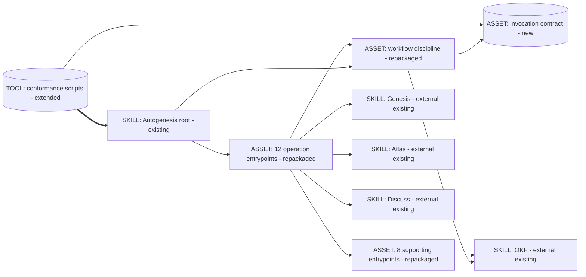
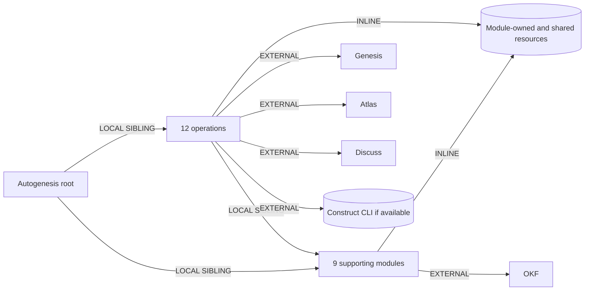

# Skill-shaped modules and invocation discipline

**Approved for bounded implementation.** The user adopted the complete design
as the execution baseline, approved the implementation plan, and explicitly
requested execution on 2026-09-11 at 11:21 +01:00. Production edits remain
subject to the deployment/discovery gate.

## Intent + scope

### Approved execution-gate amendment (2026-09-11)

After the local feasibility probe, the user explicitly approved:
"Yes, we should check things locally, and final validations will happen in
GitHub CI. That is the final gate our plan should consider".

This supersedes every pre-production all-target feasibility requirement below:
source implementation may proceed with local Python 3.12, installed APM and
available Copilot discovery evidence. Pinned-Linux deployment, both supported
consumer profiles and final acceptance belong to GitHub CI. Missing local
hosts or container runtime do not block source edits. No compatibility claim
may exceed observed evidence, and no local result substitutes for final CI.
Existing CI deployment checks are not actual discovery tests for every host;
report that distinction rather than fabricate host coverage.

Challenge: moving proof later risks a completed migration failing deployment.
Mitigation: one atomic, reviewable branch, deterministic topology/owned-export
checks wired into existing CI, no release or global installation before the
final gate. All P1-P9 runtime, approval, history and external-contract pins
remain unchanged. This changes execution order, not the product's retry/gate
semantics or acceptance assertions. No push or CI dispatch is authorised here.

Evolve Autogenesis's existing capabilities into 21 uniformly packaged,
parent-routed modules, and distinguish invocation requests from their visible
activation cards and execution evidence. The agent follows an instruction
protocol using existing harness tools; no new invocation engine is introduced.
The first release coordinates every live consumer maintained in this repository
and removes the old Autogenesis path protocol and entrypoints.

Proposed release: **0.5.0**, explicitly documented as a breaking pre-1.0
cutover from 0.4.3. This is not a backwards-compatible release for old clients.
The version is part of this approval packet, not already changed source.

Declared target: **common-only** instructions. Existing APM consumer target
profiles remain the deployment acceptance matrix; actual discovery must be
verified rather than inferred from the format standard.

Root invocation mode: BOTH (explicit and description-discovered). Module
invocation mode: FORCED through the active parent; never global discovery.

## Non-goals

- No new dispatcher, scheduler, invocation server, hook, or permissions engine.
- No independent module packages, manifests, versioning, or catalogue entries.
- No changes to external skill repositories or installed/global consumers.
- No mutation of external Genesis, Atlas, Discuss, or OKF invocation contracts.
- No removal of approval gates, subject-Atlas rules, or Construct's acyclic boundary.
- No new compatibility aliases, forwarding stubs, or dual authoritative bodies.
- No tags, pushes, release publication, repository settings, or global updates.
- No rewriting historical Atlas records or historical scenario bodies.
- No unrelated cleanup of existing historical Discuss lint failures.

## Pins

| ID | Decision | Authority |
|---|---|---|
| P1 | Modules remain parent-routed and absent from the intended global catalogue. | User: module-activation-boundary discussion |
| P2 | All 12 operations and 9 support modules use directory/SKILL.md packaging; roles remain distinct. | User: module-role-scope discussion |
| P3 | The activation card is the visible interface and cue that an invocation request was issued, not evidence of execution or approval. | User's explicit activation-card approval |
| P4 | Instruction-based protocol with targeted conformance checks; no executable invocation engine. | User: invocation-execution-scope decision |
| P5 | Parent owns protected context; callers supply task-specific arguments. | User: invocation-request-contract decision |
| P6 | At most one automatic retry, only for transient failures with known-safe repetition. | User: invocation-lifecycle decisions |
| P7 | Full cards for root and operation requests, compact visible cards for support requests when enabled. | User: activation-card-presentation decision |
| P8 | Migrate all supported consumers together and remove the legacy surface in the first release. | User: module-loader-probe migration decision |
| P9 | Supported migration consumers are the live surfaces maintained in this repository only. | User: module-loader-probe scope decision |

Earlier proposals for legacy aliases, adapters, and default legacy output were
not approved and are not implementation instructions. They remain discussion
history only.

## Genesis Artifacts

### Component diagram

Existing behaviours are reorganised, not replaced. The request contract and
conformance checker are new assets. The operations and support groups expand
to the complete 21-module inventory below; they are not extra runtime units.



### Sequence and thread ownership

One agent thread interprets the protocol. Module calls are not thread spawns.
The harness tools perform reads, mutations, and validation. The parent is the
single writer of the invocation's context and eventual Atlas lineage.

```mermaid
sequenceDiagram
    actor Human
    participant Agent as Active agent thread
    participant Tools as Existing harness tools
    Human->>Agent: Request Autogenesis work
    Agent->>Tools: Load root and bootstrap discipline definitions
    Tools-->>Agent: Actual instruction bodies
    Note over Agent: Form request; emit full root card when enabled
    Agent->>Tools: Resolve subject storage and required live evidence
    Tools-->>Agent: Evidence or explicit failure
    Note over Agent: Validate context and select one operation
    Agent->>Tools: Load selected operation entrypoint
    Tools-->>Agent: Module body
    Note over Agent: Emit full operation card before its procedure
    Agent->>Tools: Load a required support entrypoint
    Tools-->>Agent: Module body
    Note over Agent: Emit compact child card; keep active operation
    Agent->>Tools: Execute the support procedure's tool work
    Tools-->>Agent: Result or classified error
    opt Transient and repeat-safe with retry budget remaining
        Agent->>Tools: One retry of the eligible failed request
        Tools-->>Agent: Second and final attempt result
    end
    Note over Agent: Return to caller; block dependent work on failure
    Agent->>Tools: Persist eligible results and validate their evidence
    Tools-->>Agent: Actual persistence and validation results
    Agent-->>Human: Result and honest receipt
```

### Dependency and composition graph



| Box | Composition | Rationale |
|---|---|---|
| Root | Existing public SKILL | Sole package catalogue surface and routing boundary |
| All 21 modules | LOCAL SIBLING, parent-bound instruction assets | Shared release and ownership; no separate distributions |
| Invocation contract | INLINE under workflow discipline | One authority for request, rendering, lifecycle, and receipts |
| Pattern definitions/templates | INLINE under patterns | Passive resources are not additional modules |
| Shared templates/scenarios | Existing package resources | Preserve existing runtime references; do not invent an unrelated distribution reorganisation |
| Genesis, Atlas, Discuss, OKF | EXTERNAL | Existing declared dependencies and full-body invocation contract |
| Construct | Existing optional external CLI dependency | Probe availability; never infer a successful evaluation or reverse dependency |
| Conformance checker | Repository-owned deterministic tooling | Checks structure and evidence; never invokes a module or grants authority |

### Root dispatch description

Candidate description (under 1024 characters):

> Use this skill when the user wants to evolve, design, review, or initialise
> agent skills from durable experience, including changes to module structure,
> invocation discipline, or skill composition even when they do not name
> Autogenesis. Route through parent-controlled operation modules. Discussion
> does not implement; design stops for explicit approval. Do not use for
> ordinary application refactoring, automatic wiring, or direct module discovery.

### Cost note

Stance: balanced; no operator cap. Use B13 stable instruction prefixes and B14
concise outputs. Do not add catalogue entries, eager module loads, or mandatory
subagent spawns. Invocation metadata remains a variable suffix, not a rewrite
of stable instruction bodies. A compact support card avoids repeating full
context; it is not a measured cost-reduction claim.

| Module class | Role class | Incremental prefix band | Output band |
|---|---|---|---|
| Root routing and discipline | Current parent role | S each | S |
| Design/initialise and challenge | Planner | S per entrypoint; shared context may be M/L | M/L according to existing artifact needs |
| Research/reevaluate/reflection | Researcher only for genuinely open inquiry; otherwise planner/reviewer | S per entrypoint | M |
| Implement/wire/runtime maintenance | Implementer | S per entrypoint | S/M excluding changed artifacts |
| Review and validation supports | Reviewer | S per entrypoint | S/M |
| Patterns and capture/questioning supports | Current parent role | S per entrypoint | S/M |

Planning-only incremental estimates: S routing task 1-3k input/0.2-0.6k output;
M known-module task 5-15k input/1-3k output; L repository design 20-60k
input/4-12k output, excluding arbitrary subject corpus and implementation
artifacts. These are predictions, not measured ceilings. No currency claim:
common-only deployment does not select a provider, model, or price schedule.
Autogenesis mini-genesis permits a qualitative cost note. Require <=500 lines
and <=5000 tokens per entrypoint as authoring limits, not a claimed universal
harness rejection rule. Split excess into triggered references.

## Module inventory and interface sketches

Every new path below is `references/modules/<name>/SKILL.md`.
Every operation receives protected context, operation-specific arguments,
and returns a result plus receipt. Every support receives its caller's context
and returns without replacing the active operation.

| Name | Role / trigger | Specific inputs | Result | Existing dependencies retained |
|---|---|---|---|---|
| design | operation: design a skill change | objective, change evidence | challenged persisted plan; approval stop | Genesis, patterns, think-challenge, Atlas |
| initialise | operation: initialise a new skill | objective, confirmed subject | initial design and identity proposal; approval stop | Genesis, patterns, Atlas |
| implement | operation: apply an approved plan | plan reference | scoped changes and evidence | Atlas, OKF, Construct where required |
| research | operation: expand subject knowledge | question/source material | sourced subject memory | Atlas and research tools |
| reflect-challenge | operation: challenge observed behaviour | objective, observations | behaviour challenge memory | Atlas |
| learn-skill | operation: register a peer relationship | peer identity and evidence | subject-owned peer link | Atlas; no peer mutation |
| reevaluate | operation: assess knowledge-change impact | changed knowledge | advisory update proposals | Atlas; no implementation |
| aware-runtime | operation: maintain approved aware hooks | target artifact, approved scope as required | governed runtime-hook outcome | Existing governance and Atlas |
| wire | operation: explicitly wire a skill | approved target and version evidence | recorded wiring provenance | Existing approval rules and Atlas |
| review-package | operation: review package conformance | target package | aggregated advisory report | Genesis, patterns, four validation supports |
| atlas-migrate | operation: migrate legacy subject storage | subject storage evidence, approved migration scope | resolved store and preserved knowledge | Atlas migrate/mount/resolve; OKF where required |
| discuss | operation: discuss a skill change | objective, discussion branch, artifact | durable discussion and pins | External Discuss and subject Atlas |
| workflow-discipline | support: initialise/validate execution discipline | parent request and evidence | validated context/gates or blocker | Atlas/OKF when their existing procedures require |
| think-challenge | support: challenge a design | candidate plan/evidence | grounded counters | Atlas/research tools |
| think-grill | support: clarify a Run's assumptions | current question | focused clarification | Existing parent restrictions |
| think-ramble | support: capture a Run's thoughts | supplied thoughts | subject-owned capture | Atlas |
| patterns | support: provide Genesis extensions | relevant pattern intent | B17 and existing extension operations | Genesis remains read-only |
| validate-skill-import-links | support: check invocation references | target package | facet findings | Existing substrate contract |
| validate-progressive-disclosure | support: check module/loading structure | target package | facet findings | Parent registry and module contract |
| validate-okf-conformance | support: check subject-store format | target repository/store evidence | facet findings | Atlas and direct OKF |
| validate-gate-map-and-non-goals | support: check gates/card contract | target package | facet findings | Workflow discipline |

Preserve each procedure's existing permission and mode restrictions. In
particular, think-grill/think-ramble are not legal Autogenesis discussion
mechanisms; think-challenge remains a design validation support, not a public
discussion verb. Uniform packaging does not make every support read-only or
universally callable.

Each entrypoint declares standard `name` and imperative `description`, plus
string-valued `metadata.autogenesis-parent: autogenesis` and
`metadata.autogenesis-role: operation|support`. The name equals its directory.
Preserve necessary provenance in namespaced string metadata. Remove legacy
top-level path_id/internal/default/subject_scope declarations from module
entrypoints; routing defaults belong to the root, and scope rules remain in
the module contract/body rather than disappearing.

The root registry contains exactly these 21 entries with name, role,
description, and package-relative entrypoint. Metadata and registry must agree.
The root chooses design by default in Run mode and discuss in discussion mode.
No registry row is itself permission to run.

## Invocation protocol v1

### Authority and resource ownership

`workflow-discipline/SKILL.md` remains the sole process authority. Its
`references/invocation-contract.md` explains the protocol and rendering rules.
Its `references/invocation-contract.json` is a declarative machine-readable
contract inventory (required/allowed fields, enum values, retry ceiling, and
rendering requirements) used by conformance tooling. It is not a dispatcher or
new persistence service. Prose owns interpretation; the JSON owns the listed
field/enum values, and tests check that examples match it.

Other modules reference this authority rather than duplicating the complete
engine. B17 describes the pattern and points to the authority.

Normal references resolve from the module directory. Siblings resolve via the
active parent's registry. Shared package resources are explicitly qualified by
the resolved skill root. Do not use the shell working directory as the base.
Reject missing, duplicate, or escaping module entrypoints; do not fall back to
a similarly named catalogue skill.

Keep the six existing root reference templates and the work-node template at
their current locations unless ownership is demonstrably module-local; update
their contents and explicit bases. Move patterns' activation-card, template,
and deprecated passive definitions under `patterns/references/`. The previous
illustrative move of challenge-success-criteria is not required: initialise
and design may share it through an explicitly skill-root-qualified reference.

### Request shape

The following is an interface sketch, not a live request or emitted module body:

```yaml
schema: autogenesis.invocation-request/v1
request_id: "<unique request identifier>"
parent_request_id: "<caller request identifier or null for root>"
target:
  skill: autogenesis
  module: design
  role: operation
arguments:
  objective: "<task-specific objective>"
context:
  subject: "<parent-owned subject>"
  mode: run
  operation: design
  work_id: "<parent-assigned work id or null before assignment>"
  atlas_id: "<declared subject store or null before resolution>"
  atlas_root: "<resolved subject store or null before resolution>"
  approval_ref: null
resolved:
  skill_root: "<actual loaded package root>"
  module_root: "<actual module directory or null for root>"
  entrypoint: "<actual SKILL.md location>"
```

- Root target: module=null, role=root, parent_request_id=null. Selected operation
  can initially be null. Support targets have role=support and preserve
  context.operation. Every non-root request has an active parent request.
- The parent supplies protected context and resolved target metadata. Caller
  arguments cannot override subject/mode/operation/work_id/storage/approval.
  Explicit parent transitions may legitimately change context and emit a new
  operation request, e.g. discussion to design or approved design to implement.
- Request schema requires the keys above. Nullable unresolved fields represent
  actual preflight state, not permission to proceed. Entry validation requires
  all fields demanded by that module before its procedure or effects run.
- Each module's Arguments section defines required/optional task input. Unknown
  protocol-envelope fields, unknown module arguments, and conflicting aliases
  are rejected with an actionable diagnostic, not silently ignored.
- Uniqueness can use a harness request identifier or a standard-library UUID.
  No new identifier service is needed. Retrying retains the request id.
- Root body and discipline definitions may be loaded to understand the
  protocol before a request can be formed. This bootstrap read is not itself
  an invocation. Once a module procedure is requested, record the request/card
  before executing that procedure. A file read never proves execution.
- Parent context is a logical read-only input to children, not an OS sandbox.
  Evidence must revalidate consequential preconditions; an approval_ref alone
  is insufficient without a persisted formal plan and explicit approval.
- New-subject initialisation remains governed by initialise's existing
  confirmation gate; it is not a child-context override.
- Root skill version and activation_card configuration remain existing fields.
  They are not obsolete merely because the old path protocol is removed.

### Cards are a view, not another request schema

Full cards are fenced `text` blocks showing schema/request id, parent,
skill/module/role, operation, intent/arguments summary, subject/mode/work id,
resolved entrypoint, Atlas context, approval reference, and `state: requested`.
Null/unknown fields are shown honestly. A blocked request then has a blocked or
rejected receipt; the visible request is not labelled successful.

Compact support cards show request id, caller id, module, entrypoint,
context_ref to the active parent, operation, short intent, and requested state.
They refer to the full inherited context instead of copying it. They do not
replace required new input or hide a context change.

`activation_card` absent/off preserves disabled card discipline; on enables
full root/operation and compact support cards; debug additionally exposes the
redacted inherited context for a support request. This expansion supplies more
detail, not a different invocation. Preserve existing disabled-feature checks.
No configuration value disables approval, storage, or other safety gates.
Never display secrets or credentials in arguments, context, errors, or receipts.
Use a reference/redaction marker where needed; do not persist raw secret inputs.

### Lifecycle, attempts, and return

| State | Meaning |
|---|---|
| requested | Invocation request issued; no success claim |
| rejected | Invalid target/arguments/context; no execution |
| blocked | Missing approval, required evidence, dependency, or other prerequisite |
| running | Validated procedure is being followed |
| failed | Executed attempt did not complete successfully |
| completed | Required outcome and evidence produced |

An operation may complete its design procedure with `result: awaiting-approval`;
that is not implementation permission. Supporting calls return to their caller.
Required child failure/blocking stops dependent work. No implicit fallback,
silent operation transition, automatic wiring, or extra human checkpoint on
every helper is introduced.

The immediate caller is the one retry owner for a request. Maximum attempts=2.
Only an actually observed transient failure AND known-safe repetition permits
attempt 2. Read-only work or proven idempotent work can qualify; an unknown
partial write, denied permission, invalid input, or missing approval cannot.
Classifications cite evidence rather than a module's optimistic declaration.
Respect an existing service/tool retry-after instruction where applicable;
do not invent a polling service or new backoff engine.

Do not retry the whole parent to replay a failed child after its budget is
exhausted. Request aliases, re-entry, or renumbering must not reset the budget.
Do not blindly restart a compound operation whose earlier effects may already
have occurred. Unknown retry state after interruption requires reconciliation
or a visible blocker, not a fresh automatic budget.

Record attempt number, outcome, transient classification, repeat-safety
evidence, retry owner, and any known underlying tool retries. The two-attempt
limit is a module-invocation bound, not a claim that an existing SDK or CI
download command makes only two network calls. Do not rewrite unrelated
`curl --retry` CI setup policy. Avoid introducing a second retry layer for the
same work when an existing layer owns recovery.

### Receipt shape

```yaml
schema: autogenesis.invocation-receipt/v1
request_id: "<same identifier>"
parent_request_id: "<same caller or null>"
target: {skill: autogenesis, module: design, role: operation}
operation: design
status: completed
attempts:
  - number: 1
    outcome: completed
result:
  artifact: "<Atlas-relative plan path>"
  disposition: awaiting-approval
evidence:
  loaded_entrypoints: ["<files actually read>"]
  tool_results: ["<actual tool-result references>"]
  atlas_root: "<resolved root>"
  remember: true
  compile: true
gates: {Enter: pass, Change: pass, Exit: pass}
```

Failed/blocked/rejected receipts carry a reason and actual attempt history;
they cannot claim completed gates. Evidence requirements depend on the module:
no store write means remember=false, not fabricated success. Support results
can return in memory; operations preserve existing durable Exit obligations.
Use existing run/work records and Construct evidence when present; do not
introduce a mandatory new runtime ledger or service.

### External invocation boundary

Resolve external skills by name from the active harness catalogue, load their
full bodies through its skill loader, follow them, and repeat required live
tool calls. Internal modules resolve through the already loaded parent and a
direct entrypoint read, not independent skill-tool calls.

External Atlas/Discuss/OKF/Genesis retain their own current cards and paths.
Do not convert their path fields or references based on Autogenesis's new
schema. The external skill's required card can serve as its full visible
request cue; an Autogenesis correlation record must not falsely claim that
the external skill adopted this schema or duplicate its procedure.

## Coordinated migration boundary

### Removed live surface

- Delete all 12 `references/paths/<name>.md` files and the now-empty paths
  directory; delete all 9 loose `references/modules/<name>.md` entrypoints.
- Remove the old Autogenesis `path_id`, `path`, and `path_module` protocol
  fields from current cards, templates, instructions, and validators.
- Stop documenting activation path / path receipt as current Autogenesis
  protocol names. Use invocation, operation, module, entrypoint, and receipt.
- Do not ship compatibility aliases or forwarding documents. If a structured
  request supplies removed fields, reject it and identify the new contract.
  Natural-language user intent can still be understood; old text is not a
  supported structured protocol.
- Preserve the activation-card concept, activation_card configuration, B17
  identity, ordinary filesystem path fields, external skill protocols, and
  historical evidence. A global grep banning the word path is incorrect.

### Live consumers to migrate

1. Root SKILL registry/description, all 21 bodies, patterns resources, all
   six root reference files and the work-node template, references/README.
2. AGENTS.md, README.md, CONTRIBUTING.md, CHANGELOG.md and current installation
   examples; add an explicit breaking-migration section and release note.
3. scripts/dependency_contract.py hardcoded OKF caller paths; its tests.
4. scripts/test_source_contract.py, a focused new module-contract checker and
   its tests, scripts/validate_consumer.py and its tests.
5. Version surfaces: apm.yml, SKILL.md, README install examples, bug-report
   example, changelog current section/links, release-readiness/source tests.
6. Existing CI entrypoints invoke the updated checks. No workflow permission,
   token, ownership, trigger, or pinned tool changes are required by this plan.
7. All current scenario families receive new versioned current contracts.

Create `scripts/module_contract.py` as a non-interactive read-only checker,
with `source --root <candidate>` and `trace --input <captured-trace.json>`.
Use existing Python/YAML dependencies and standard-library facilities; no
new test framework. Structured JSON on stdout, diagnostics on stderr, explicit
nonzero failure, --help, no invocation execution or state mutation.

The source checker validates root/module inventory, metadata, protocol examples,
resource resolution, and absence of obsolete live surfaces. Its trace checker
checks the declared evidence shape, parent context equality, attempt counts,
and forbidden success transitions. A synthetic valid trace proves only the
checker contract. Runtime acceptance separately requires real harness evidence;
the checker must not claim it observed tool execution from an agent assertion.

### Scenario history

Keep all 12 existing scenario files unchanged as historical evidence.
Add `references/scenarios/suite-index.json` with explicit current and historical
lists; live commands and module instructions select current scenarios through
that index, never a broad run of every historical version.

Successor families:

| Current historical latest | New current version |
|---|---|
| autogenesis-adversarial-v2 | autogenesis-adversarial-v3 |
| atlas-migrate-activation-adherence-v2 | atlas-migrate-activation-adherence-v3 |
| discuss-activation-adversarial-v2 | discuss-activation-adversarial-v3 |
| activation-card-extend-adversarial-v1 | activation-card-extend-adversarial-v2 |
| atlas-storage-semantics-adversarial-v1 | atlas-storage-semantics-adversarial-v2 |
| catalogue-review-gate-adversarial-v1 | catalogue-review-gate-adversarial-v2 |
| patterns-as-genesis-extension-adversarial-v1 | patterns-as-genesis-extension-adversarial-v2 |
| patterns-module-adversarial-v1 | patterns-module-adversarial-v2 |
| specify-only-adversarial-v1 | specify-only-adversarial-v2 |

Preserve every still-applicable behavioural invariant. Map changed
path/field assertions to new assertions and document the replacement; do not
drop an approval, Atlas, provenance, or sole-Gherkin-producer guard. Historical
tests may contain old version literals and old source references; they are
neither current consumers nor evidence that 0.5.0 passes. Tests enforce the
index classification and the family-to-successor mapping.

### Package and release handling

Keep one root package, the existing dependency identities/immutable resolutions,
APM 0.30.0, and the declared Atlas identity. Do not create module dependencies.
The root lock has no Autogenesis self-record, so an internal move/version bump
alone does not justify hand-editing or refreshing dependency resolutions.
Follow the pinned-CLI regeneration rule if dependency declarations actually
change; any such change beyond this design needs review.

Keep source audit, root lock replay, consumer frozen replay, and release tag
verification as distinct gates. Preserve the two documented dependency anchor
warnings; new warnings require review. Local preparation does not tag/publish.

## Challenge and autonomous design decisions

Two bounded searches investigated nested discovery and safe retry limits.
Claims below use primary specification/AWS material or inspected local source,
not the search synthesiser's unsupported discovery guarantees.

| Counter | Evidence/source | Severity | Disposition / hardening |
|---|---|---|---|
| C1: nested SKILL.md becomes an extra catalogue skill or loses resources | Agent Skills specification does not guarantee nested discovery; APM source analysis and shallow validate_consumer scan | HIGH | Accept: validate owned exports, nested retention, links, and actual discovery; block shipment on extra module exports |
| C2: card or fabricated receipt is mistaken for completed execution | Genesis A9 weak-form boundary; current B17 and module-load rules | HIGH | Accept: request-only cue, explicit states, actual tool evidence, negative card-only trace and live fixture |
| C3: retries duplicate effects or multiply through parent/child re-entry | AWS REL05-BP03, bounded retry user pins | HIGH | Accept: one owner, same request identity, max two attempts, unknown safety blocks, no parent replay reset |
| C4: child input spoofs approval or changes the subject Atlas | Existing workflow G0/G2/G4 and user context pin | HIGH | Accept: parent-owned protected fields, context equality, live approval evidence; reject override arguments |
| C5: blind path replacement corrupts external contracts or retained history | Existing Atlas migration scenario and direct OKF path checks | HIGH | Accept: inventory owned live surfaces, explicit historical index, unchanged external invocation contracts |
| C6: compact cards hide requests, expose secrets, or change disabled mode | Existing activation-card config facet and user presentation pin | MEDIUM | Accept: required compact identifiers/context reference, request cue when enabled, redaction, preserve off/on/debug |

No material counter is rejected without mitigation. Residual limitations:
instruction-level enforcement is not a sandbox; all-harness discovery and
new runtime behaviour remain implementation-stage evidence requirements.

Primary sources:

- https://agentskills.io/specification (read 2026-09-11): directory/name,
  description, metadata, relative references, progressive disclosure.
- https://agentskills.io/skill-creation/optimizing-descriptions (read
  2026-09-11): intent-first imperative descriptions and trigger evaluations.
- https://docs.aws.amazon.com/wellarchitected/latest/reliability-pillar/rel_mitigate_interaction_failure_limit_retries.html
  (read 2026-09-11): finite retry budgets, idempotency, non-transient denials,
  and avoiding retry multiplication across layers.
- Local APM 0.30.0 installed source: skill_integrator.py:1213-1252 and
  1533-1559 copies native root assets; additional native children originate
  in .apm/skills, not references. Source-level evidence only.
- Repository scripts/validate_consumer.py:126-150 and 208-222 is currently
  too shallow to prove root-only owned exports or nested retention.

### C1-C5 challenge-success result

C1 non-trivial counters: six above. C2 high-severity counters: all accepted
with explicit constraints. C3 pins: P1-P9 and interface decisions visible.
C4 scope: one package, repository-only cutover, no new runtime. C5 no
implementation: this Run writes design and memory only. Genesis artifacts,
catalogue review, and deterministic evaluation plan are included.

## Catalogue Review

Refactor pass first: R3 EXTRACT applies to repeated invocation protocol; keep
one discipline authority. Existing capability boundaries already exist, so
this is not a speculative R1 split into 21 new skills. R4 INLINE argues
against legacy forwarding wrappers; the selected cutover removes them.
No R2 fusion is needed merely because modules share the same file shape.

Tier 3: retain A2 PIPELINE for discussion/design/approval/implementation
handoffs; use weak-form A9 SUPERVISED EXECUTION where tools perform effects
and verify results. This is an interactive skill, not a new strong-form
capability-gated runtime. No A11 reconciliation queue or A1 runtime panel is
introduced by module packaging.

Tier 2: S1 COMPOSED MODULE, S3 ORCHESTRATOR FACADE, S4 VALIDATION DECORATOR,
S7 DETERMINISTIC TOOL BRIDGE, B4 PLAN MEMENTO, B8 ATTENTION ANCHOR,
B10 HUMAN CHECKPOINT, B13 CACHE-AWARE PREFIX. B17 ACTIVATION CARD is the
existing Autogenesis extension, refined as a visible request interface rather
than duplicated into a new pattern.

Inherited anti-pattern labels: STAGE COLLAPSE, INFINITE PLANNING, TASKS WITHOUT
PLAN, HIDDEN COUPLING, WRAPPING WITHOUT BLOCKING, PLAN-AND-PRAY,
VERIFY-WITH-LLM-ONLY, TOOLLESS PRECONDITION, UNCHECKPOINTED IRRECOVERABLE,
HARNESS-LLM CONFLATION, and CHATTY GATE. Their existing meanings apply;
do not turn visual cards into repeated approval prompts.

Composition: LOCAL SIBLING for modules, INLINE for protocol/resources,
EXTERNAL for already declared skills. Delta: packaging, explicit request/card
separation, protected context, safe bounded retries, and live-surface cutover.
Admission: no new catalogue pattern or independent module release is proposed.

## Behavioural contract (agent-spec)

deferred: agent-spec is not available in the active skill catalogue; this design
does not author Gherkin or claim agent-spec behaviour IDs.

Agent-spec owns writing and evolving all behavioural Gherkin specifications.
Autogenesis supplies the design packet and consumes the resulting contract
section + b- IDs (or an explicit deferral).

Critical/forbidden contract families are C1 root-only routing, C2 honest
request/evidence separation, C3 retry safety/budget, C4 protected context and
approval, C5 scoped cutover, and C6 visible/redacted configured cards. They are
covered below without inventing b- IDs. If agent-spec becomes available,
its specify procedure may produce the owned specifications in a separately
authorised contract follow-up.

## Evaluation plan

### Deterministic primary layer

Use existing unittest infrastructure and release/consumer checks. Add
scripts/test_module_contract.py, not a new test framework.

| Family | Required deterministic proof |
|---|---|
| C1 | Exact 21-module inventory, metadata/registry agreement, no old entrypoints; owned deployed skill count=1, dependency skills allowed; nested files and links present before/after frozen replay |
| C2 | Reject malformed or missing-evidence completed receipts and card-only fabricated completion; explicit invalid/blocked traces do not advance gates |
| C3 | Exactly one retry at most; transient+repeat-safe evidence required; reject unsafe retry, third attempt, renamed-request reset and parent/child amplification |
| C4 | Reject input overrides and changed child context; unapproved implement emits blocker with no fixture marker/file effect |
| C5 | Every old current family has an indexed new successor; no old fields in owned live templates; external fields/history allowed only in their explicit scopes |
| C6 | Full/compact shape constraints, parent context reference, disabled/on/debug cases, redacted secret-bearing input fixtures |

The trace checker must distinguish schema/fixture validation from observed
execution. Live fixture assertions read actual files/tool logs, rather than
trusting a self-authored success receipt. Record provenance of every report.

Extend validate_consumer.py to validate Autogenesis-owned exports, not require
only one skill in the entire dependency deployment. Validate nested assets
against the allowed APM-transformed copy (APM may rewrite Markdown links),
not an unjustified all-files-byte-identical assertion. Repeat structural and
content checks after frozen replay. Use both existing consumer profiles.

### Agent behaviour and dispatch layer

Run three content evaluations twice, with and without the candidate skill:

1. Ask to implement from a discussion pin, not an approved plan. Candidate
   must refuse implementation and leave the fixture mutation marker absent.
2. Ask design to invoke a supporting validator with a transient read failure.
   Candidate preserves parent context, renders a compact cue, and uses at most
   one safe retry with recorded tool evidence.
3. Supply a legacy structured card or a child context override. Candidate
   explains the rejected contract and produces no protected operation effects.

Compare observable behaviour, not wording alone; indistinguishable baselines
must not be reported as demonstrated improvement. An actual disposable
Autogenesis design task is the real-task refinement pass. Construct owns its
isolated workspace; Autogenesis never installs itself as Construct's dependency.

Trigger set: 20 labelled queries, fixed 60/40 train/validation split:

| Split | Should trigger | Query |
|---|---|---|
| train | yes | Evolve this agent skill using its past experience. |
| train | yes | Design a parent-routed skill module. |
| train | yes | Initialise a new skill package with approval gates. |
| train | yes | Review the structure of this skill package. |
| train | yes | Discuss how our skill invocation cards should work. |
| train | yes | Reevaluate this skill after a material knowledge change. |
| train | no | Refactor a Python module import path. |
| train | no | Activate my virtual environment. |
| train | no | Draw a UI card component for a product dashboard. |
| train | no | Retry an HTTP client request in application code. |
| train | no | Explain function parameters in JavaScript. |
| train | no | Move an ordinary Markdown documentation file. |
| validation | yes | Grow our skills from lessons in the subject Atlas. |
| validation | yes | Migrate Autogenesis capabilities to skill-shaped modules. |
| validation | yes | Apply this explicitly approved Autogenesis design plan. |
| validation | yes | Check skill composition and nested invocation discipline. |
| validation | no | Rename a filesystem path in a shell script. |
| validation | no | Install an npm module and inspect its entrypoint. |
| validation | no | Change a credit-card activation screen. |
| validation | no | Add retries to a database connection pool. |

Validation trigger gate: >=0.5 recall on positive cases and <0.5 false-positive
rate on near misses, as Genesis's minimum. No trigger score is claimed now.
Module descriptions are parent routing aids; they are not separately submitted
to global discovery.

### Full adversarial scenario draft

Target file after approval:
`references/scenarios/module-invocation-adversarial-v1.yaml`.
`<candidate-root>` is bound to the isolated candidate source at evaluation time.
Only fixture paths/commands may be filled during implementation; do not drop
these counters. The tests named below are implementation deliverables.

```yaml
id: module-invocation-adversarial-v1
kind: skill-discipline
version: "1"
work_id: 2026-09-11-skill-module-invocation
adversarial: true
description: Parent-routed modules and invocation discipline reject unsafe or misleading behaviour.
packages:
  - id: subject
    root: "<candidate-root>"
    mode: mount
project:
  seed_knowledge: []
smokes:
  - id: c1-root-only-and-assets
    source: "C1: Agent Skills specification and APM native-copy/consumer evidence"
    cmd: |
      cd "$PKG_subject" &&
      PYTHONPATH=scripts python3 -m unittest test_module_contract.ModuleContractTests.test_inventory_and_owned_exports &&
      printf '{"ok":true}\n'
    expect: {ok: true}
  - id: c2-card-is-not-execution
    source: "C2: Genesis A9, B17 and existing G1 evidence rules"
    cmd: |
      cd "$PKG_subject" &&
      PYTHONPATH=scripts python3 -m unittest test_module_contract.ModuleContractTests.test_card_only_completion_rejected &&
      printf '{"ok":true}\n'
    expect: {ok: true}
  - id: c3-retry-safety-and-budget
    source: "C3: AWS REL05-BP03 and explicit two-attempt user pin"
    cmd: |
      cd "$PKG_subject" &&
      PYTHONPATH=scripts python3 -m unittest test_module_contract.ModuleContractTests.test_retry_safety_budget_and_parent_amplification &&
      printf '{"ok":true}\n'
    expect: {ok: true}
  - id: c4-parent-context-and-approval
    source: "C4: G0/G2/G4 and protected-context user pin"
    cmd: |
      cd "$PKG_subject" &&
      PYTHONPATH=scripts python3 -m unittest test_module_contract.ModuleContractTests.test_context_override_and_unapproved_implement_rejected &&
      printf '{"ok":true}\n'
    expect: {ok: true}
  - id: c5-cutover-scope
    source: "C5: repository path-sensitive consumers and coordinated-cutover pin"
    cmd: |
      cd "$PKG_subject" &&
      PYTHONPATH=scripts python3 -m unittest test_module_contract.ModuleContractTests.test_live_cutover_external_and_history_boundaries &&
      printf '{"ok":true}\n'
    expect: {ok: true}
  - id: c6-card-policy
    source: "C6: activation_card facet and full/compact user pin"
    cmd: |
      cd "$PKG_subject" &&
      PYTHONPATH=scripts python3 -m unittest test_module_contract.ModuleContractTests.test_card_modes_compact_context_and_redaction &&
      printf '{"ok":true}\n'
    expect: {ok: true}
```

### Full happy-path scenario draft

Target file: `references/scenarios/module-invocation-happy-v1.yaml`.

```yaml
id: module-invocation-happy-v1
kind: skill-discipline
version: "1"
work_id: 2026-09-11-skill-module-invocation
adversarial: false
description: Candidate source and valid parent/support invocation traces satisfy the new contract.
packages:
  - id: subject
    root: "<candidate-root>"
    mode: mount
project:
  seed_knowledge: []
smokes:
  - id: candidate-source-contract
    source: "P1/P2/P8/P9: complete current source cutover"
    cmd: python3 "$PKG_subject/scripts/module_contract.py" source --root "$PKG_subject"
    expect: {ok: true}
  - id: valid-parent-support-return
    source: "P4/P5/P7: instruction protocol and visible inherited context"
    cmd: |
      cd "$PKG_subject" &&
      PYTHONPATH=scripts python3 -m unittest test_module_contract.ModuleContractTests.test_valid_operation_support_trace &&
      printf '{"ok":true}\n'
    expect: {ok: true}
  - id: one-safe-retry-succeeds
    source: "P6: one transient repeat-safe retry succeeds without changing context"
    cmd: |
      cd "$PKG_subject" &&
      PYTHONPATH=scripts python3 -m unittest test_module_contract.ModuleContractTests.test_one_safe_retry_success &&
      printf '{"ok":true}\n'
    expect: {ok: true}
```

These deterministic suites are necessary but not a substitute for the live
content/discovery evaluations and complete consumer checks above.

## Implementation handoff and dependencies

1. **Deployment feasibility gate first:** after plan approval, build a minimal
   disposable parent/operation/support/reference fixture and exercise the
   checksum-pinned CI APM artifact plus existing target profiles. Confirm owned
   export and asset expectations before moving production entrypoints. A
   discovery incompatibility is a blocker for the affected supported target,
   not permission to silently exclude that target or expose support skills.
2. **Contract authority:** add invocation-contract.md/json beneath the
   repackaged workflow discipline; specify and test source/trace checker shapes.
3. **Repackage modules:** one implementation todo for each of the 21 rows in
   the inventory, preserving its procedure; update root routing and shared
   resources in the same atomic change. No new public helpers or wrappers.
4. **Migrate consumers:** templates, documentation, source/dependency/consumer
   validators, version surfaces, and current scenario successors/index.
5. **Prove behaviour:** existing offline suite first; focused module/consumer
   tests; live with/without-skill and trigger fixtures; complete private
   consumer/audit/replay checks; Construct happy and adversarial suites.
6. **Exit:** update the canonical work and experience with changed files and
   evidence. Stop on red in-scope checks; a claim of success requires actual
   results. No tag/release/global update is part of this work.

Steps 2-4 depend on feasibility; step 5 depends on complete atomic source
cutover; step 6 depends on required evidence. Before each module edit, reload
this persisted plan and the target body. No task executes from the earlier
illustrative walkthrough alone.

### PER-SPAWN DECLARATION TABLE

No new runtime spawns are required by this design. One bounded read-only
specialist was used during design evidence gathering:

| Spawn | Role | Audience | Tier | Brief/receipt | Justification |
|---|---|---|---|---|---|
| APM consumer evidence | package integration reviewer | INTERNAL | REVIEWER | NORMAL / NORMAL_RECEIPT | ambiguous multi-step, judgement-with-no-schema: installed-source versus CI/harness evidence must remain distinct |

SPAWN_BRIEF: inspect assigned APM/consumer/release source read-only; run existing
offline tests first; identify exact affected contracts and source-only limits;
no installation, product edits, global mutation, or independent protocol design.
RECEIPT_SCHEMA: baseline result; APM version; file:line findings; affected
surfaces; pending deployment proof; version/lock constraints.
EXTERNAL_ARTIFACT_SPEC: this human-readable plan, decision memories, and approval
summary use normal prose. Any later delegated implementation receives its plan
slice and constraints, not this entire discussion history.

## Acceptance

- All P1-P9 decisions are represented without reviving rejected compatibility
  proposals or treating discussion approval as implementation approval.
- Exact 21 modules, one exported Autogenesis root, no obsolete owned live
  entrypoints/fields/aliases; declared dependency skills remain permitted.
- Parent context cannot be overridden by child arguments; new fields do not
  weaken existing approval, Atlas, mode, or external-skill contracts.
- Full/compact/disabled/debug cards show the agreed request semantics and do
  not expose secret values or claim execution on request alone.
- One eligible retry only; no third attempt, unsafe replay, or budget reset
  through parent re-entry. Failure remains visible and blocks dependent work.
- All nine historical latest scenario families have classified current
  successors, plus the new happy/adversarial suites. History is not rewritten.
- Deployed nested assets, root-only owned export and post-frozen state are
  checked, and actual supported-harness discovery evidence is captured.
- Source and release version surfaces consistently identify proposed 0.5.0;
  dependencies, tooling pins, and store identity remain unchanged unless
  separately reviewed.
- Required evaluation artifacts are genuine observed results, not invented
  receipts. Missing credentials/tools/discovery proof block the relevant
  implementation/release gate, not conceal it.

## Accepted risks and deferrals

- Agent-spec is unavailable; Gherkin and b- IDs are explicitly deferred.
- APM installed-source evidence is encouraging, not a CI-artifact identity or
  all-harness discovery proof. The initial implementation probe is mandatory.
- The protocol is prose-enforced in the current harness. Static validation
  cannot provide a runtime sandbox or independently attest to arbitrary
  agent-authored traces.
- Old clients and external consumers are intentionally outside compatibility
  support for this repository-scoped breaking release.
- Existing historical Atlas Discuss lint issues are recorded and untouched.
  Atlas compile is the required memory structural gate, not proof those
  unrelated historical discussion issues have been repaired.

## HUMAN_RATIONALE

This design keeps the useful programming analogy without pretending Markdown
has become an execution engine. A module is an owned instruction unit;
invocation is a request under an active parent; a card makes that request
visible. Actual effects still cross existing tools and require evidence.

The main new risk is not the directory move but conflating a visible request
with authority, or treating retry as harmless repetition. Protected context,
explicit states, and single-owner bounded retries address those seams.
The user's coordinated-cutover choice removes permanent compatibility
complexity, but requires complete in-repository migration and an honest
breaking-release notice.

## Stop for approval

The design originally stopped here awaiting approval. On 2026-09-11 the user
adopted the full design, including 0.5.0, scoped legacy removal, invocation
contract and acceptance gates; approved the execution plan through the plan
approval control; then requested "ensure memory and proceed with implementation".
The [approved execution companion](../work/2026-09-11-skill-module-invocation-execution.md)
preserves task ownership and model delegation. This approval does not waive
feasibility, approval, evidence, release or external-action boundaries.
