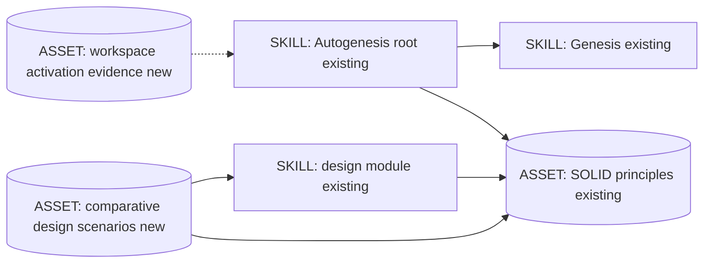

# Dogfood SOLID on Autogenesis before next release

**Stops for approval. Do not implement.**

`change_class: new-surface`

## Intent + scope

Dogfood the approved skill-native SOLID lens on Autogenesis itself before the
next version release. The user-facing capability is: an Autogenesis design or
eval run on this repository actually exercises the workspace skill and records
whether the lens changed a design decision. Trigger: explicit Autogenesis
design of Autogenesis, release-candidate review, or this work_id.

Boundary: this plan does not implement the lens (that is the earlier approved
work). It does not merge into that change set. It does not force modules,
adapters, or a semantic validator.

Scope of the first implement slice, after approval:

1. Maintainer-scope workspace-source activation so focused tests and scenario
   smokes fail closed when they would otherwise evaluate the installed catalog
   skill instead of the checkout.
2. Three comparative design exercises as portable scenarios: root-only skill,
   multi-procedure skill, and provider-coupled skill. Each exercise records a
   five-row or abbreviated SOLID table and a named design consequence.
3. Documentation pointers in CONTRIBUTING and AGENTS so humans and agents
   activate the workspace package for dogfood runs.

Deferred beside this plan as protostars: skill-root-qualified loads, compact
good/bad evidence examples, root/workflow-discipline prose dedupe, and exact
scenario-count decoupling.

## Non-goals

- Modify Genesis, B17, or S8 admission.
- Add a new public skill, private Autogenesis module, pattern ID, runtime
  schema, or semantic validator.
- Add a new Python script file; extend existing runners or scenarios only.
- Absorb issue 9 shared-template path work or the lens implementation PR.
- Force modularization or treat SOLID as structural compliance.
- Retrofit historical plans.
- Ship eval fixtures inside the user-facing skill runtime bundle.
- Update the lens PR gitlink with this Atlas branch.

## Pins

1. **Workspace source first.** Catalog Autogenesis v0.4.3 is not evidence for
   the v0.5.0 lens. Activation evidence must name the loaded skill root.
2. **Comparative designs, not grep-only wording.** Existing adversarial smokes
   may stay; this work adds exercises that fail if no design consequence is
   recorded.
3. **Consideration, not compliance.** The three exercises must include at least
   one `not-applicable` or `trade-off` row so agents cannot pass by marking
   every principle applicable.
4. **New parent change set after approval.** Implement on a branch from current
   main (or rebased main), not by expanding the lens PR.
5. **Maintainer-scope composition.** Fixtures and comparative scenarios live
   with contributor tests/scenarios, not as a new runtime module.
6. **No installed-vs-workspace compatibility matrix in this slice.** Dual-run
   skew testing is a later product; this slice only forces workspace-source
   for Autogenesis self-work.

## Genesis Artifacts

### Intent + scope + non-goals

See sections above. Mini-genesis depth for `new-surface`.

### Diagrams / interface (when required by change-class)

New nodes are maintainer-scope assets. Dashed edge: the fixture observes which
skill root was loaded; it does not become a caller-facing Autogenesis module.

Interface sketch:

- **Workspace activation evidence:** input = checkout path + installed catalog
  path if present; output = pass only when the evaluated Autogenesis body is
  the workspace `SKILL.md` (version surface 0.5.x on this line of work);
  failure names the loaded path.
- **Comparative exercise:** input = one of three fixtures; output = persisted
  five-row or abbreviated SOLID record plus one named consequence
  (`split` / `keep-root` / `no-adapter` / `governed-change`); missing
  consequence fails the smoke.
- **Dependencies:** existing `references/skill-design-principles.md`, design
  module step 1b, current scenario runner. No new CLI.

### Cost note

Stance: `balanced` (undeclared; default). Role class: existing contributor
unittest and agent design loop; no extra fan-out panel. Prefix: do not load
Genesis catalogues beyond B17/S8 status already required by design. Output:
one plan, three short exercise records. S trivial = activation smoke only; M =
one comparative exercise; L = all three plus docs. Cap: none declared. Do not
add model-router or panel cost for this slice.

## SOLID principles for skills

| Principle | Status | Rationale / design consequence |
|---|---|---|
| S | applicable | This work owns Autogenesis self-evaluation of the SOLID lens, not the lens definitions themselves. Keep the lens PR separate. |
| O | applicable | Preserve the lens contract (consideration, not compliance). Extend through scenarios and maintainer fixtures, not a new validator. |
| L | not-applicable | No interchangeable skill or module is claimed. Catalog Autogenesis is not a substitute for workspace Autogenesis. |
| I | applicable | Callers of dogfood runs need only workspace-root proof and the exercise record; they must not take a new invocation protocol. |
| D | trade-off | Depend on the workspace skill body as the capability under test, not the harness catalog install. Do not add an adapter layer; name the path and fail closed. |

## Catalogue Review

In scope: evaluation activation topology for Autogenesis self-runs.

- Genesis matches: none new. Uses existing B8 attention (named skill root) and
  B4 plan memento (this page). No A1 panel.
- Autogenesis extensions: B17 remains **active**; cards stay request views.
  `pattern_applicability: not-applicable` for S8; `pattern_admission: not-selected`.
  No new private module.
- Composition: INLINE maintainer assets in existing scenario/test trees.
  User-facing bundle unchanged.
- Inherited anti-patterns: do not treat a card as execution; do not ship eval
  fixtures as runtime skills (bundle leakage).
- Delta only: workspace-source fail-closed check + three comparative exercises.
- Admission note: draft S8 is not applied.

`catalogue_review: complete`

## Behavioural contract (agent-spec)

`deferred: this subject repository has no agent-spec specify producer; Autogenesis remains the sole writer of portable YAML scenarios and must not author .feature files.`

`behavioural_contract: deferred:no-agent-spec-in-subject`

@forbidden family: evaluating catalog Autogenesis as proof of the workspace
lens; recording SOLID rows without a design consequence; implementing on the
lens PR.

## Evaluation plan

Deterministic smokes (primary):

- Workspace activation: a current-suite smoke or existing source-contract
  assertion fails if the skill body under test is not the repository
  `SKILL.md` (version surface and SOLID authority path present on disk).
- Comparative exercises: three scenario files or one file with three smokes;
  each requires the consequence phrase and at least one
  `not-applicable` or `trade-off` token in the recorded table.
- Docs: CONTRIBUTING or AGENTS names workspace-source activation for
  Autogenesis self-dogfood.
- Map: activation family -> existing unittest/scenario runner; exercises ->
  `grep -Fq` on committed exercise records plus suite-index entry.

Agent evaluations (secondary): one real Autogenesis design against a fixture
after implement, recorded as Atlas experience. Not the sole gate.

## Adversarial scenario draft

Filename: `references/scenarios/solid-dogfood-autogenesis-adversarial-v1.yaml`
(`adversarial: true`, `work_id: 2026-09-12-14-solid-dogfood-autogenesis`).

| id | expect | source |
|---|---|---|
| workspace-source-not-catalog | fail if catalog-only load is treated as lens evidence | this plan pin 1; version-skew dogfood practice |
| comparative-consequence-required | fail if a SOLID table has no named design consequence | OpenAI eval-skills guidance; grep-only critique |
| not-all-applicable | fail if every principle is marked applicable | approved lens: not-applicable is a reasoned conclusion |
| no-new-runtime-module | fail if a new public skill or private module is added for this slice | approved lens non-goals; SkillsBench less-is-more |
| no-lens-pr-absorption | fail if implement lands only as extra commits on the lens PR | pin 4 |

Implement may add smokes; it must not drop these without a new design.

## Challenge summary

Grounded counters (think-challenge):

1. **Catalog/workspace skew** — live `/autogenesis` loaded v0.4.3 while the
   workspace is v0.5.0. Severity high. **Pin 1 accept.**
2. **Grep-only docs tests** — systematic skill evals should check invocation
   and task consequence, not string presence alone
   (https://developers.openai.com/blog/eval-skills). Severity high.
   **Pin 2 accept.**
3. **Premature SOLID structure** — over-applying SOLID creates fragile shared
   modules (https://hatchworks.com/blog/gen-ai/llm-projects-production-abstraction/).
   Severity high. **Pin 3 accept; no new module.**
4. **Installed-vs-source dual fixture** — some harnesses run both released and
   workspace copies. Severity medium. **Reject for this slice** (pin 6);
   workspace-source fail-closed is enough before the next release.

C1 non-trivial counters present. C2 high-severity pinned. C3 pins visible.
C4 scope intact (first slice only). C5 no implementation in this operation.
change-class stated. Genesis Artifacts complete for new-surface.

## Acceptance

After approved implement:

- A dogfood or CI-adjacent check fails closed when Autogenesis self-evaluation
  would use the installed catalog skill instead of the workspace package.
- Three comparative design records exist and are current-suite indexed.
- CONTRIBUTING or AGENTS tells agents to load workspace Autogenesis for
  self-work.
- No Genesis/B17/S8-admission change, no new Python file, no new module.
- Atlas lineage compiled green on a dedicated store branch; parent gitlink
  for the lens PR is untouched by this design persist.

## Accepted risks

- Agents can still paste a fake SOLID table; deterministic smokes check
  tokens, not judgment. Residual risk accepted until a later protostar adds
  examples, not a validator.
- Workspace activation may be harness-specific in practice; the smoke asserts
  repository files and documented load path, not every host catalog.

## Stop for approval

Explicit user approval of this persisted plan is required before implement.
Completion of design is not implement authority.
