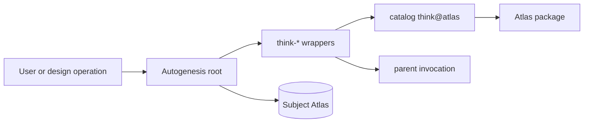

## Intent + scope

During an Autogenesis Run, challenge / grill / ramble use catalog `think@atlas`
procedure plus Autogenesis-owned overlays. Keep the three parent-routed
think-* support modules. Each wrapper nest-loads the matching catalog skill
and does not vendor a forked Process.

Scope: rewrite the three think entrypoints; update root, workflow-discipline,
design, docs, tests, and scenarios; supersede the fork decision; bump the live
version surface to 0.7.0 without publishing.

## Non-goals

- Reopening Discuss adapter work
- Changing the think package or its pin `874613a`
- Deleting the Autogenesis think-* modules
- Conversation-only catalog fallback during a Run
- Tags, GitHub releases, or marketplace pin updates
- Treating 0.6.0 as the ship vehicle

## Pins

P1. Keep `think@atlas` 0.1.0 at `874613a67018c74ee95f857416fb315d2f80b92b`.
P2. Keep 20 parent-routed modules as thin wrappers.
P3. Nested load is an external harness skill-loader call to package `think`.
P4. Nested catalog load must not recurse into the Autogenesis module.
P5. Overlays only: parent invocation; think-challenge as a design validation
    gate with named-theory smokes; subject-Atlas write-home; no grill/ramble
    while catalog Discuss is active.
P6. Supersede `internal-think-modules`: Autogenesis no longer owns forked
    think procedure.
P7. Live version surface becomes 0.7.0 under Unreleased. No tags.
P8. Atlas gitlink advance is implement-only, for lineage.
P9. agent-spec `specify` is deferred; the skill is unavailable here.

## Challenge summary

High-severity counters pinned: R4 deletion rejected (overlays are material);
name-lookup recursion blocked by P4; catalog never-invent rule does not strip
named-theory smokes; vendored drift is closed by nest-load plus the existing
pin. C1–C5 hold. No implementation in design.

## Genesis Artifacts

### Intent + scope + non-goals

Stated above. Cost stance is balanced with no cap.

### Diagrams / interface

Wrappers stay parent-routed support modules. Catalog think owns primitive
procedure. Autogenesis owns Run overlays only.

### Cost note

No fan-out. Extra load is three short catalog bodies plus short overlays.

## SOLID record

| Principle | Status | Rationale |
|---|---|---|
| S | applicable | Catalog owns think procedure; wrappers own Run overlays. |
| O | applicable | Catalog semantics stay behind the pin; overlays are the governed Run delta. |
| L | applicable | Wrappers are not interchangeable with catalog think-*; Run adds preconditions. |
| I | applicable | Compact Autogenesis cards; catalog bodies load only on nest. |
| D | applicable | Depend on the APM think pin via substrate contract, not a vendored snapshot. |

## Catalogue Review

B17 remains on Autogenesis wrappers. S8 is not newly admitted. Composition is
EXTERNAL catalog think plus INLINE overlays. Anti-patterns avoided: HIDDEN
EXTERNAL, PHANTOM DEPENDENCY, STUB ORCHESTRATION.

## Behavioural contract (agent-spec)

deferred: agent-spec is not available in this harness.

Required families: nest-load catalog bodies; no recursion; design-gate
named-theory smokes; Discuss fence for grill/ramble; subject-Atlas write-home
during a Run.

## Evaluation plan

Deterministic smokes: pin, nest-load wording, no recursion, overlays, module
count 20, docs, version 0.7.0, new adversarial scenario, unittest suite.

## Acceptance

- Three think modules nest-load catalog `think@atlas` and keep only overlays
- Module count remains 20
- `catalog-think-integration-adversarial-v1.yaml` is current
- Live version surfaces say 0.7.0; no tags created
- `python3 -m unittest discover -s scripts -p 'test_*.py'` passes

## Accepted risks

Catalog think 0.1.0 will not absorb Autogenesis overlays. Dual-load token cost
is accepted as balanced.

## Stop for approval

Explicit user approval was given for this pinned plan before implement.
