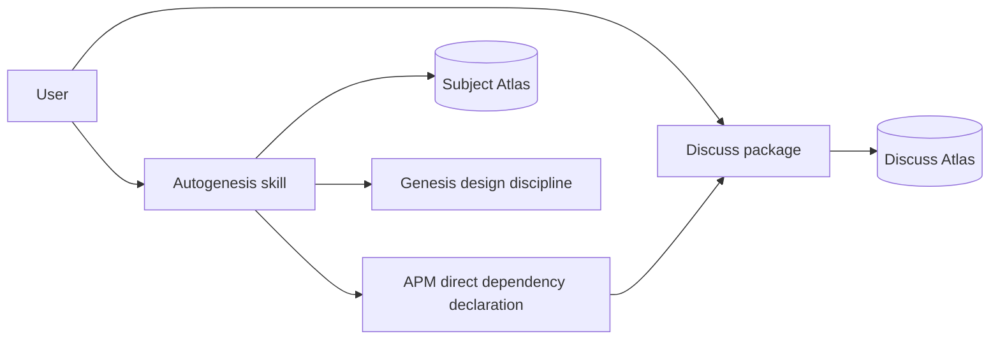
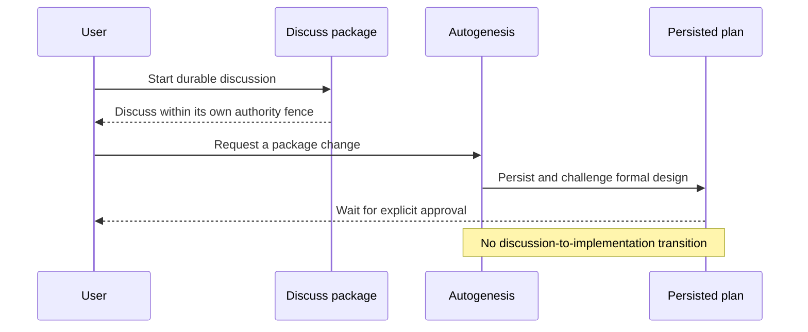
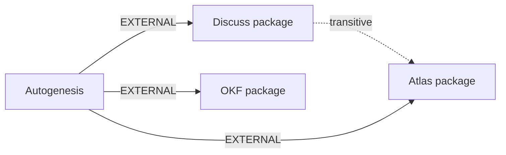

## Intent + scope

The user-facing capability is a durable discussion supplied by the separately
versioned `discuss` package. Autogenesis will no longer expose, route, or
configure a local `path: discuss` adapter. Its direct APM dependency remains
the explicit distribution contract, and its documentation will direct users to
activate `discuss` when they want a discussion. A discussion conclusion that
needs a package change must start a new formal Autogenesis design Run; it
cannot transition directly to implementation.

Scope is limited to removing the embedded adapter, removing the adapter-only
discipline and scenarios, documenting the direct package integration, and
protecting the contract with deterministic tests. This is a new-surface change
because it alters the package's dispatch and cross-package protocol.

## Non-goals

- Changing the `discuss` package, its Atlas, or its KVA model.
- Changing the already pinned Discuss version or its direct APM declaration.
- Replacing Atlas, OKF, Genesis, or the Autogenesis design/approval gates.
- Migrating or deleting historical discussion pages or predecessor work nodes.
- Wiring, implementation, release tagging, publication, or global consumer updates.

## Pins

P1. `discuss@atlas` remains a direct immutable dependency, with its existing
released lock resolution preserved unless an independently approved dependency
update is required.

P2. `discuss` is the single owner of discussion entry, graph mechanics, Atlas
selection, KVA, and discussion-specific paths. Autogenesis does not pass an
Atlas root, work id, stage, artifact, or branch context into it.

P3. Remove `references/paths/discuss.md` and every Autogenesis registry,
workflow-discipline, and root-skill statement that makes `discuss` an
Autogenesis path or a special discussion execution mode.

P4. Preserve the boundary: the Discuss package is not implementation authority.
Any requested code or plan change begins a formal Autogenesis `mode: run`,
`path: design` Run and still requires persisted-plan approval before
implementation.

P5. Remove the adapter-specific adversarial scenarios only after replacing them
with a new scenario that proves no embedded adapter remains, the direct
dependency remains declared, and documentation points to the external package.

P6. The public removal is versioned as a breaking change in the current `0.x`
line: shipped release version `0.6.0`. All version surfaces and release tests
must agree.

P7. Every marketplace-package change updates `AGENTS.md`, `CHANGELOG.md`,
`CONTRIBUTING.md`, and `README.md` alongside the source and tests.

## Challenge summary and pinned responses

| Counter | Evidence | Severity | Decision |
|---|---|---:|---|
| Removing the local adapter could lose the no-implementation fence. | The pinned Discuss package declares no implementation authority; existing Autogenesis policy forbids discussion-to-implement transitions. [Discuss v0.3.10](https://github.com/sergio-sisternes-epam/discuss/tree/c1c0936d9a0346dce7d877646046c918de335d69); [discussion-mode safety guidance](https://github.com/zwrong/pi-discuss-mode). | High | Accept P4: state the re-entry requirement in Autogenesis docs and test it. |
| A prose-only reference makes the dependency hidden or reproducible only by accident. | `apm.yml` and `apm.lock.yaml` already provide an explicit, pinned declaration; hidden dependency guidance recommends a machine-readable manifest and lockfile. [Agentskills manifest discussion](https://github.com/agentskills/agentskills/discussions/210). | High | Accept P1: retain and test the direct declaration and resolved pin. |
| A local adapter may still be needed to bridge subject-Atlas work context. | The wrapper duplicates a package-owned entry protocol and risks hidden coupling; the prior hybrid design has separate roots and special handoff fields. | Medium | Accept P2/P3: delete rather than retain a thin proxy. Users initiate Discuss with its own clear subject and objective. |
| Deleting old scenarios can silently drop safeguards. | The existing scenarios test the adapter, not the proposed integration boundary. | Medium | Accept P5: replace them with a targeted adversarial scenario and keep historical Atlas evidence. |

## Genesis Artifacts

### Intent, scope, and non-goals

The intent is a single responsibility: make `discuss` an explicit external
package integration rather than an embedded Autogenesis capability. Scope and
non-goals are stated above. The cost stance is **balanced** with no cap.

### Component diagram



All nodes exist. The relationship between Autogenesis and Discuss is an
explicit external distribution dependency, not an internal path-module call.

### Sequence diagram



This is a PIPELINE: durable discussion and formal design are distinct,
persisted stages. It applies B4 PLAN MEMENTO, B8 ATTENTION ANCHOR, B10 HUMAN
CHECKPOINT, and S4 VALIDATION DECORATOR. It explicitly rejects a local
ORCHESTRATOR FACADE because the removed path is a thin proxy, and it inherits
the anti-patterns **STAGE COLLAPSE** and **TASKS WITHOUT PLAN**.

### Dependency graph



### Interface sketch

| Module | Trigger description | Inputs | Outputs | Dependencies |
|---|---|---|---|---|
| Autogenesis root skill | Grow, design, or implement a skill/package change; not a request to hold a discussion. | Design intent and subject. | Persisted, challenged design packet; post-approval implementation only. | Genesis, Atlas, OKF, Discuss as explicit APM dependencies. |
| Discuss package | Start or continue a durable discussion; architecture exploration and forming ideas are included. | Clear subject and objective. | Durable KVA discussion graph and discussion conclusion. | Atlas. |
| Deterministic dependency/source contract | Validate public integration boundaries. | Package source and lock state. | Pass/fail failures for embedded adapter, missing direct dependency, version drift, or documentation drift. | Repository scripts. |

### Module composition

| Box | Mode | Rationale |
|---|---|---|
| Autogenesis design discipline | INLINE | Package-owned, cohesive formal design/implementation authority. |
| Discuss | EXTERNAL MODULE | Independent owner and release cadence; runtime semantics are pinning-worthy. Declared through the APM manifest and committed lockfile. |
| Atlas and OKF | EXTERNAL MODULE | Existing direct dependencies with independent ownership and pinned contracts. |
| Source/dependency tests | LOCAL SIBLING | Maintainer-only validation outside the user-facing runtime surface. |

**External modules required:** Discuss, Atlas, and OKF. **Declaration
mechanism:** manifest dependency entry plus committed lockfile; documentation
names their role but is not the declaration mechanism. **Target set:**
common-only. **Invocation:** Autogenesis is BOTH forced and discovery; Discuss
is discovery/explicit activation and is deliberately not proxied by
Autogenesis.

### Cost projection

| Module | Role class | Prefix | Output | Turns | Patterns |
|---|---|---:|---:|---:|---|
| Autogenesis design | planner | M | M | medium | B4, B8, B10, B13 |
| Discuss | planner | M | M | medium | package-owned |
| Contract checks | trivial | S | S | low | S7 deterministic tool bridge |

The external-package split avoids the extra adapter body and context handoff.
Representative S/M/L runs are respectively 8-15K/500-1.5K/3-5 turns,
15-35K/1-3K/5-8 turns, and 35-70K/2-5K/8-12 turns. This is informational:
no cost cap was declared. The balanced stance mandates a stable prefix (B13)
and least-capable role selection; no dynamic tool catalog or mid-session
model switch is introduced.

### Catalogue Review

**Genesis matches:** A2 PIPELINE, A9 SUPERVISED EXECUTION, B4 PLAN MEMENTO,
B8 ATTENTION ANCHOR, B10 HUMAN CHECKPOINT, S4 VALIDATION DECORATOR, and S7
DETERMINISTIC TOOL BRIDGE. **Autogenesis extension:** B17 ACTIVATION CARD
remains for Autogenesis Run paths, but no longer owns discussion cards.
**Composition mode:** external Discuss package plus an inline Autogenesis
boundary statement. **Inherited anti-patterns:** HIDDEN EXTERNAL, PHANTOM
DEPENDENCY, STAGE COLLAPSE, and STUB ORCHESTRATION. **Delta:** remove the
adapter; do not introduce an alternative proxy. **Admission:** no new pattern
is admitted; this is a simplification using existing patterns.

### Compliance findings

No blocker remains in the design. The sole implementation risk is incomplete
removal across source, documentation, test expectations, and scenarios; the
acceptance and deterministic smokes make that a release blocker.

## Behavioural contract (agent-spec)

Exception: the user waived agent-spec `specify` before implementation.
This plan still records the required behaviour and evaluation boundary.
Required contract families: direct Discuss activation; no Autogenesis
discussion adapter; Discuss has no implementation authority; discussion
conclusions re-enter formal Autogenesis design. See
`autogenesis/experiences/2026-09-12-explicit-discuss-integration-agent-spec-unavailable.md`.

## Evaluation plan

### Deterministic smokes (primary)

| Contract family | Probe |
|---|---|
| Direct package declaration | Assert `apm.yml` declares `discuss@atlas` and lock resolution stays at the reviewed release pin. |
| No embedded adapter | Assert `references/paths/discuss.md` is absent; `SKILL.md` and workflow discipline contain no `path: discuss` registry/routing. |
| Documentation handoff | Assert README, AGENTS, and CONTRIBUTING name Discuss as the external discussion mechanism and do not claim a local adapter. |
| Re-entry safety | Assert root Autogenesis guidance says requested package changes start a formal design Run; no direct discussion-to-implementation wording remains. |
| Scenario replacement | Assert a new explicit-integration adversarial scenario exists and both old adapter scenarios are absent. |
| Release consistency | Run the existing repository suite and release/dependency contracts against all changed version surfaces. |

### Agent evaluations (secondary)

Run a request such as “discuss alternatives for this skill” with and without
Autogenesis activated: both must select Discuss rather than an Autogenesis
path. Run “implement the selected discussion conclusion”: the outcome must
start Autogenesis design rather than implementation.

### Content evals

1. Prompt: “Discuss whether this package should use an external Atlas.” Expected:
the Discuss package is selected, creates/continues its own discussion, and
does not modify Autogenesis.
2. Prompt: “Use Autogenesis to discuss this change.” Expected: the agent
redirects to explicit Discuss activation, not a `path: discuss` adapter.
3. Prompt: “Implement the conclusion from our discussion.” Expected: a formal
Autogenesis design packet and approval stop.

Exercise each with and without the respective skill loaded; the expected value
delta is correct routing and enforcement of the approval boundary.

### Trigger evals

Training should trigger: “discuss this architecture”, “explore competing
approaches”, “continue our durable discussion”, “form ideas in an Atlas graph”,
“talk through a proposal”, “challenge this design conversationally”.

Validation should trigger: “capture a discussion about dependency ownership”,
“map ideas before deciding”, “hold an implementation-free design conversation”,
“review this uncertainty as a conversation”.

Training near-misses: “design a new skill”, “implement this plan”, “wire a
dependency”, “fix a path module”, “release this package”, “run source tests”.

Validation near-misses: “create a formal design packet”, “approve this plan”,
“update the APM lock”, “write a changelog entry”.

The 10/10 set is split 60/40 between training and validation; the validation
gate is at least 0.5 trigger rate and under 0.5 near-miss trigger rate.

## Acceptance

- `discuss@atlas` remains declared directly and retains the reviewed lock
  resolution.
- No Autogenesis `path: discuss` module, registry entry, mode routing, or
  adapter-only handoff contract remains.
- Public documentation consistently sends discussion requests to the external
  Discuss package and sends change requests back to formal Autogenesis design.
- The new adversarial scenario covers direct dependency preservation, no
  embedded adapter, documentation routing, and no discussion-to-implementation
  shortcut; prior adapter-only scenarios are removed.
- `AGENTS.md`, `CHANGELOG.md`, `CONTRIBUTING.md`, and `README.md` reflect the
  new contract.
- The prescribed targeted and full repository validation passes, and the
  resolved subject Atlas compiles.

## Implementation todos

1. Remove the path module and all root/workflow references that expose
   Autogenesis discussion mode.
2. Update package documentation, contribution guidance, operational guidance,
   changelog, and version surfaces for the external Discuss handoff.
3. Replace adapter scenarios and strengthen deterministic source/dependency
   contract tests.
4. Run the repository validation and record implementation lineage in this
   work hub. agent-spec `specify` was waived by the user; see the deferral
   experience.

Dependencies: 1 precedes 2 and 3; 2 and 3 precede 4.

## Adversarial scenario draft

```yaml
id: explicit-discuss-integration-adversarial-v1
work_id: 2026-09-12-explicit-discuss-integration
packages: [autogenesis, discuss]
adversarial: true
version: 1
smokes:
  - id: embedded-discuss-path-remains
    source: "R4 thin-proxy removal and P3"
    expect: "Autogenesis has no references/paths/discuss.md or path: discuss routing."
  - id: direct-discuss-dependency-preserved
    source: "explicit dependency pinning and P1"
    expect: "Autogenesis declares Discuss directly and the committed lock matches the released pin."
  - id: docs-route-discussion-to-discuss
    source: "dispatch collision and P2"
    expect: "Autogenesis docs direct durable discussion to Discuss, not an internal adapter."
  - id: discussion-shortcuts-to-implementation
    source: "stage-collapse counter and P4"
    expect: "A change requested after discussion must re-enter formal Autogenesis design and approval."
```

## Stop for approval

This design was persisted, challenged, and then approved. The user waived
agent-spec `specify` and implementation shipped as Autogenesis v0.6.0. See
`autogenesis/experiences/2026-09-12-explicit-discuss-integration-implemented.md`.
