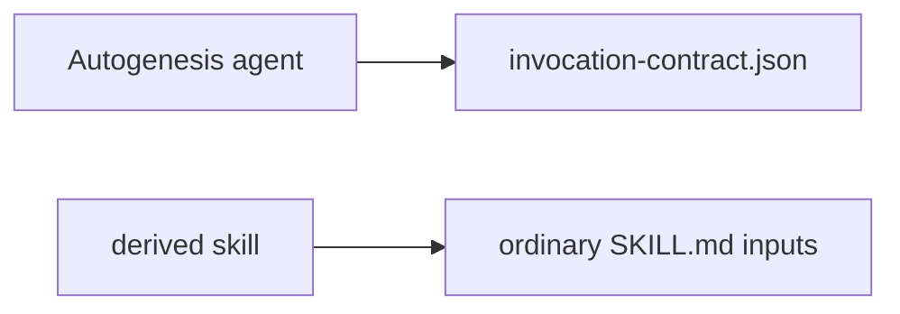

# Invocation JSON is Autogenesis checker policy only

**Stops for approval. Do not implement.**

`change_class: new-surface`

## Intent + scope

`invocation-contract.json` already claims it is not a derived-skill template.
After approval, implement makes that fail-closed in contributor docs and
current-suite smokes: initialise/design/S8 guidance must not require adopters
to emit `autogenesis.invocation-request/v1`. The JSON inventory remains for
this repository's checkers.

## Non-goals

- Delete `invocation-contract.json` or stop source-contract argument inventory.
- Add a validator, execution engine, adapter, or Python script.
- Fuse think-* or change S8 admission.
- Mutate PR #15 or retarget `6746d60`.

## Pins

1. **Checker-only JSON.** Named consequence: maintainer policy, not runtime.
2. **Instruction-first derived skills.** Ordinary prose inputs/outcomes.
3. **No-adapter.** Do not invent a second protocol layer.

## SOLID record

| Principle | Status | Rationale / design consequence |
|---|---|---|
| S | applicable | JSON inventory changes with Autogenesis checkers; derived-skill authoring must not. |
| O | applicable | Autogenesis request envelope stays closed to accidental export (`governed-change`). |
| L | not-applicable | JSON schema does not claim to substitute an adopter's module contract. |
| I | applicable | Derived callers must not load Autogenesis envelope fields they cannot satisfy. |
| D | trade-off | Keep the concrete JSON file for checkers (`no-adapter`); do not wrap it behind a protocol service. |

## Genesis Artifacts

### Intent + scope + non-goals

Covered above.

### Diagrams / interface

Interface sketch: Autogenesis Run may render the configured card from the
prose+JSON pair. Derived S8 modules describe arguments in instructions only.

### Cost note

One extra current-suite smoke. No new runtime. Stance: cheap.

### Acceptance

- CONTRIBUTING/AGENTS/S8 template state JSON is not required for adopters.
- Current-suite smoke `json-not-derived-runtime` is red if initialise/S8
  tells adopters to emit the Autogenesis envelope.
- JSON file remains and source-contract still validates module argument keys.
- No new Python script.

## Catalogue Review

- genesis matches: none
- Autogenesis extension: B17 cards stay Autogenesis-local
- S8 `pattern_applicability: applicable` for Autogenesis,
  `pattern_admission: draft`; JSON is explicitly not an S8 requirement
- composition: LOCAL existing checker file
- anti-pattern: do not generate validators from the JSON
- admission note: draft S8 not promoted

## Behavioural contract (agent-spec)

deferred: agent-spec unavailable; portable YAML smokes are the contract.

## Evaluation plan

Deterministic: extend `scripts/test_source_contract.py` and
`references/scenarios/` (existing files or one new YAML). Map smoke
`json-not-derived-runtime` to grep/source-contract. Agent narrative secondary.

## Challenge

| Counter | Source | Severity | Pin |
|---|---|---|---|
| Removing JSON from agent instructions causes envelope drift | O / checkers | medium | Keep JSON for checkers; only stop exporting it |
| Agents still copy the YAML request from design examples | I | high | Examples must label Autogenesis-local vs derived |
| Mixing into PR #15 | isolation | high | Separate branch |

Adversarial draft:
`references/scenarios/invocation-json-checker-adversarial-v1.yaml`
smokes: `json-not-derived-runtime`, `json-file-still-present`,
`no-new-runtime-module`.

## Stop for approval

Explicit user approval required before implement.
