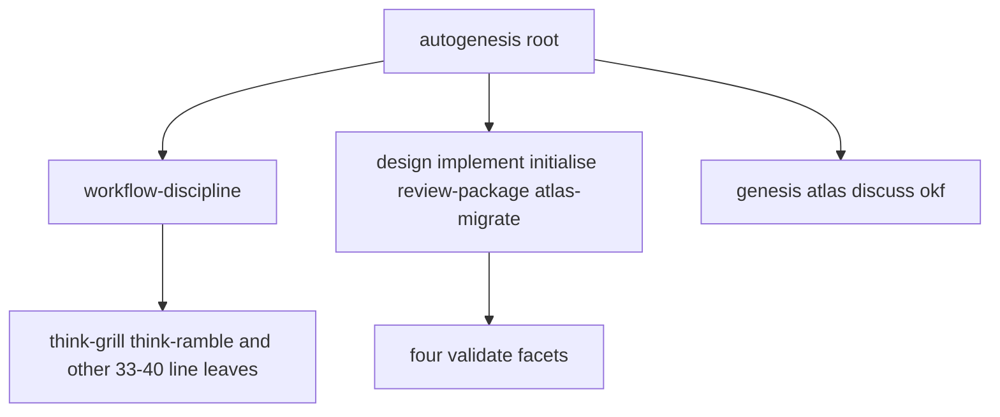

# Re-justify Autogenesis modules with the SOLID lens

**Stops for approval. Do not implement.**

`change_class: new-surface`

Workspace Autogenesis v0.6.0 is the skill under test. Catalog v0.4.3 is not
evidence. Draft PR sergio-sisternes-epam/autogenesis#15 is dogfood evidence
only and is not this change set.

## Intent + scope

Autogenesis adopted parent-routed modules before the SOLID lens existed. The
user-facing job of this work is: after approval, an implementer can fuse or
keep each of the 20 modules using a recorded SOLID table, without adding
structure.

First implement slice after approval (not this persist):

1. Publish the keep/fuse map in contributor docs only as far as needed to
   bind implementers (AGENTS/CONTRIBUTING pointers), not a new module.
2. Fuse or inline the thin always-co-loaded support leaves that fail S8
   applicability (starting with think-grill and think-ramble), updating the
   registry and invocation inventory in the same change.
3. Make root SKILL.md a thinner router by moving duplicated Atlas/approval
   prose solely into workflow-discipline (absorbs parked protostar
   `2026-09-12-14-root-prose-dedupe` only if still open).
4. Keep `invocation-contract.json` as maintainer/checker policy; do not
   present it as derived-skill runtime.

Deferred: skill-root-qualified lens loads, compact good/bad examples, exact
scenario-count decoupling, catalog-vs-workspace identity beyond #15's
workspace-source fail-closed checks.

## Non-goals

- Modify Genesis, B17, or S8 admission (S8 stays draft).
- Add a public skill, private module, pattern ID, runtime schema, semantic
  validator, adapter, or new Python script.
- Force modularization or treat SOLID as structural compliance.
- Absorb issue 9 / PR 10 shared-template work or retarget PR #15's gitlink.
- Promote S8 to active conformance for derived skills.
- Reverse the whole 20-module tree in one slice.

## Pins

1. **Consideration, not compliance.** Keep/fuse must include at least one
   `not-applicable` or `trade-off` row.
2. **Split only on real pressure.** Named consequence `split` is reserved for
   operations with distinct callers or change cadence.
3. **No-adapter.** Atlas, GitHub, Genesis, Discuss, OKF stay concrete.
4. **Governed-change.** Protocol or fusion changes are versioned; no silent
   semantic drift.
5. **Workspace source.** Catalog Autogenesis is not self-evidence.

## SOLID record

| Principle | Status | Rationale / design consequence |
|---|---|---|
| S | trade-off | Keep design/implement/initialise/review-package/atlas-migrate and the four validate facets. Fuse thin always-loaded leaves (`fuse-thin-support`). |
| O | applicable | Parent-owned context stays closed. Catalog name collision is a separate identity hazard already mitigated in #15. No new extension points. |
| L | applicable | Same skill name, two contracts (catalog vs checkout) is substitution failure. Leaves do not claim interchangeability. |
| I | trade-off | Progressive disclosure of operations stays. Bootstrap must not require the full JSON envelope for every Run (`narrow-bootstrap`). |
| D | trade-off | Concrete providers (`no-adapter`). Invocation JSON is not a second runtime. |

## Genesis Artifacts

### Intent + scope + non-goals

Covered above.

### Diagrams / interface

Interface sketch: one public catalogue skill; parent selects an operation;
support returns to the caller; no child overrides subject, approval, or Atlas.

### Cost note

Fusing two tiny think leaves reduces bootstrap tokens. Do not fan-out
review-package facets unless a later design proves independent lenses need
parallel threads. Stance: balanced.

## Challenge (think-challenge)

| Counter | Source | Severity | Pin response |
|---|---|---|---|
| Fusing think-grill/ramble hides a real cadence split if challenge stays a gate | Genesis R2 FUSE vs R1 SPLIT | medium | Keep think-challenge as support; only fuse grill/ramble if they remain Run-local and always co-loaded |
| Workspace-only identity breaks catalog consumers after a real release | Liskov / package identity | high | #15 fail-closed is maintainer dogfood, not a ban on catalog after version match |
| Demoting JSON weakens argument-inventory checks | local invocation contract | medium | Keep JSON for checkers; drop it from derived-skill instructions |
| Mixing this work into PR #15 contaminates dogfood evidence | change-set isolation | high | New parent change set after approval; do not retarget 6746d60 |

Adversarial smokes (draft; fill at implement): `no-new-runtime-module`,
`s8-stays-draft`, `fuse-only-thin-leaves`, `no-adapter-atlas`,
`workspace-source-not-catalog`.

## Acceptance

- Plan persisted under this work_id with five-row SOLID table.
- Implement advice page lists slice order, non-goals, and gitlink rule.
- After future approval: registry count drops only for fused leaves; tests
  still pass; no new Python file; S8 remains draft.
- `atlas compile` green on the memory branch.

## Accepted risks

- Leaving #15 unpinned from this Atlas branch until a governed pin.
- Not fusing every 33–40 line operation in the first slice.

## Stop for approval

Explicit user approval required before implement.
