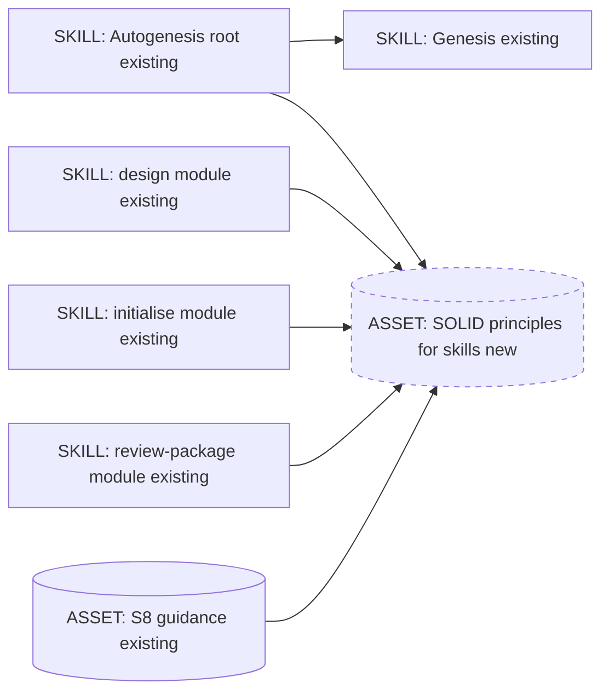
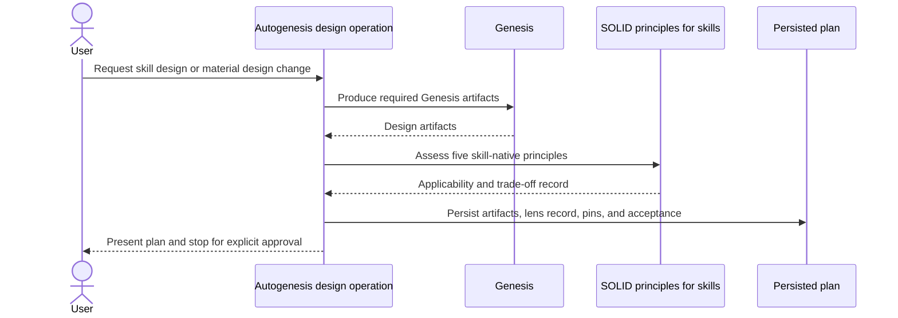
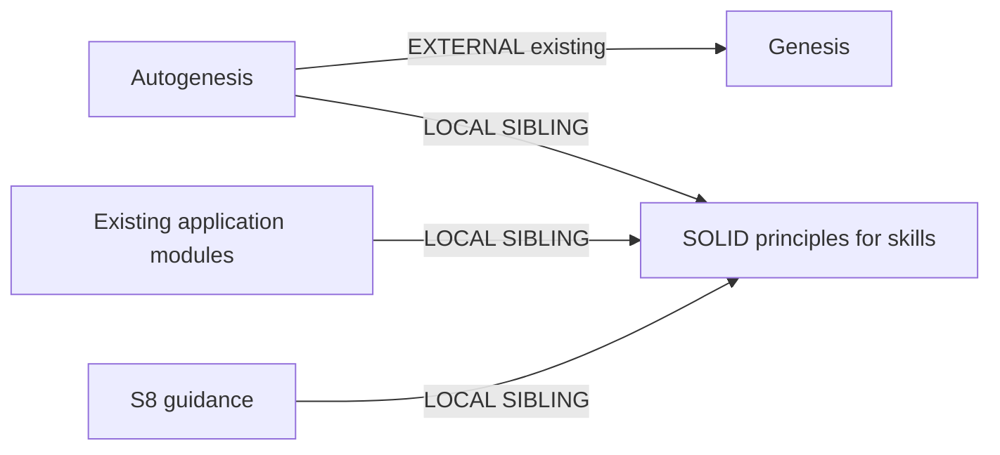

# SOLID principles for skills

**Approved for implementation on 2026-09-12.**

## Genesis Artifacts

### Intent, scope and non-goals

Add **SOLID principles for skills** as an Autogenesis-owned design lens applied
after Genesis in every formal Autogenesis design. The lens translates the five
principles into skill-native questions about responsibility, governed
extension, substitutability, interface completeness, and dependency direction.
It is grounded in information hiding, cohesion, and change locality rather than
literal object-oriented structures.

For `new-surface` and `new-skill` work, the persisted plan contains a compact
five-row lens table with `applicable`, `not-applicable`, or `trade-off`
rationale. Hardening may use an abbreviated statement covering only material
principles. A required record that is absent makes the design incomplete and
prevents presentation for approval. Enforcement remains instructional and
review-based; deterministic checks verify only the presence and linkage of the
discipline, not semantic design quality.

Scope:

- one shared Autogenesis reference containing the complete skill-native
  definitions and review questions;
- concise application rules in the root, design, initialise, review-package,
  and S8 guidance;
- prospective adoption, including existing artifacts only when their design is
  materially changed;
- repository documentation and an additive adversarial scenario;
- existing source-contract coverage for structural presence and linkage.

Non-goals:

- changing or redefining the separate Genesis package;
- adding a new catalogue pattern, public skill, private module, invocation
  protocol, schema, or runtime validator;
- treating all five principles as structurally applicable to every artifact;
- requiring modules for short root-only skills;
- retrofitting every historical plan or existing skill;
- prohibiting intentional behavior changes after release;
- introducing speculative extension points or dependency abstractions;
- changing S8 draft admission or B17 Activation Card behavior.

### Component diagram



The design is single-threaded. The shared reference is loaded only when a
design, initialization, review, or S8 module decision needs it. No child thread,
runtime service, or additional public dispatch surface is introduced.

### Design sequence



### Dependency graph and composition



| Box | Composition | Rationale |
|---|---|---|
| Autogenesis root | INLINE existing | Owns the cross-cutting requirement and progressive-disclosure route |
| Genesis | EXTERNAL MODULE existing | Remains the design foundation and is not modified by this work |
| SOLID principles for skills | LOCAL SIBLING new asset | Reused by five application surfaces; one authority prevents drift |
| design | LOCAL SIBLING existing | Applies the lens after Genesis and before approval |
| initialise | LOCAL SIBLING existing | Requires the full lens for every new skill |
| review-package | LOCAL SIBLING existing | Reviews applicable design claims without forcing retrofits |
| S8 guidance | LOCAL SIBLING existing asset | Specializes the lens for private module boundaries |

No new external module is required. The existing Genesis dependency declaration
and substrate-loading contract remain unchanged. Declared target is
`common-only`; the design introduces no harness-specific syntax.

### Skill-native definitions

The shared reference will define:

| Principle | Skill-native interpretation |
|---|---|
| Single Responsibility | A skill, module, or rule has one cohesive user-facing responsibility and one primary reason to change. Split only at a real caller, change-cadence, attention, ownership, or effect boundary. |
| Open/Closed | The intended contract is closed to accidental semantic drift and open through declared, governed extension points. Intentional behavior changes remain allowed when reviewed, versioned, and evaluated. |
| Liskov Substitution | Assess only when skills or modules claim the same capability or an interchangeable contract. A substitute must preserve required preconditions, promised outcomes, authority/effect boundaries, and failure semantics. |
| Interface Segregation | Expose only the inputs, context, tools, and outputs a caller needs, using progressive disclosure. A narrow interface must still carry enough context and authority information for safe execution. |
| Dependency Inversion | Depend on stable capabilities and contracts rather than incidental harness, provider, or tool details. Add adapters or indirection only when real portability, volatility, reuse, or ownership pressure justifies them. |

The reference will state that information hiding, cohesion, and change locality
are the foundation. The SOLID names are prompts for disciplined judgment, not
proof of quality or mandatory object-oriented structure.

### Interface sketch

| Surface | Trigger | Input | Required outcome |
|---|---|---|---|
| Shared reference | A formal design, new-skill initialization, package review, or S8 module decision needs the lens | Change class, design artifact, declared contracts, target architecture | Five definitions, applicability rules, compact record template, and anti-patterns |
| Root | Any formal Autogenesis design or review | Active operation and change class | Declare the Autogenesis-owned overlay and route to the shared reference |
| design | After Genesis artifacts, before challenge completion and approval presentation | Candidate plan and change class | Full five-row record for new-surface/new-skill; material abbreviated record for hardening; block approval if missing |
| initialise | After Genesis artifacts, before new-skill approval | Candidate new-skill design | Full five-row record and explicit root-only versus modular consequence |
| review-package | Deep package review | Target's current or materially changed design | Assess applicable claims; do not retroactively fail untouched legacy artifacts |
| S8 guidance | Private module boundary is proposed or materially changed | Parent/module responsibilities, callers, effects, dependencies | Module-specific interpretation without forced splitting or machinery |

The compact plan record is:

| Principle | Status | Rationale / design consequence |
|---|---|---|
| S | applicable / not-applicable / trade-off | One concise, artifact-specific statement |
| O | applicable / not-applicable / trade-off | One concise, artifact-specific statement |
| L | applicable / not-applicable / trade-off | One concise, artifact-specific statement |
| I | applicable / not-applicable / trade-off | One concise, artifact-specific statement |
| D | applicable / not-applicable / trade-off | One concise, artifact-specific statement |

`not-applicable` is a reasoned conclusion, not an omission. `trade-off` names
the competing property and the chosen boundary. The record describes design
consequences; it does not require class-like interfaces or machine metadata.

### This design's SOLID record

| Principle | Status | Rationale / design consequence |
|---|---|---|
| S | applicable | One shared asset owns the definitions; existing modules own when and how they apply them. |
| O | trade-off | The reference is one governed extension point, but its definitions may intentionally change through a reviewed, versioned Autogenesis change. |
| L | not-applicable | This change introduces no interchangeable skill or module implementation. Future designs assess L only when substitutability is claimed. |
| I | applicable | Application surfaces link one lazy asset and retain only concise local rules; the reference still contains complete safety and applicability guidance. |
| D | applicable | Autogenesis depends on Genesis as an external design capability and adds its own overlay without editing Genesis or leaking harness-specific syntax. |

### Cost note

Stance is `balanced`; no cap was supplied. One planner thread produces the
design and one implementer thread can apply an approved edit. Planned
`task()` spawns: zero.

| Surface | Role class | Prefix | Output | Turns | Cost control |
|---|---|---|---|---|---|
| Shared reference application | planner or reviewer, inherited from active operation | S | S | low | C1 lazy loading; one central asset avoids duplicated prefix text |
| Implementation | implementer | M | M | low | Existing focused tests and no new framework |

The new reference is contributor/design-time guidance and does not load into
ordinary derived-skill runtime. Expected incremental cost is one small asset
read during relevant Autogenesis operations. B13 cache-aware prefix applies:
keep the stable definitions centralized and do not add timestamps or
harness-specific variants. Exact dollar projection is not material because no
new model call, spawn, or workflow stage is introduced.

### Acceptance

- The root identifies SOLID principles for skills as an Autogenesis-owned
  overlay applied after Genesis.
- One shared reference defines all five principles in skill-native terms and
  states information hiding, cohesion, and change locality as the foundation.
- `design` requires the five-row record for new-surface/new-skill work and an
  abbreviated material assessment for hardening; incomplete required evidence
  cannot proceed to approval.
- `initialise` applies the full record to every new skill without assuming
  modules.
- `review-package` applies the discipline prospectively and to materially
  changed designs without flagging untouched legacy artifacts solely for
  missing historical evidence.
- S8 specializes the lens for module boundaries while preserving root-only
  skills, instruction-first modules, and draft status.
- Open/Closed, substitutability, interface completeness, and dependency
  indirection match the pinned definitions above.
- No new public skill, private module, pattern ID, runtime schema, semantic
  validator, Python script, or mandatory generated artifact is introduced.
- Shared-reference presence and links are covered by the existing source
  contract; semantic behavior is evaluated through scenarios and real design
  tasks.
- User-facing and contributor guidance remains aligned.
- The operation stops for explicit approval before product implementation.

## Pinned decisions

1. Authority is an Autogenesis-owned overlay applied after Genesis in every
   formal Autogenesis design. Genesis remains read-only.
2. The canonical name is **SOLID principles for skills**. The definitions are
   explicitly skill-native.
3. Consideration is mandatory, but structural compliance is not. Each principle
   is recorded as `applicable`, `not-applicable`, or `trade-off` with rationale.
4. New-surface and new-skill plans carry a compact five-row table. Hardening
   may use an abbreviated material statement.
5. Missing required evidence makes a design incomplete and blocks approval
   presentation. Instructions and review enforce meaning; no semantic validator
   is added.
6. Full definitions live in one shared reference linked by the root, design,
   initialise, review-package, and S8 guidance.
7. This is a cross-cutting discipline, not a new catalogue pattern or an
   S8-only rule.
8. Open/Closed means closed to accidental semantic drift and open through
   declared extension points; intentional changes remain reviewed and
   versioned.
9. Liskov substitution applies only where a shared capability or
   interchangeability claim exists.
10. Adoption is prospective. Existing artifacts are assessed when their design
    is materially changed, not retrofitted or marked nonconforming in bulk.

## Catalogue Review

Refactor triggers run first. R3 EXTRACT applies because five surfaces need the
same definitions and duplicated inline text would drift. C1 LAZY ASSET keeps
the full lens out of unrelated operations. B4 PLAN MEMENTO and B8 ATTENTION
ANCHOR are realized by the persisted plan and mandatory compact record.

No Tier-3 runtime architecture fits: this is a single-threaded instruction
change, not a panel, pipeline, saga, or event workflow. R1 SPLIT is rejected
because a new runtime module would create a second dispatch surface without an
independent user-facing capability. R4 INLINE is rejected because five callers
justify the shared asset.

`autogenesis:S8` is relevant to the content but not selected as this change's
structure: `pattern_applicability: not-applicable` for creating a new private
module, because the lens is shared reference material rather than a callable
procedure. `pattern_admission: not-selected`; S8 itself remains draft and gains
only specialized application guidance.

Composition delta: one LOCAL SIBLING asset and links from existing surfaces.
Inherited anti-patterns: PREMATURE SPLIT, HIDDEN COUPLING, EAGER BLOAT,
DISPATCH COLLISION, SPECULATIVE GENERALITY, and TOOLLESS ASSERTION. No B17,
gate-map, invocation, or module-registry change is proposed.

## Challenge and resolution

| Counter | Evidence | Seriousness | Resolution |
|---|---|---|---|
| SOLID is an object-oriented mnemonic and literal transfer to LLM instructions is a category error | Parnas's decomposition criterion emphasizes information hiding and changeability rather than class structure | High | Accept; use skill-native definitions grounded in cohesion, hidden decisions, and change locality |
| Open/Closed can encourage speculative extension points and needless abstractions | Fowler's Speculative Generality documents the maintenance cost of unused flexibility | High | Accept; extension points must be declared and justified by actual variation, while intentional versioned modification remains legal |
| Liskov substitution is meaningless when no interchangeable contract exists | The principle concerns behavioral subtyping/substitutability, not arbitrary parent-child file layout | Medium | Accept; mark not-applicable unless interchangeability is claimed |
| Interface segregation can become unsafe minimalism by omitting authority, context, or failure semantics | Existing S8 evidence found complete callable boundaries more important than short signatures | High | Accept; progressive interfaces must remain complete enough for safe execution |
| Dependency inversion can add indirection without portability or volatility pressure | Empirical evidence is stronger for coupling/cohesion control than for SOLID as an indivisible bundle | Medium | Accept; require a concrete dependency pressure before adding an adapter or abstraction |

Sources:

- D. L. Parnas, "On the Criteria to Be Used in Decomposing Systems into
  Modules": https://dl.acm.org/doi/10.1145/361598.361623
- Martin Fowler, "Speculative Generality":
  https://martinfowler.com/bliki/SpeculativeGenerality.html
- Jabangwe et al., "Empirical evidence on the link between object-oriented
  measures and external quality attributes":
  https://www.researchgate.net/publication/264888784_Empirical_evidence_on_the_link_between_object-oriented_measures_and_external_quality_attributes_a_systematic_literature_review

C1-C5 are satisfied: non-trivial counters were grounded; high-severity
counters changed the design; decisions are visible; the requested cross-cutting
scope remains intact; no product implementation occurs in this design.

## Behavioural contract (agent-spec)

Deferred: agent-spec is not available in this session. Agent-spec remains the
sole legal writer of any behavioral Gherkin. This plan supplies the design and
scenario draft; it does not author or edit `.feature` files. If agent-spec
becomes available before implementation, `specify` may produce `b-` IDs for:

- required lens evidence before approval;
- non-applicability as an explicit rationale rather than omission;
- no forced modularization;
- prospective review of existing artifacts.

Critical/forbidden intent to preserve: `@critical` incomplete lens evidence
blocks approval for new-surface/new-skill work; `@forbidden` the lens must not
force modules, speculative adapters, schemas, or semantic validators.

## Evaluation plan

### Deterministic smokes

Add `references/scenarios/solid-skill-design-adversarial-v1.yaml` to the current
suite index. Use repository-native shell assertions and the existing
`scripts.test_source_contract` suite; do not add a dedicated validator.

| Contract family | Primary evidence |
|---|---|
| One authority and five links | Existing source-contract test verifies the shared reference exists and is linked from root, design, initialise, review-package, and S8 |
| Mandatory plan record | Scenario asserts design text contains the full-table and abbreviated-hardening rules plus the approval blocker |
| Skill-native semantics | Scenario asserts canonical OCP wording, conditional LSP scope, interface completeness, and justified DIP |
| No forced structure | Scenario asserts root-only validity, no new module registry row, no new pattern ID, and no validator requirement |
| Prospective adoption | Scenario asserts review guidance limits retroactive findings to materially changed design |
| Historical integrity | New scenario is additive and existing scenario bodies remain unchanged |

No smoke attempts to prove semantic design quality by keyword. Structural checks
prove wiring and stable requirements; actual design tasks supply behavioral
evidence.

### Agent evaluations

Exercise three representative design prompts twice, with and without the new
lens:

1. A short root-only text-normalization skill. Expected lens value: preserve
   one body, mark substitutability not-applicable, and avoid speculative
   modules.
2. A parent skill with two independently invoked review procedures. Expected
   lens value: identify cohesive module boundaries, complete interfaces, and
   controlled extension points.
3. A tool-backed skill initially coupled to one provider. Expected lens value:
   distinguish justified concrete dependency from a real portability pressure
   without automatically adding an adapter.

Compare boundary clarity, explicitly surfaced trade-offs, unnecessary
abstractions, and reviewer effort. If the with-lens designs do not expose a
useful design consequence beyond generic prose, revise or remove the
discipline. Trigger-description evaluation is not applicable because this work
adds no discoverable entrypoint.

### Adversarial scenario draft

Future file:
`references/scenarios/solid-skill-design-adversarial-v1.yaml`.

```yaml
id: solid-skill-design-adversarial-v1
kind: skill-discipline
version: "1"
work_id: 2026-09-12-solid-skill-design-lens
adversarial: true
packages:
  - id: subject
    root: "<candidate-root>"
    mode: mount
project:
  seed_knowledge: []
smokes:
  - id: shared-lens-is-linked-not-duplicated
    source: Parnas information hiding and R3 EXTRACT
    cmd: |
      test -f "$PKG_subject/references/skill-design-principles.md" &&
      grep -Fq "references/skill-design-principles.md" "$PKG_subject/SKILL.md" &&
      grep -Fq "../../skill-design-principles.md" "$PKG_subject/references/modules/design/SKILL.md" &&
      grep -Fq "../../skill-design-principles.md" "$PKG_subject/references/modules/initialise/SKILL.md" &&
      grep -Fq "../../skill-design-principles.md" "$PKG_subject/references/modules/review-package/SKILL.md" &&
      grep -Fq "../../../skill-design-principles.md" "$PKG_subject/references/modules/patterns/references/parent-routed-skill-module.md" &&
      printf '{"ok":true}\n'
    expect: {ok: true}
  - id: ocp-allows-governed-change
    source: Fowler Speculative Generality
    cmd: |
      grep -Fq "closed to accidental semantic drift" "$PKG_subject/references/skill-design-principles.md" &&
      grep -Fq "intentional" "$PKG_subject/references/skill-design-principles.md" &&
      grep -Fq "versioned" "$PKG_subject/references/skill-design-principles.md" &&
      printf '{"ok":true}\n'
    expect: {ok: true}
  - id: lsp-is-conditional
    source: behavioral substitutability boundary
    cmd: |
      grep -Fq "interchange" "$PKG_subject/references/skill-design-principles.md" &&
      grep -Fq "not-applicable" "$PKG_subject/references/skill-design-principles.md" &&
      printf '{"ok":true}\n'
    expect: {ok: true}
  - id: lens-does-not-force-machinery
    source: instruction-first S8 and PREMATURE SPLIT
    cmd: |
      grep -Fq "does not require modules" "$PKG_subject/references/skill-design-principles.md" &&
      grep -Fq "no semantic validator" "$PKG_subject/references/skill-design-principles.md" &&
      test ! -e "$PKG_subject/scripts/solid_contract.py" &&
      printf '{"ok":true}\n'
    expect: {ok: true}
  - id: incomplete-design-cannot-seek-approval
    source: user-pinned mandatory consideration
    cmd: |
      grep -Fq "five-row" "$PKG_subject/references/modules/design/SKILL.md" &&
      grep -Fq "incomplete" "$PKG_subject/references/modules/design/SKILL.md" &&
      grep -Fq "approval" "$PKG_subject/references/modules/design/SKILL.md" &&
      printf '{"ok":true}\n'
    expect: {ok: true}
  - id: review-is-prospective
    source: user-pinned adoption boundary
    cmd: |
      grep -Fq "materially changed" "$PKG_subject/references/modules/review-package/SKILL.md" &&
      grep -Fq "legacy" "$PKG_subject/references/modules/review-package/SKILL.md" &&
      printf '{"ok":true}\n'
    expect: {ok: true}
```

## Implementation handoff

Implementation, only after explicit approval:

1. Add the shared `references/skill-design-principles.md` authority.
2. Link and specialize it in `SKILL.md`, `design`, `initialise`,
   `review-package`, and S8 guidance.
3. Keep the optional module template free of a copied compliance checklist;
   its existing cohesive-boundary guidance remains sufficient.
4. Add the current adversarial scenario and suite-index entry.
5. Extend the existing source-contract test only for structural presence and
   linkage. Do not add a new Python file or semantic validator.
6. Align `README.md`, `CONTRIBUTING.md`, `AGENTS.md`, and `CHANGELOG.md`.
7. Run existing focused tests, scenario smokes, release checks, and GitHub CI.
8. Record actual implementation and evaluation evidence in the subject Atlas.

Compliance findings still open: none. External modules required: none new.
Invocation mode: n/a, because no module entrypoint is introduced. Audience:
the shared reference and documentation are EXTERNAL human/agent-readable prose;
the scenario and test assertions are INTERNAL maintainer evidence.

## Approval gate

The user explicitly approved this design on 2026-09-12. Approval authorizes
only the implementation handoff above; it does not authorize release, tag,
merge, global consumer updates, or changes to Genesis.
