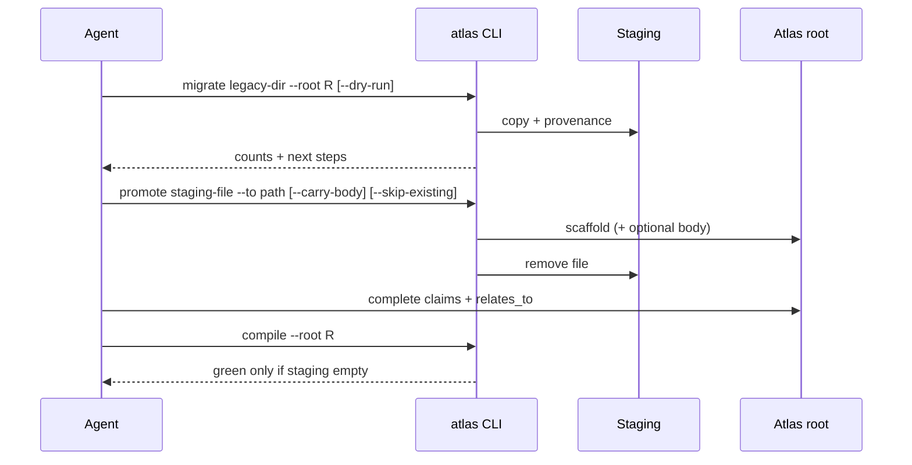

## Intent + scope

# Design plan: Improve Atlas migrate CLI and skill guidance

**work_id:** `atlas-migrate-cli-improve-v1`  
**change-class:** new-surface  
**subject:** atlas  
**status:** awaiting approval  
**plan_path:** `artifacts/autogenesis-plans/2026-08-23-atlas-migrate-cli-improve-v1.md`

## Intent + scope

Improve the Atlas **migrate / promote CLI** and **atlas skill** documentation (SKILL.md + `references/paths/remember.md`) so full-store migrations (as done for autogenesis) are less error-prone and better guided.

### In scope
1. **CLI inventory** — `atlas migrate --dry-run` or post-migrate `atlas staging summary` listing counts by folder/type.
2. **Promote options** — optional `--carry-body` to append original staging body under the template scaffold; `--skip-existing` when target exists.
3. **Batch helper** — `atlas promote --all-staging --to-map <rules>` or documented batch pattern (even if thin: promote all knowledge→decisions, experiences→experiences).
4. **Skill docs** — remember path + SKILL.md: explicit directory vs file migrate; “staging must be 0”; agent checklist for claims + relates_to mesh; link to lessons decision.
5. **Clearer CLI messaging** after migrate (next steps already partial; strengthen with counts + promote examples).

### Non-goals
- Automatic LLM claim synthesis without agent review.
- BM25 / full live okf-wiki answerability (`atlas-bm25-and-live-migration-v1`).
- Changing OKF format rules (skill **okf**).

## Pins (from migration retrospective)

1. Directory migrate is the bulk intake path.
2. Promote remains scaffold-first unless `--carry-body`.
3. Compile green requires empty staging — non-negotiable.
4. Agent owns final claims and resolving `relates_to`.
5. Lessons decision `decisions/migrate-cli-lessons-from-autogenesis.md` is authoritative until superseded.

## Genesis Artifacts (mini-genesis — new-surface)

### Intent + scope + non-goals
See above.

### Mermaid (sequence)



### Interface sketch

```text
atlas migrate <source> --root <R> [--dry-run] [--json]
atlas staging summary --root <R>          # NEW: counts, sample paths
atlas promote <staging-file> --to <path> --root <R>
           [--type experience|decision|…]
           [--carry-body]                 # NEW
           [--skip-existing]              # NEW
atlas promote-batch --root <R> --from staging/knowledge --to-dir decisions --type decision
           [--carry-body] [--skip-existing]  # NEW optional
atlas compile --root <R>
```

Skill surface:
- `references/paths/remember.md` — bulk migration procedure subsection
- `SKILL.md` — CLI surface table + pointer to lessons decision

### Cost note
Small CLI surface area; no new runtime services. Agent token cost drops if batch/summary reduce failed compile loops.

### Acceptance criteria
1. `migrate --dry-run` reports file count without writing.
2. `staging summary` works when staging non-empty.
3. `promote --carry-body` includes original markdown body below scaffold note.
4. `promote --skip-existing` exits 0 and skips without error when target exists.
5. remember path documents full-directory flow + staging-empty rule with reference to autogenesis migration experience.
6. `atlas compile` on fixture + autogenesis atlas still green after changes.
7. Construct adversarial (if scenarios touch migrate) updated or explicitly deferred with reason.

### Stop for approval
**Do not implement** until explicit user approval of this plan.

## Residual risks
- `--carry-body` may produce pages that still fail `not_just_links` if body is empty — agent must still complete claims.
- Batch promote without agent review could scatter thin pages — default remains one-file promote; batch is opt-in.
- Overlap with `atlas-bm25-and-live-migration-v1` — keep BM25 out of this work_id.

## Challenge (automated×1; confidence: limited)
- Counter: “CLI should auto-clear staging” — **rejected** (would destroy unclaimed content; agent must claim or explicit defer).
- Counter: “Carry-body alone is enough” — **partial**; still need relates_to and type sections.
- Counter: “Only docs, no CLI” — **rejected**; inventory/skip-existing are high leverage from live failure modes.

## Path receipt (design)

```text
subject: atlas
path: design
approved: pending
atlas_root: /home/workdir/.grok/skills/atlas/references/atlas
nested_skills_loaded: atlas, okf (format)
substrate_contract: applied
remember: yes
compile: yes
Enter|Change|Exit: pass (design stops for approval — no implement)
```

## Genesis Artifacts

Embedded in plan body above (mini-genesis for new-surface).

## Acceptance

See Acceptance criteria in plan body.

## Stop for approval

Explicit user approval required before implement (still pending).
